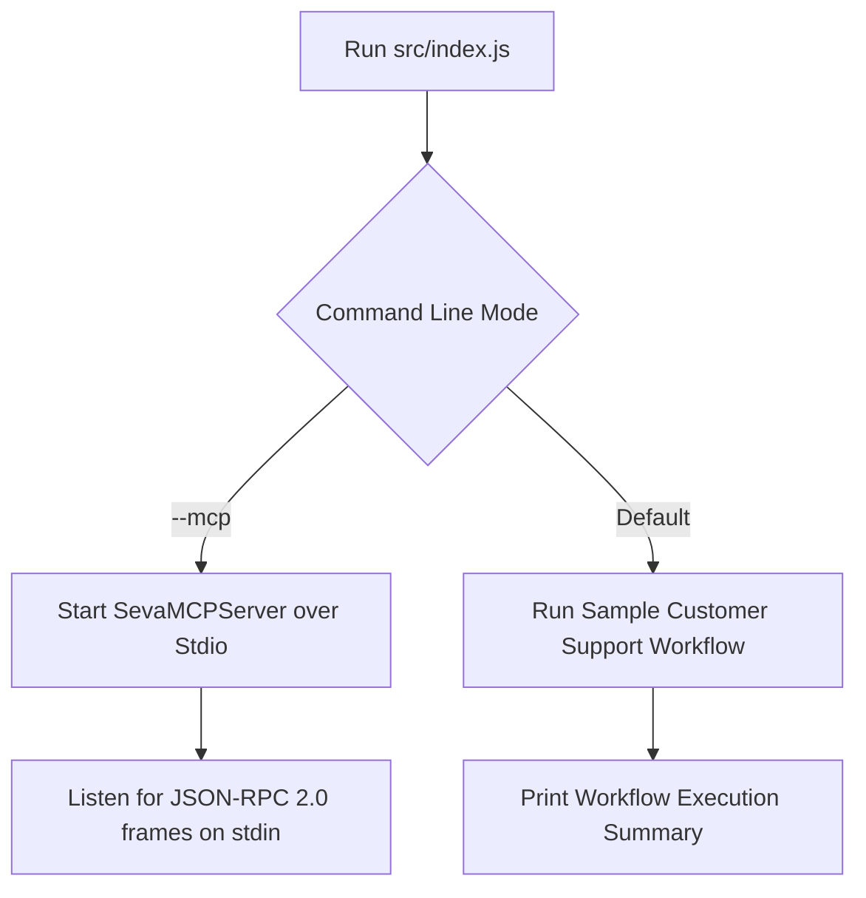

# File 13: Main Server & CLI Runner (`src/index.js`)

## Overview
**`src/index.js`** serves as the main entry point for Seva MCP, starting the Model Context Protocol (MCP) server over Stdio for production desktop client connections or launching a sample test workflow runner.

---

## 1. Boot Execution Flow



---

## 2. Main Entry Implementation (`src/index.js`)

```javascript
import { SevaMCPServer } from "./mcp/server.js";
import { runCustomerSupportWorkflow } from "./mastra/workflows.js";
import { PIIFilter } from "./guardrails/pii-filter.js";

const isMcpMode = process.argv.includes("--mcp");

if (isMcpMode) {
    // Launch MCP Server over Stdio
    const server = new SevaMCPServer();
    server.start();
} else {
    // Run Sample Test Workflow
    async function main() {
        console.log("=== SEVA MCP CUSTOMER SUPPORT RUNNER ===");
        
        const rawQuery = "I need a refund for my order. My credit card is 4111-2222-3333-4444.";
        const sanitizedQuery = PIIFilter.redactPII(rawQuery);
        console.log("Sanitized Input Query:", sanitizedQuery);

        const result = await runCustomerSupportWorkflow("priya@example.com", sanitizedQuery, false);
        console.log("\nWorkflow Output Result:\n", result);
    }

    main().catch(console.error);
}
```

---

## Key Takeaways
1. Run `node src/index.js --mcp` to connect the server directly to Claude Desktop or Cursor via Stdio.
2. Run `node src/index.js` to execute local workflow test runs.
