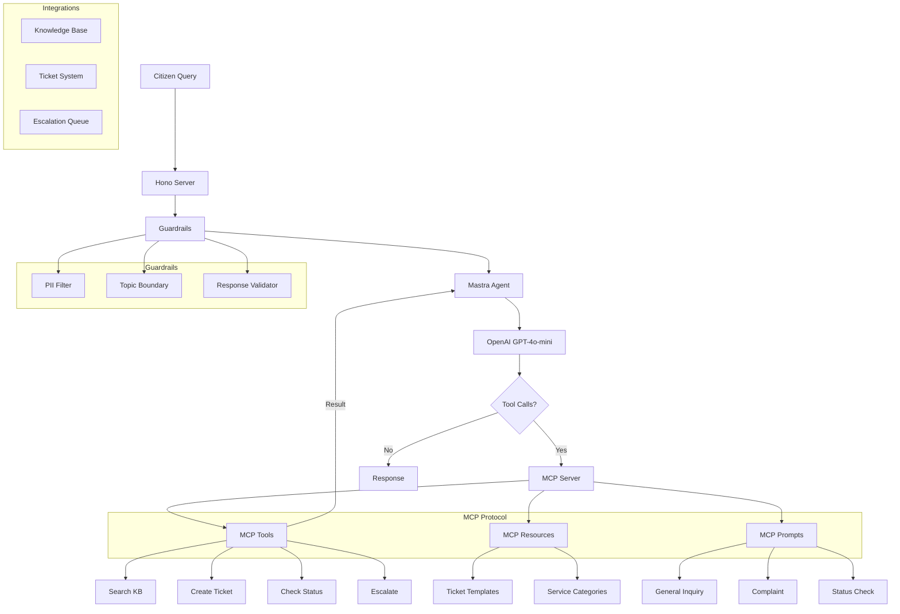
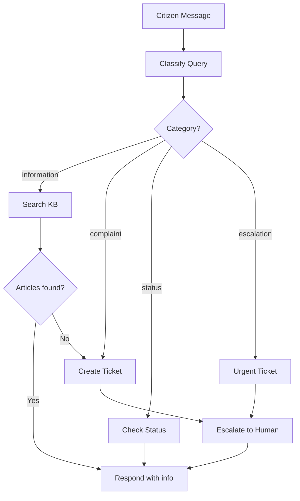

# 06 - SevaDwaar MCP

**Client:** SevaDwaar, Lucknow — GovTech citizen services with MCP-powered support agent.

**Tech:** OpenAI, Mastra, MCP (Model Context Protocol), Hono

## Architecture



## Workflow: Classify then Route



## What is MCP?

**Model Context Protocol** — an open standard for connecting AI models to tools and data.

Three primitives:
- **Tools**: Functions the AI can call (createTicket, searchKB, etc.)
- **Resources**: Data the AI can read (templates, knowledge base)
- **Prompts**: Pre-defined prompt templates for different scenarios

MCP separates tool definitions from agent logic. Any MCP-compatible agent can use these tools.

## Setup

```bash
cp .env.example .env
# Add your OPENAI_API_KEY
npm install
npm run dev
```

## API

```bash
# Chat with the agent (tool-calling loop)
curl -X POST http://localhost:3006/chat \
  -H "Content-Type: application/json" \
  -d '{"message": "How do I apply for a ration card?", "citizenName": "Ramesh"}'

# Run the classify-then-route workflow
curl -X POST http://localhost:3006/workflow \
  -H "Content-Type: application/json" \
  -d '{"message": "My pension has not arrived for 3 months", "citizenName": "Sushila Devi"}'

# List all tickets
curl http://localhost:3006/tickets

# Check a specific ticket
curl http://localhost:3006/tickets/SEVA-1001

# View escalation queue
curl http://localhost:3006/escalations

# List service categories
curl http://localhost:3006/categories

# Health check
curl http://localhost:3006/health
```

## MCP Server (Standalone)

The MCP server can also run independently via stdio:

```bash
npm run mcp
```

This allows any MCP-compatible client (Claude Desktop, Cursor, etc.) to connect.

## File Structure

```
src/
  index.js                   — Hono server
  mcp/
    server.js                — MCP server (tools + resources + prompts)
    tools.js                 — Tool definitions in MCP format
    resources.js             — MCP resources (templates, categories)
    prompts.js               — MCP prompt templates
  mastra/
    agent.js                 — Agent with tool-calling loop
    workflows.js             — Classify → route → act workflow
    config.js                — Agent configuration
  integrations/
    ticket-system.js         — Ticket CRUD operations
    knowledge-base.js        — KB search and retrieval
    escalation.js            — Escalation queue management
  guardrails/
    pii-filter.js            — Detect and redact Aadhaar, phone numbers
    topic-boundary.js        — Keep agent on government topics only
    response-validator.js    — Validate and clean responses
  data/
    knowledge-base.json      — Government schemes and services
```

## Key Concepts

- **MCP**: Open protocol for tool interoperability. Define tools once, use from any agent.
- **Mastra**: Agent framework that connects to MCP servers for tooling.
- **Guardrails**: PII detection, topic boundaries, response validation.
- **Workflow**: Classify the query first, then route to the right action.
- **Escalation**: When AI cannot help, hand off to a human gracefully.
