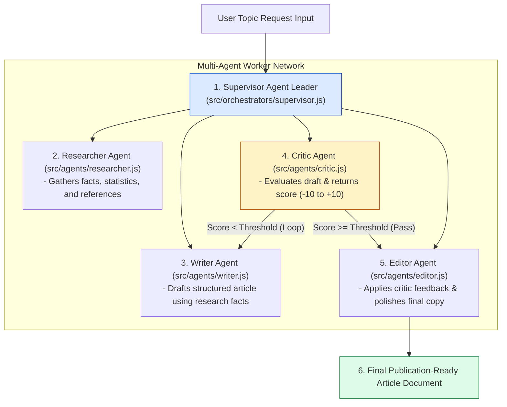
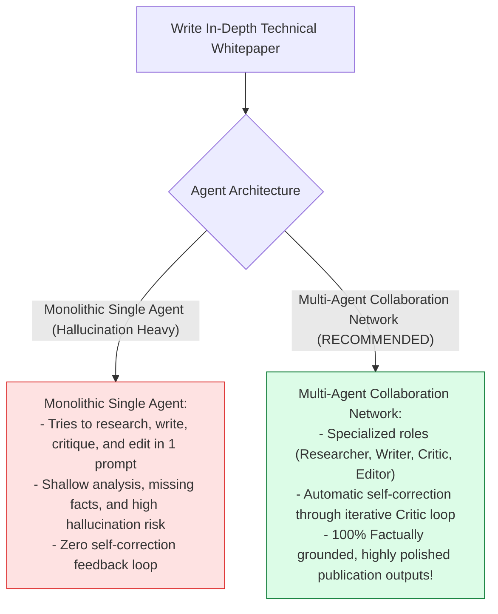
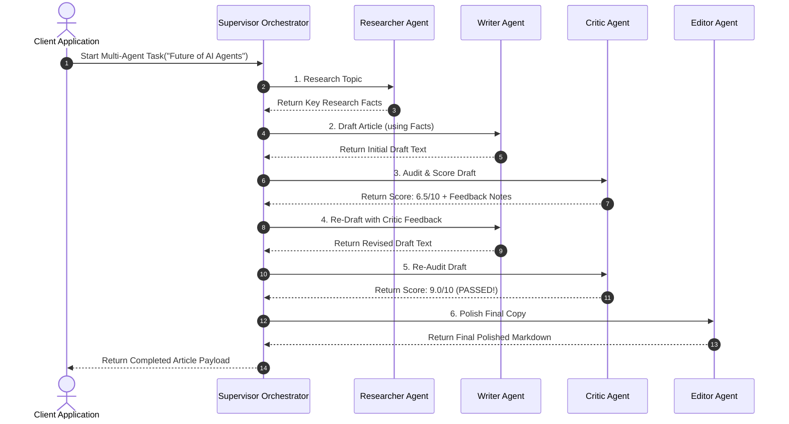

# Module 00: Multi-Agent Systems & Collaboration Architecture Overview

## Overview

Monolithic single-agent LLM prompts fail when tasked with multi-faceted, complex objectives (such as researching, drafting, critiquing, and editing technical publications). The **Neta Multi-Agent Framework** implements an enterprise multi-agent collaboration architecture using three primary topologies: **Router/Dispatcher**, **Supervisor Pattern**, and **Hierarchical LangGraph State Machine**. By dividing responsibility among four specialized AI worker agents (**Researcher**, **Writer**, **Critic**, **Editor**), the system achieves higher output quality through iterative feedback loops and strict separation of concerns.

Understanding **Multi-Agent Collaboration Topologies**, **Supervisor vs. Router Patterns**, **Iterative Critic Loops**, and **Shared State Memory Busses** is essential for multi-agent engineering.

---

## 1. Multi-Agent Collaboration Topology

---

## 2. Monolithic Single-Agent Prompts vs. Multi-Agent Systems

### Neta Multi-Agent Role & Responsibility Specification

| Agent Role Key | Source Module | Technical Specialty | Primary Channel Output |
| :--- | :--- | :--- | :--- |
| **`Researcher`** | `src/agents/researcher.js` | Fact-finding & Web Search Retrieval | Key Fact Bullets & Citation Notes. |
| **`Writer`** | `src/agents/writer.js` | Creative & Structured Drafting | Initial Full Article Draft Text. |
| **`Critic`** | `src/agents/critic.js` | Structural Audit & Quality Evaluation| Numerical Score ($-10$ to $+10$) & Feedback. |
| **`Editor`** | `src/agents/editor.js` | Tone Adjustment & Grammar Polish | Final Publication-Ready Markdown Document. |

---

## 3. Asynchronous Multi-Agent State Machine Sequence

---

## Key Production Takeaways

1. **Decompose Complex Workflows via Agent Specialization**: Divide complex tasks among focused worker agents (**Researcher**, **Writer**, **Critic**, **Editor**) rather than relying on a single monolithic LLM prompt.
2. **Implement Iterative Critic Feedback Loops**: Use a dedicated **Critic Agent** to score intermediate drafts and trigger re-drafting loops until quality thresholds ($\text{Score} \ge 8.0$) are satisfied.
3. **Use Supervisor Orchestrators for Control**: Employ a **Supervisor Agent** to maintain state transitions, route worker tasks, and govern iteration limits.
4. **Standardize Shared State Channels**: Persist agent outputs in a unified state graph envelope to allow worker agents to build seamlessly on previous step results.

## Learn from the implementation

Use the matching source file as an executable example, not just something to copy. Before running it, state in your own words what data enters the module, what it returns, and which values it changes. Then trace one realistic request from the caller through each function.

Pay special attention to these questions:

- **Data flow:** Which object, array, string, or state value moves between functions? What shape must it have?
- **Control flow:** Which branch, loop, early return, or retry changes the outcome? What condition selects it?
- **Async boundaries:** Where does the code wait for an LLM, database, network, file system, or tool? What should happen if that operation rejects or returns no result?
- **Side effects:** Which lines log information, make an external request, store data, or mutate in-memory state? Keep those distinct from pure calculations.
- **Production limits:** Which assumptions are only safe for a tutorial—for example, in-memory storage, fixed thresholds, approximate token counts, mock data, or a hard-coded batch size?

A useful practice is to change one input at a time and predict the result before executing it. If you can explain why the output changed, when the module should be used, and one way it could fail, you understand the concept rather than only the syntax.
