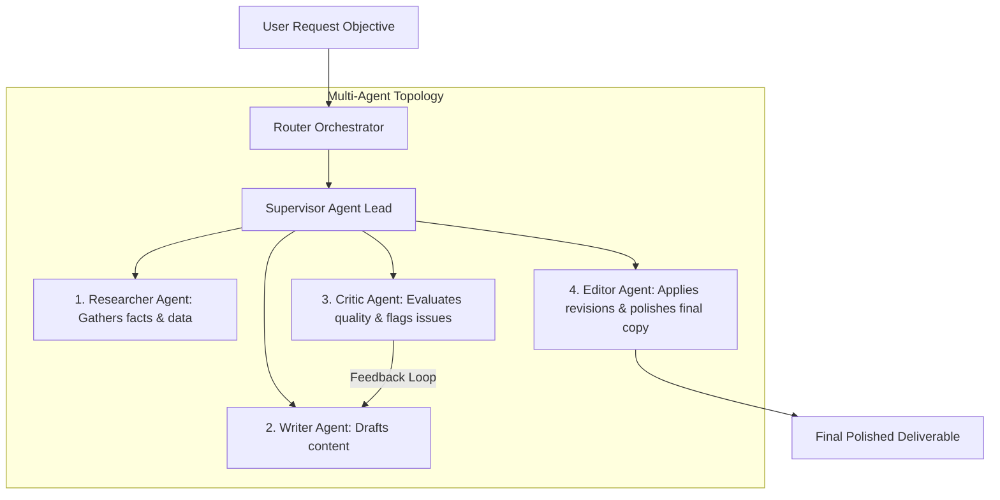

# File 00: Multi-Agent Systems & Collaboration Overview

## Overview
**Neta Multi-Agent** is an enterprise-grade **Multi-Agent Collaboration Framework**. It models multi-agent workflows using three core topologies: **Router/Dispatcher**, **Supervisor Pattern**, and **Hierarchical LangGraph State Machine**, orchestrating four specialized AI worker agents (**Researcher**, **Writer**, **Critic**, **Editor**).

---

## 1. Multi-Agent Systems Topology Matrix

---

## 2. Agent Roles & Responsibilities

| Agent Name | Source Module | Specialty | Primary Output |
| :--- | :--- | :--- | :--- |
| **`Researcher`** | `src/agents/researcher.js` | Fact-finding & Web search | Structured Fact Bullet Points |
| **`Writer`** | `src/agents/writer.js` | Content drafting | Initial Full-Length Draft |
| **`Critic`** | `src/agents/critic.js` | Quality & logic evaluation | Critiques & Quality Score (-10 to +10) |
| **`Editor`** | `src/agents/editor.js` | Polish & grammar refinement | Publication-Ready Final Document |

---

## Key Takeaways
1. Decomposes large tasks into specialized domain worker agents (Separation of Concerns).
2. Uses **Critic Feedback Loops** to iterate on drafts until passing quality thresholds.
3. Implements **LangGraph StateGraph** to manage multi-agent state transfers.
