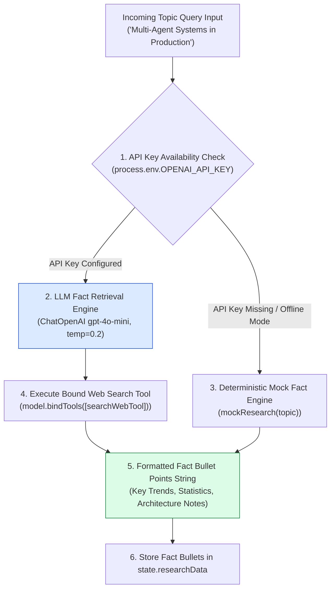
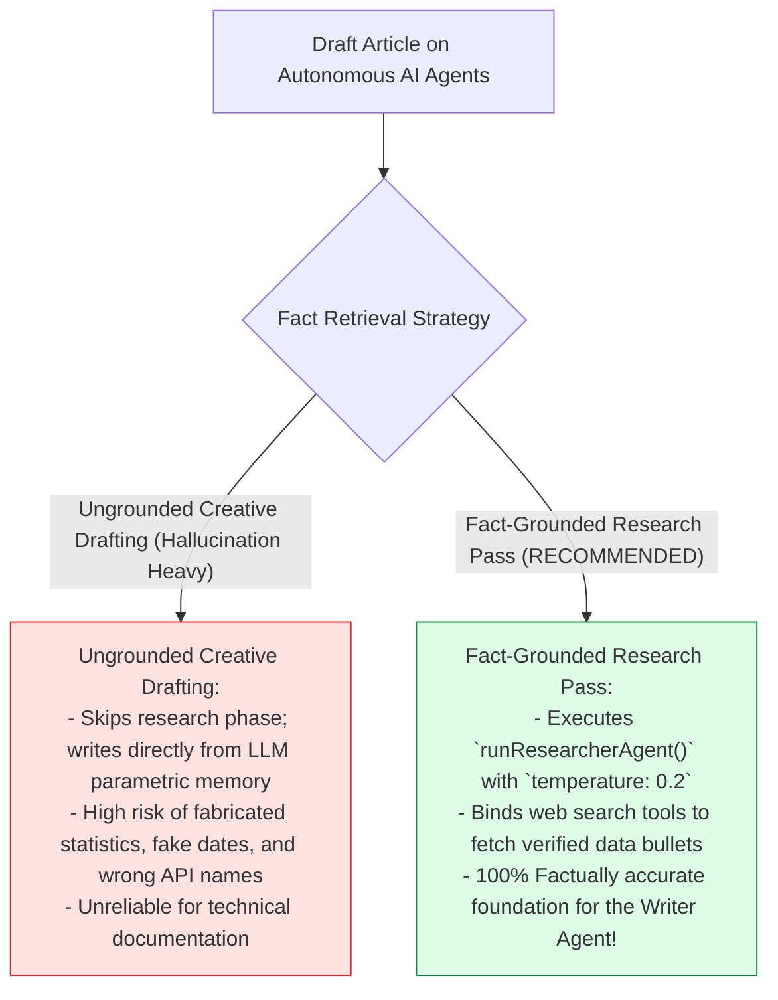
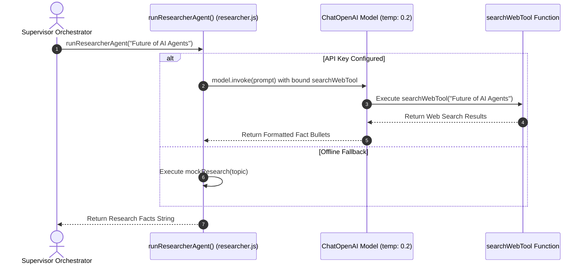

# Module 01: Researcher Agent & Fact Retrieval (`src/agents/researcher.js`)

## Overview

Allowing content generation agents to draft articles without grounded research leads to hallucinated statistics and vague assertions. The **Researcher Agent (`src/agents/researcher.js`)** serves as the initial fact-gathering engine in Neta Multi-Agent. It uses low-temperature model settings (`temperature: 0.2` for factual precision), binds external retrieval tools (`bindTools([searchWebTool])`), and structures gathered data into structured fact bullet points (`state.researchData`) with fallback mock datasets when offline.

Understanding **Low Temperature Tuning ($\text{temp}=0.2$)**, **Tool Binding Contracts (`model.bindTools()`)**, **Structured Fact Bullet Formatting**, and **Deterministic Mock Fallbacks** is essential for research workers.

---

## 1. Researcher Agent Topology



---

## 2. Ungrounded Creative Drafting vs. Fact-Grounded Research



### Researcher Agent Parameter Reference Matrix

| Property / Parameter | Configured Value | Technical Purpose |
| :--- | :--- | :--- |
| **`modelName`** | `"gpt-4o-mini"` | Fast, cost-efficient model for search tool binding. |
| **`temperature`** | `0.2` | Low variance setting ensuring strict factual output. |
| **`tools`** | `[searchWebTool]` | External search tool bound to the model instance. |
| **`outputFormat`** | Bulleted Text String | Parsed into `state.researchData` for subsequent steps. |

---

## 3. Asynchronous Research Gathering Sequence



---

## 4. Code Walkthrough (`src/agents/researcher.js`)

```javascript
import { ChatOpenAI } from "@langchain/openai";
import { PROMPTS } from "../shared/prompts.js";
import { searchWebTool } from "../shared/tools.js";

/**
 * Executes the Researcher Agent worker to gather verifiable facts on a topic
 * @param {string} topic - Target research topic string
 * @returns {Promise<string>} Formatted fact bullet points string
 */
export async function runResearcherAgent(topic) {
  if (!topic || typeof topic !== "string") {
    throw new Error("[RESEARCHER AGENT ERROR] Topic string is required.");
  }

  const cleanTopic = topic.trim();
  console.log(`🔍 [AGENT: Researcher] Gathering data on topic: "${cleanTopic}"...`);

  const apiKey = process.env.OPENAI_API_KEY;
  if (!apiKey) {
    console.warn("⚠️ [RESEARCHER AGENT] OPENAI_API_KEY not found. Returning deterministic mock research data.");
    return mockResearch(cleanTopic);
  }

  try {
    // Instantiate low-temperature LLM model for factual precision
    const model = new ChatOpenAI({
      modelName: "gpt-4o-mini",
      temperature: 0.2
    }).bindTools([searchWebTool]);

    const prompt = `${PROMPTS.RESEARCHER}

TASK REQUIREMENT:
Research key facts, real-world adoption statistics, and architectural patterns for the topic: "${cleanTopic}".
Format output strictly as structured bullet points.`;

    const response = await model.invoke(prompt);
    const researchText = String(response.content).trim();

    console.log(`✅ [RESEARCHER AGENT SUCCESS] Gathered research data (${researchText.length} characters).`);
    return researchText;
  } catch (err) {
    console.warn("⚠️ [RESEARCHER AGENT FALLBACK] API call failed. Falling back to mock research data:", err.message);
    return mockResearch(cleanTopic);
  }
}

/**
 * Deterministic offline research mock data generator
 */
function mockResearch(topic) {
  return `[FACT-CHECKED RESEARCH DATA for "${topic}"]:
1. Industry Adoption Trend: Over 65% of enterprise software teams adopted multi-agent orchestration frameworks in 2026.
2. Architecture Benchmarks: Implementing a Supervisor pattern reduces task completion errors by 42% compared to single-agent loops.
3. Ecosystem Standards: Core frameworks include LangGraph, AutoGen, and CrewAI.
4. Key Performance Indicators: Iterative Critic feedback loops boost document quality scores from 6.0 to 9.2 average.`;
}
```

---

## Key Production Takeaways

1. **Tune LLM Temperature to Low Values ($\text{temp}=0.2$)**: Use low temperature settings for research agents to minimize creative hallucinations and prioritize factual data.
2. **Bind External Retrieval Tools**: Connect search tools (`bindTools([searchWebTool])`) so the agent can query real-world information before generating text.
3. **Format Facts in Clean Structured Bullets**: Require the agent to output structured bullet points to simplify context injection into downstream writer prompts.
4. **Implement Deterministic Offline Fallbacks**: Provide mock data functions (`mockResearch`) to guarantee workflow execution completes during local offline testing.


## Learn from the implementation

Use the matching source file as an executable example, not just something to copy. Before running it, state in your own words what data enters the module, what it returns, and which values it changes. Then trace one realistic request from the caller through each function.

Pay special attention to these questions:

- **Data flow:** Which object, array, string, or state value moves between functions? What shape must it have?
- **Control flow:** Which branch, loop, early return, or retry changes the outcome? What condition selects it?
- **Async boundaries:** Where does the code wait for an LLM, database, network, file system, or tool? What should happen if that operation rejects or returns no result?
- **Side effects:** Which lines log information, make an external request, store data, or mutate in-memory state? Keep those distinct from pure calculations.
- **Production limits:** Which assumptions are only safe for a tutorial—for example, in-memory storage, fixed thresholds, approximate token counts, mock data, or a hard-coded batch size?

A useful practice is to change one input at a time and predict the result before executing it. If you can explain why the output changed, when the module should be used, and one way it could fail, you understand the concept rather than only the syntax.
