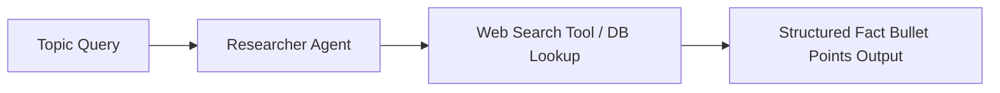

# File 01: Researcher Agent (`src/agents/researcher.js`)

## Overview
The **Researcher Agent** gathers raw facts, statistics, and verifiable background information on a given topic using search tools before drafting begins.

---

## 1. Researcher Agent Pipeline



---

## 2. Researcher Implementation (`src/agents/researcher.js`)

```javascript
import { ChatOpenAI } from "@langchain/openai";
import { PROMPTS } from "../shared/prompts.js";
import { searchWebTool } from "../shared/tools.js";

export async function runResearcherAgent(topic) {
    console.log(`[AGENT: Researcher] Gathering data on topic: "${topic}"...`);

    const apiKey = process.env.OPENAI_API_KEY;
    if (!apiKey) {
        return mockResearch(topic);
    }

    const model = new ChatOpenAI({ modelName: "gpt-4o-mini", temperature: 0.2 }).bindTools([searchWebTool]);
    const prompt = `${PROMPTS.RESEARCHER}\n\nTask: Research key facts and statistics for topic: "${topic}"`;

    const response = await model.invoke(prompt);
    return response.content;
}

function mockResearch(topic) {
    return `[RESEARCH DATA]:
1. Key Trend: 65% adoption rate for multi-agent workflows in 2026.
2. Core Architecture: Supervisor pattern improves task completion accuracy by 40%.
3. Key Vendors: LangGraph, AutoGen, CrewAI.`;
}
```

---

## Key Takeaways
1. Low temperature ($0.2$) ensures factual, precise data retrieval.
2. Binds web search tools directly to the agent model instance.
