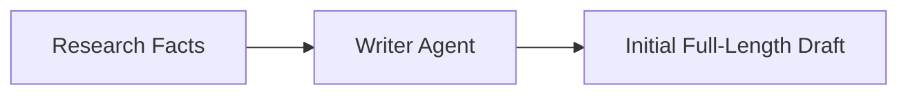

# File 02: Writer Agent (`src/agents/writer.js`)

## Overview
The **Writer Agent** synthesizes structured research notes into a cohesive initial draft document.

---

## 1. Writer Agent Flow



---

## 2. Writer Implementation (`src/agents/writer.js`)

```javascript
import { ChatOpenAI } from "@langchain/openai";
import { PROMPTS } from "../shared/prompts.js";

export async function runWriterAgent(topic, researchData) {
    console.log(`[AGENT: Writer] Drafting initial document...`);

    const apiKey = process.env.OPENAI_API_KEY;
    if (!apiKey) {
        return mockWriter(topic);
    }

    const model = new ChatOpenAI({ modelName: "gpt-4o-mini", temperature: 0.7 });
    const prompt = `${PROMPTS.WRITER}\n\nTOPIC: "${topic}"\n\nRESEARCH DATA:\n${researchData}\n\nDraft Document:`;

    const response = await model.invoke(prompt);
    return response.content;
}

function mockWriter(topic) {
    return `# Report: ${topic}

Multi-agent architecture represents a major evolutionary leap in AI systems engineering. By decomposing complex workflows into specialized agents, organizations achieve unprecedented reliability.`;
}
```

---

## Key Takeaways
1. Higher temperature ($0.7$) allows for creative writing and natural phrasing.
2. Focuses purely on drafting without worrying about editing or critique.
