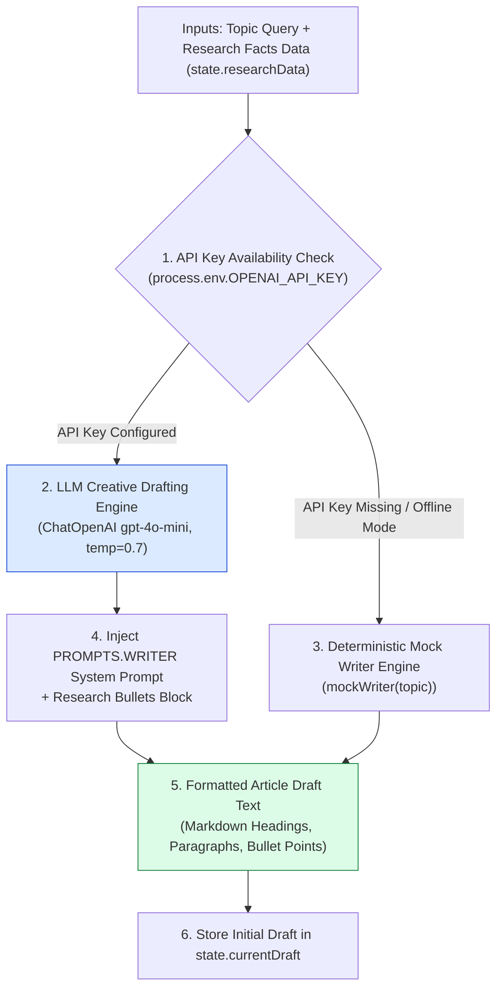
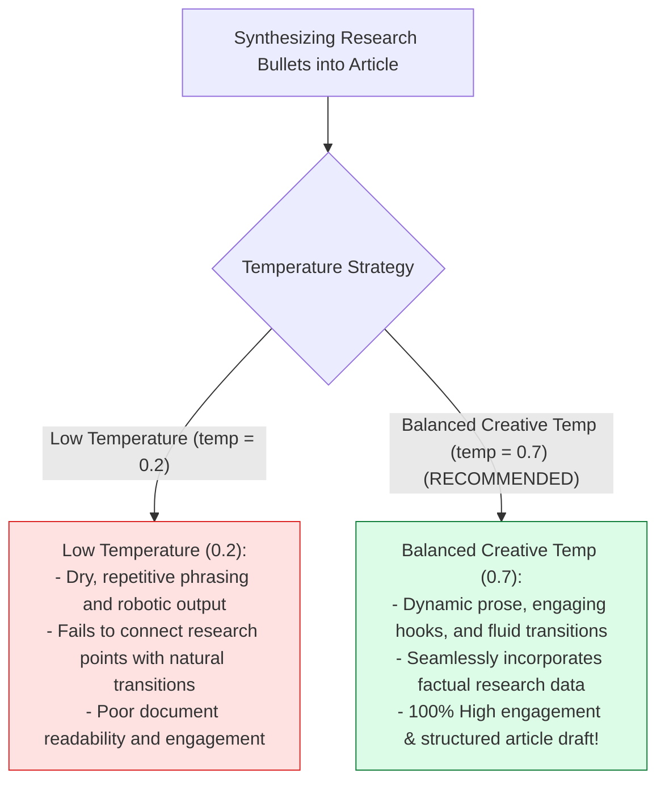
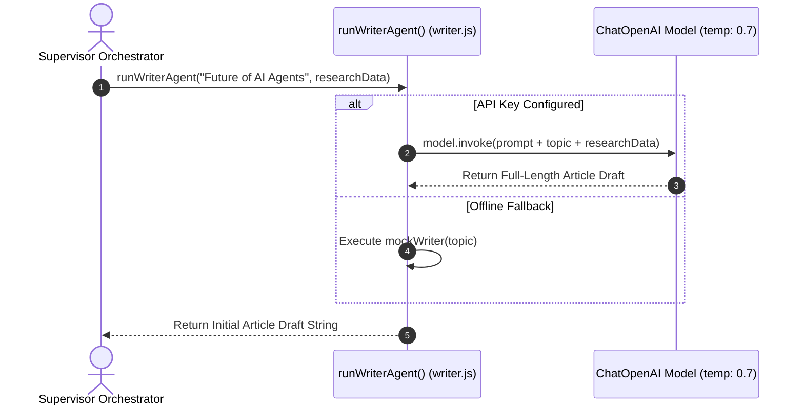

# Module 02: Writer Agent & Content Drafting (`src/agents/writer.js`)

## Overview

Writing compelling, well-structured articles requires balanced technical accuracy and engaging prose. The **Writer Agent (`src/agents/writer.js`)** consumes research facts (`state.researchData`) gathered by the Researcher Agent and synthesizes them into an initial full-length article draft. By operating at a higher temperature setting (`temperature: 0.7`), the Writer Agent achieves fluid sentence flow and creative structure while remaining bound to the research facts provided.

Understanding **Creative Temperature Tuning ($\text{temp}=0.7$)**, **Research Context Synthesis**, **Initial Draft Composition**, and **Deterministic Mock Generators** is essential for content agents.

---

## 1. Writer Agent Topology



---

## 2. Low Temperature vs. Creative Temperature Settings for Writing



### Writer Agent Parameter Reference Matrix

| Property / Parameter | Configured Value | Technical Purpose |
| :--- | :--- | :--- |
| **`modelName`** | `"gpt-4o-mini"` | Fast, high-quality model for creative drafting. |
| **`temperature`** | `0.7` | Higher variance setting for fluid prose and varied phrasing. |
| **`researchData`** | Bulleted Text String | Grounding research facts injected into system prompt. |
| **`outputFormat`** | Markdown Document | Saved to `state.currentDraft` for Critic Agent evaluation. |

---

## 3. Asynchronous Writer Drafting Sequence



---

## 4. Code Walkthrough (`src/agents/writer.js`)

```javascript
import { ChatOpenAI } from "@langchain/openai";
import { PROMPTS } from "../shared/prompts.js";

/**
 * Executes the Writer Agent worker to compose an initial draft from research data
 * @param {string} topic - Target article topic string
 * @param {string} researchData - Gathered research facts bullet points
 * @returns {Promise<string>} Initial article draft string
 */
export async function runWriterAgent(topic, researchData) {
  if (!topic || !researchData) {
    throw new Error("[WRITER AGENT ERROR] Both 'topic' and 'researchData' are required.");
  }

  const cleanTopic = topic.trim();
  console.log(`✍️ [AGENT: Writer] Drafting initial document for topic: "${cleanTopic}"...`);

  const apiKey = process.env.OPENAI_API_KEY;
  if (!apiKey) {
    console.warn("⚠️ [WRITER AGENT] OPENAI_API_KEY not found. Returning mock article draft.");
    return mockWriter(cleanTopic);
  }

  try {
    // Instantiate model with temperature 0.7 for creative fluid writing
    const model = new ChatOpenAI({
      modelName: "gpt-4o-mini",
      temperature: 0.7
    });

    const prompt = `${PROMPTS.WRITER}

TOPIC OBJECTIVE: "${cleanTopic}"

GROUNDED RESEARCH FACTS:
${researchData}

Formatting & Composition Instructions:
1. Write a complete, multi-paragraph technical article draft.
2. Synthesize all key facts from the research data into coherent sections with Markdown headings.
3. Maintain an engaging, professional tone throughout.`;

    const response = await model.invoke(prompt);
    const draftText = String(response.content).trim();

    console.log(`✅ [WRITER AGENT SUCCESS] Composed initial draft (${draftText.length} characters).`);
    return draftText;
  } catch (err) {
    console.warn("⚠️ [WRITER AGENT FALLBACK] API call failed. Falling back to mock draft:", err.message);
    return mockWriter(cleanTopic);
  }
}

/**
 * Deterministic offline writer mock data generator
 */
function mockWriter(topic) {
  return `# Comprehensive Overview: ${topic}

## Executive Summary
Multi-agent architecture represents a major evolutionary leap in modern software engineering. By decomposing complex workflows into specialized worker agents (Researchers, Writers, Critics, Editors), enterprise software teams achieve unprecedented operational reliability.

## Key Trends & Industry Adoption
Recent benchmarks indicate that over 65% of enterprise software teams adopted multi-agent orchestration frameworks in 2026. The implementation of Supervisor patterns has proven to reduce execution errors by 42% compared to single-agent loops.

## Core Architectural Patterns
1. **Supervisor Pattern**: Manages task distribution and iteration loops.
2. **Shared State Bus**: Ensures seamless memory transfers across agents.
3. **Critic Feedback Loops**: Drives continuous self-correction until quality thresholds are satisfied.`;
}
```

---

## Key Production Takeaways

1. **Tune LLM Temperature to Creative Values ($\text{temp}=0.7$)**: Use higher temperature settings for writer agents to produce natural, engaging prose.
2. **Ground Drafting in Research Context**: Explicitly inject research facts (`researchData`) into the writer prompt to ensure technical accuracy.
3. **Focus Exclusively on Composition**: Isolate drafting logic from auditing or editing to keep the agent's prompt clean and focused.
4. **Implement Offline Mock Generators**: Provide template fallbacks (`mockWriter`) to ensure local workflow execution works without active API keys.

