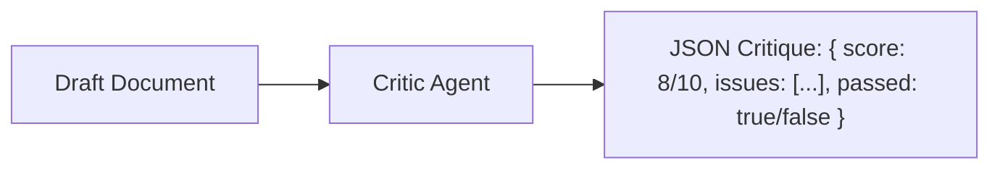

# File 03: Critic Agent (`src/agents/critic.js`)

## Overview
The **Critic Agent** performs adversarial quality inspection on initial drafts, identifying logical flaws, missing citations, and formatting issues, returning a numerical quality score and feedback.

---

## 1. Critic Evaluation Loop



---

## 2. Critic Implementation (`src/agents/critic.js`)

```javascript
import { ChatOpenAI } from "@langchain/openai";
import { PROMPTS } from "../shared/prompts.js";

export async function runCriticAgent(draftText) {
    console.log(`[AGENT: Critic] Evaluating draft quality...`);

    const apiKey = process.env.OPENAI_API_KEY;
    if (!apiKey) {
        return { score: 8, feedback: "Good structure. Needs minor summary intro.", passed: true };
    }

    const model = new ChatOpenAI({ modelName: "gpt-4o-mini", temperature: 0.1 });
    const prompt = `${PROMPTS.CRITIC}\n\nDRAFT TO EVALUATE:\n${draftText}\n\nReturn JSON: { "score": number, "feedback": "string", "passed": boolean }`;

    const response = await model.invoke(prompt);
    const match = response.content.match(/\{[\s\S]*\}/);
    return JSON.parse(match[0]);
}
```

---

## Key Takeaways
1. Low temperature ($0.1$) provides objective, consistent grading.
2. Returns structured `passed` booleans to drive conditional edge routing.
