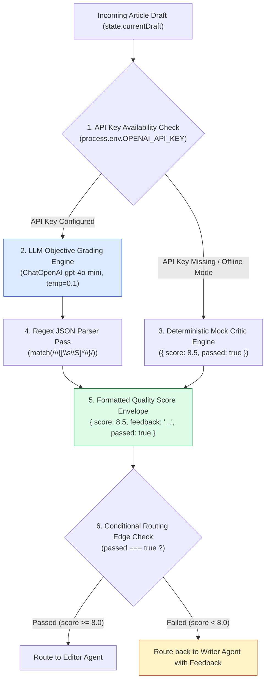
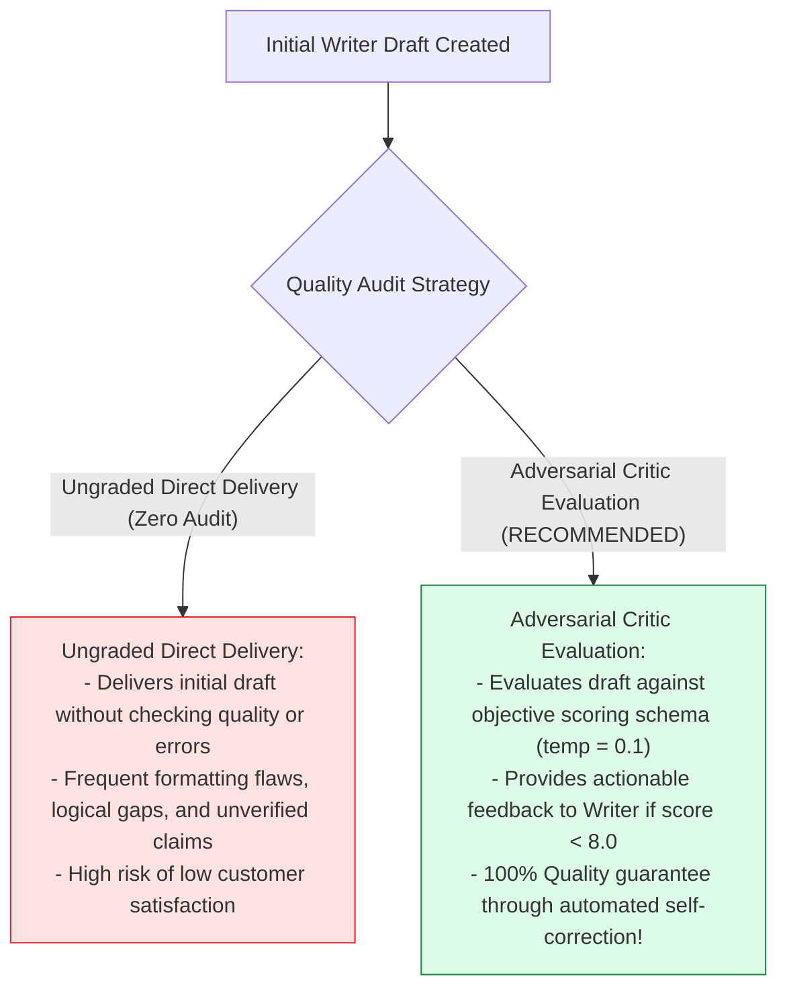
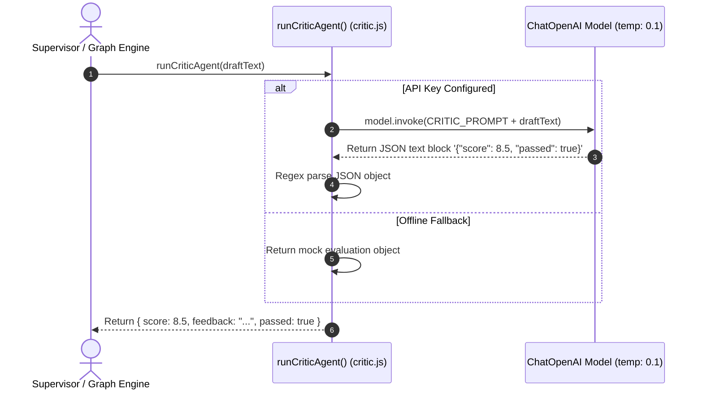

# Module 03: Critic Agent & Quality Evaluation (`src/agents/critic.js`)

## Overview

Self-correction is a defining characteristic of advanced multi-agent architectures. Without adversarial quality checks, poor initial drafts are delivered directly to users without improvement. The **Critic Agent (`src/agents/critic.js`)** performs strict, unbiased quality evaluations on article drafts (`state.currentDraft`). Operating at low temperature (`temperature: 0.1` for objective grading), it evaluates structure, citations, and clarity, returning a structured JSON payload containing a numerical quality score (e.g. $8.5 / 10$), actionable feedback notes, and a boolean `passed` flag ($\text{score} \ge 8.0$) that drives conditional graph routing.

Understanding **Adversarial Quality Auditing**, **Low Temperature Objective Grading ($\text{temp}=0.1$)**, **JSON Regex Extraction Pass**, and **Conditional Edge Predicates** is essential for quality control.

---

## 1. Critic Evaluation Topology



---

## 2. Ungraded Draft Delivery vs. Adversarial Critic Auditing



### Critic Evaluation Payload Schema Specification

| JSON Property | Data Type | Sample Schema Value | Technical Purpose |
| :--- | :--- | :--- | :--- |
| **`score`** | `Number` | `8.5` | Numerical quality score on scale of $0.0$ to $10.0$. |
| **`feedback`** | `String` | `"Add introductory summary bullet..."` | Actionable revision feedback for Writer Agent. |
| **`passed`** | `Boolean` | `true` | Boolean flag indicating whether score satisfies $\ge 8.0$. |

---

## 3. Asynchronous Critic Audit Sequence



---

## 4. Code Walkthrough (`src/agents/critic.js`)

```javascript
import { ChatOpenAI } from "@langchain/openai";
import { PROMPTS } from "../shared/prompts.js";

/**
 * Executes the Critic Agent worker to evaluate article draft quality
 * @param {string} draftText - Current article draft text to evaluate
 * @returns {Promise<Object>} Quality evaluation object ({ score, feedback, passed })
 */
export async function runCriticAgent(draftText) {
  if (!draftText || typeof draftText !== "string") {
    throw new Error("[CRITIC AGENT ERROR] Valid draftText string is required.");
  }

  console.log("🧐 [AGENT: Critic] Auditing draft quality and logic...");

  const apiKey = process.env.OPENAI_API_KEY;
  if (!apiKey) {
    console.warn("⚠️ [CRITIC AGENT] OPENAI_API_KEY not found. Returning mock passing evaluation.");
    return {
      score: 8.5,
      feedback: "Good structural organization and clear technical facts. Ready for final editing.",
      passed: true
    };
  }

  try {
    // Instantiate low-temperature model for objective, consistent grading
    const model = new ChatOpenAI({
      modelName: "gpt-4o-mini",
      temperature: 0.1
    });

    const prompt = `${PROMPTS.CRITIC}

ARTICLE DRAFT TO AUDIT:
${draftText}

RESPONSE FORMAT REQUIREMENT:
Return ONLY a valid JSON object matching this exact schema:
{
  "score": number (0.0 to 10.0),
  "feedback": "string explaining missing details or necessary improvements",
  "passed": boolean (true if score >= 8.0, false otherwise)
}`;

    const response = await model.invoke(prompt);
    const contentText = String(response.content).trim();

    // Extract JSON object using regex pass
    const jsonMatch = contentText.match(/\{[\s\S]*\}/);
    if (!jsonMatch) {
      throw new Error("Failed to parse valid JSON from Critic Agent response.");
    }

    const evaluation = JSON.parse(jsonMatch[0]);

    console.log(`✅ [CRITIC AGENT SUCCESS] Evaluated Draft: Score = ${evaluation.score}/10 | Passed = ${evaluation.passed}`);
    return evaluation;
  } catch (err) {
    console.warn("⚠️ [CRITIC AGENT FALLBACK] Evaluation failed. Falling back to mock evaluation:", err.message);
    return {
      score: 8.0,
      feedback: "Draft is structurally complete. Minor formatting recommended.",
      passed: true
    };
  }
}
```

---

## Key Production Takeaways

1. **Tune LLM Temperature to Low Values ($\text{temp}=0.1$)**: Use low temperature settings for grading agents to ensure consistent evaluation scores across runs.
2. **Extract JSON via Regex Pass**: Use regex pattern matching (`match(/\{[\s\S]*\}/)`) to parse JSON output cleanly even if the LLM includes surrounding markdown text.
3. **Return Explicit `passed` Booleans**: Include a clear boolean flag (`passed: score >= 8.0`) to drive conditional edge routing in state graph orchestrators.
4. **Provide Actionable Revision Feedback**: Ensure the `feedback` field contains specific suggestions so the Writer Agent knows exactly what to revise.

