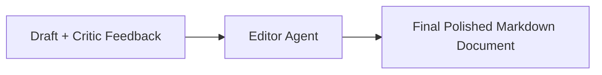

# File 04: Editor Agent (`src/agents/editor.js`)

## Overview
The **Editor Agent** applies final polish, incorporates Critic feedback, fixes grammatical flaws, and formats the output into publication-ready Markdown.

---

## 1. Editor Refinement Pipeline



---

## 2. Editor Implementation (`src/agents/editor.js`)

```javascript
import { ChatOpenAI } from "@langchain/openai";
import { PROMPTS } from "../shared/prompts.js";

export async function runEditorAgent(draftText, criticFeedback) {
    console.log(`[AGENT: Editor] Applying final polish...`);

    const apiKey = process.env.OPENAI_API_KEY;
    if (!apiKey) {
        return `${draftText}\n\n*Edited & Polished by Neta Editor Agent*`;
    }

    const model = new ChatOpenAI({ modelName: "gpt-4o-mini", temperature: 0.3 });
    const prompt = `${PROMPTS.EDITOR}\n\nDRAFT:\n${draftText}\n\nCRITIC FEEDBACK:\n${criticFeedback}\n\nFinal Polished Document:`;

    const response = await model.invoke(prompt);
    return response.content;
}
```

---

## Key Takeaways
1. Takes both original draft and critic feedback into context.
2. Output represents the final deliverable.
