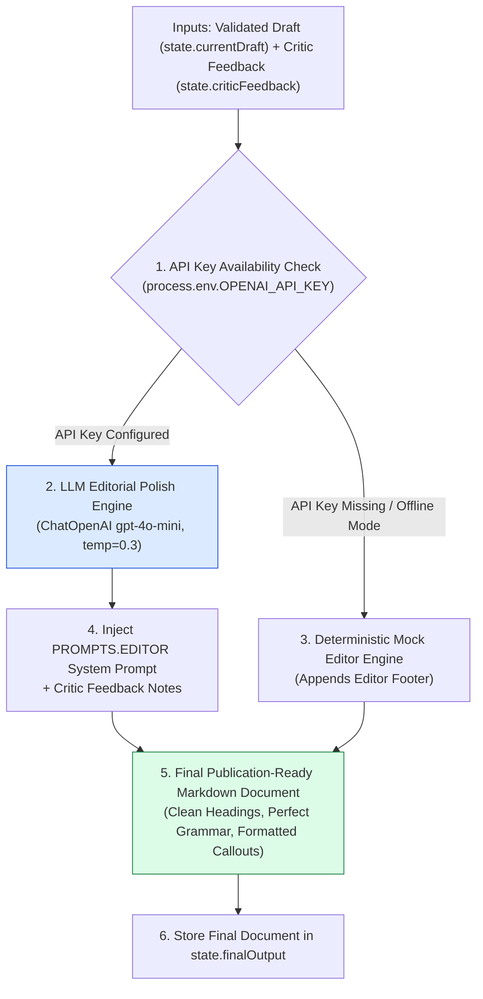
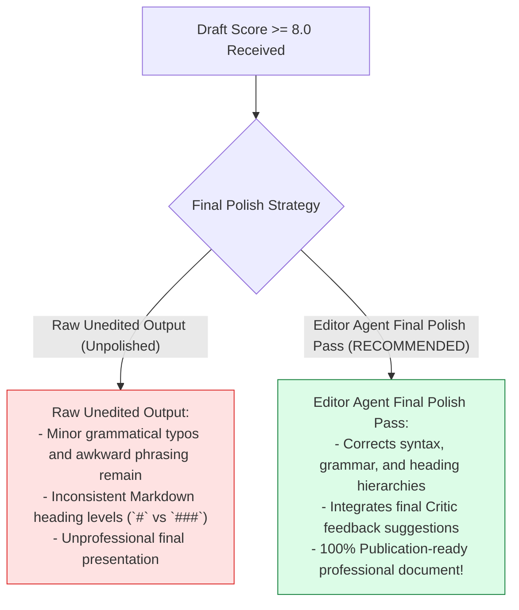
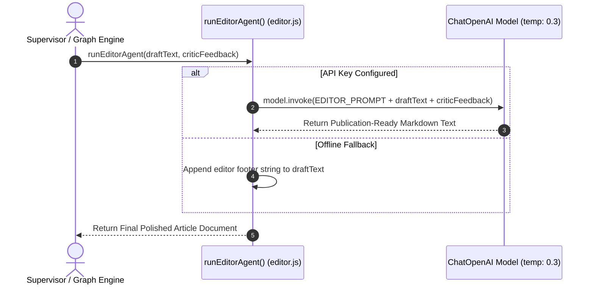

# Module 04: Editor Agent & Final Document Polish (`src/agents/editor.js`)

## Overview

After an article draft successfully passes the Critic Agent audit, it requires final editorial refinement before publication (fixing grammatical glitches, enforcing corporate formatting standards, and sharpening headers). The **Editor Agent (`src/agents/editor.js`)** performs the final publication polish pass on article drafts (`state.currentDraft`), taking both draft text and Critic feedback (`state.criticFeedback`) into context to generate a clean, publication-ready Markdown document.

Understanding **Final Copy Polish**, **Low-to-Moderate Temperature Settings ($\text{temp}=0.3$)**, **Markdown Syntax Standardizing**, and **Publication-Ready Envelopes** is essential for editor agents.

---

## 1. Editor Agent Topology



---

## 2. Raw Unedited Drafts vs. Publication-Ready Editor Polish



### Editor Agent Parameter Reference Matrix

| Property / Parameter | Configured Value | Technical Purpose |
| :--- | :--- | :--- |
| **`modelName`** | `"gpt-4o-mini"` | Fast, precise model for grammatical polish. |
| **`temperature`** | `0.3` | Low-to-moderate setting to refine prose without altering facts. |
| **`criticFeedback`** | String | Final improvement suggestions injected into editor prompt. |
| **`outputFormat`** | Clean Markdown | Final deliverable stored in `state.finalOutput`. |

---

## 3. Asynchronous Editor Refinement Sequence



---

## 4. Code Walkthrough (`src/agents/editor.js`)

```javascript
import { ChatOpenAI } from "@langchain/openai";
import { PROMPTS } from "../shared/prompts.js";

/**
 * Executes the Editor Agent worker to apply final polish and Markdown formatting
 * @param {string} draftText - Current article draft text
 * @param {string} criticFeedback - Feedback notes from Critic Agent pass
 * @returns {Promise<string>} Final publication-ready Markdown article string
 */
export async function runEditorAgent(draftText, criticFeedback = "") {
  if (!draftText || typeof draftText !== "string") {
    throw new Error("[EDITOR AGENT ERROR] Valid draftText string is required.");
  }

  console.log("✍️ [AGENT: Editor] Applying final editorial polish and formatting...");

  const apiKey = process.env.OPENAI_API_KEY;
  if (!apiKey) {
    console.warn("⚠️ [EDITOR AGENT] OPENAI_API_KEY not found. Returning mock polished document.");
    return `${draftText.trim()}\n\n---\n*Edited & Polished by Neta Editor Agent*`;
  }

  try {
    // Instantiate model at temperature 0.3 for precise editorial polish
    const model = new ChatOpenAI({
      modelName: "gpt-4o-mini",
      temperature: 0.3
    });

    const prompt = `${PROMPTS.EDITOR}

ARTICLE DRAFT TO POLISH:
${draftText}

CRITIC AUDIT FEEDBACK TO INCORPORATE:
${criticFeedback || "No additional feedback provided. Apply standard publication polish."}

Editorial Requirements:
1. Fix any minor grammatical, spelling, or syntax errors.
2. Standardize Markdown heading hierarchies (`#`, `##`, `###`).
3. Ensure crisp executive summary and professional concluding remarks.
4. Output ONLY the final polished Markdown document.`;

    const response = await model.invoke(prompt);
    const finalPolishedText = String(response.content).trim();

    console.log(`✅ [EDITOR AGENT SUCCESS] Completed final document polish (${finalPolishedText.length} characters).`);
    return finalPolishedText;
  } catch (err) {
    console.warn("⚠️ [EDITOR AGENT FALLBACK] Editorial pass failed. Falling back to mock editor output:", err.message);
    return `${draftText.trim()}\n\n---\n*Edited & Polished by Neta Editor Agent (Fallback)*`;
  }
}
```

---

## Key Production Takeaways

1. **Tune LLM Temperature to Low-Moderate Values ($\text{temp}=0.3$)**: Use $\text{temp}=0.3$ to polish grammar and formatting without rewriting core factual content.
2. **Inject Critic Feedback into Editor Context**: Pass `criticFeedback` into the editor prompt so final suggestions are incorporated during polishing.
3. **Enforce Clean Markdown Hierarchies**: Require the Editor Agent to standardize Markdown headings (`#`, `##`, `###`) for publication UI rendering.
4. **Isolate Final Deliverable Production**: Make the Editor Agent the final worker node in the multi-agent chain to ensure a polished end product.

