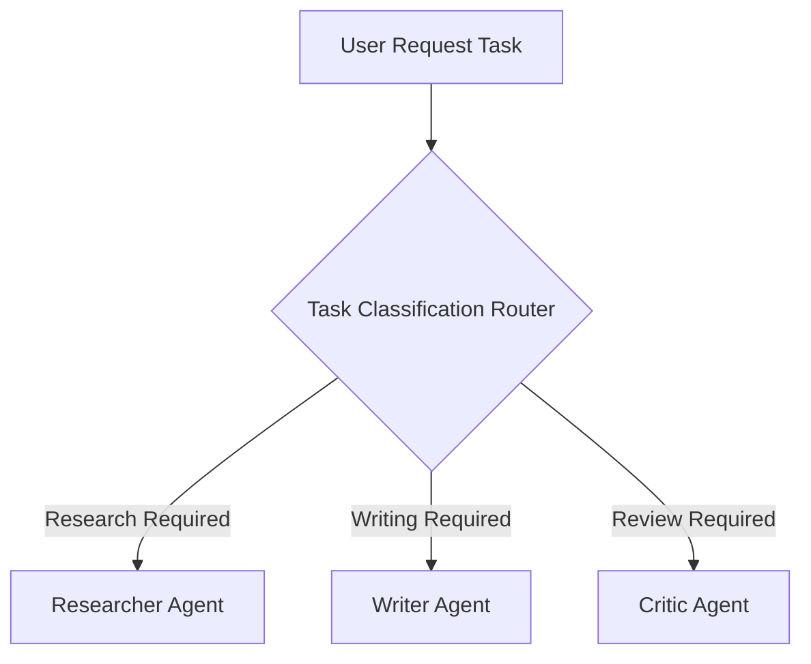

# File 05: Router / Dispatcher Orchestrator (`src/orchestrator/router.js`)

## Overview
The **Router / Dispatcher** pattern inspects user request task classification and dispatches the task to the appropriate specialized agent worker.

---

## 1. Router Classification Flow



---

## 2. Router Implementation (`src/orchestrator/router.js`)

```javascript
export function routeTask(taskDescription) {
    const desc = taskDescription.toLowerCase();

    if (desc.includes("research") || desc.includes("find facts")) {
        return "researcher";
    }
    if (desc.includes("write") || desc.includes("draft")) {
        return "writer";
    }
    if (desc.includes("review") || desc.includes("critique")) {
        return "critic";
    }

    return "supervisor"; // Default to full multi-agent workflow
}
```

---

## Key Takeaways
1. Fast, lightweight task routing without unnecessary LLM overhead.
2. Directs specialized tasks to dedicated worker agents.
