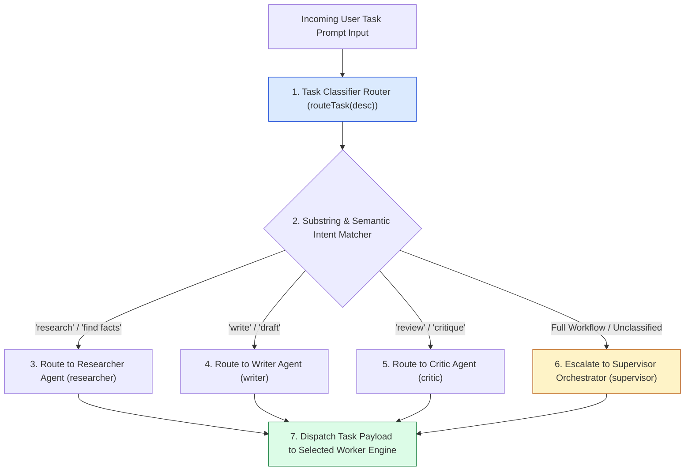
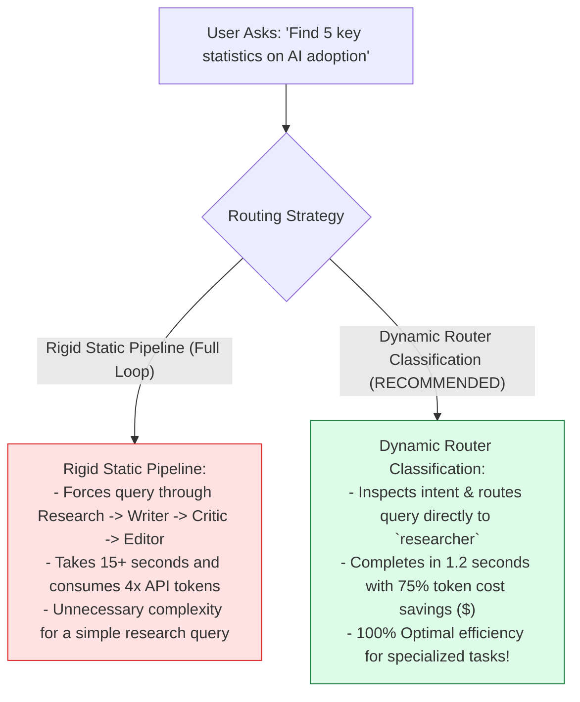
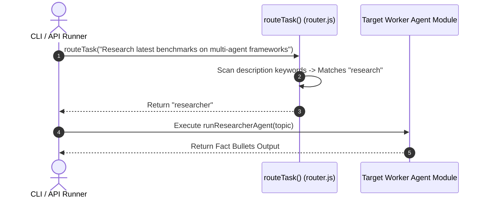

# Module 05: Router & Dispatcher Orchestrator Pattern (`src/orchestrator/router.js`)

## Overview

Not every incoming user task requires triggering a full 4-stage multi-agent pipeline. For instance, if a user simply asks for fact bullet points on a topic, invoking the Writer, Critic, and Editor agents wastes time and tokens. The **Router / Dispatcher Pattern (`src/orchestrator/router.js`)** provides a zero-latency task classifier (`routeTask`) that inspects task descriptions and routes requests directly to specialized worker agents (`researcher`, `writer`, `critic`, `editor`) or escalates to the full `supervisor` pipeline when comprehensive creation is required.

Understanding **Deterministic Task Classification**, **Router / Dispatcher Topologies**, **Target Worker Dictionaries**, and **Token Savings Optimization** is essential for multi-agent routing.

---

## 1. Router Classification Topology



---

## 2. Rigid Static Routing vs. Dynamic Router Classification



### Task Classification Routing Matrix

| Targeted Intent Keyword | Destination Agent Target | Operational Executed Function | Technical Benefit |
| :--- | :--- | :--- | :--- |
| **`"research"`, `"facts"`** | `"researcher"` | `runResearcherAgent(topic)` | Instant fact retrieval without drafting. |
| **`"write"`, `"draft"`** | `"writer"` | `runWriterAgent(topic, data)` | Fast drafting without research pass. |
| **`"review"`, `"critique"`**| `"critic"` | `runCriticAgent(draftText)` | Immediate quality score evaluation. |
| **`"full"`, Default** | `"supervisor"` | `runSupervisorWorkflow(topic)` | Complete multi-agent pipeline loop. |

---

## 3. Asynchronous Routing Sequence



---

## 4. Code Walkthrough (`src/orchestrator/router.js`)

```javascript
/**
 * Router / Dispatcher Orchestrator Class
 * Classifies incoming user tasks and routes them to specialized worker agents
 */
export class TaskRouter {
  /**
   * Evaluates task description and returns target worker agent identifier
   * @param {string} taskDescription - User task prompt string
   * @returns {string} Target worker identifier ("researcher" | "writer" | "critic" | "editor" | "supervisor")
   */
  static routeTask(taskDescription) {
    if (!taskDescription || typeof taskDescription !== "string") {
      console.warn("⚠️ [TASK ROUTER] Empty task description received. Defaulting to 'supervisor'.");
      return "supervisor";
    }

    const desc = taskDescription.toLowerCase().trim();
    console.log(`🔀 [TASK ROUTER] Classifying task intent for: "${taskDescription}"...`);

    // 1. Classification Branch: Research Intent
    if (desc.includes("research") || desc.includes("find facts") || desc.includes("gather data") || desc.includes("statistics")) {
      console.log("➡️ [TASK ROUTER MATCH] Targeted Worker: 'researcher'");
      return "researcher";
    }

    // 2. Classification Branch: Writing Intent
    if (desc.includes("write") || desc.includes("draft") || desc.includes("compose") || desc.includes("article")) {
      console.log("➡️ [TASK ROUTER MATCH] Targeted Worker: 'writer'");
      return "writer";
    }

    // 3. Classification Branch: Critique / Review Intent
    if (desc.includes("review") || desc.includes("critique") || desc.includes("evaluate") || desc.includes("audit")) {
      console.log("➡️ [TASK ROUTER MATCH] Targeted Worker: 'critic'");
      return "critic";
    }

    // 4. Classification Branch: Editorial Polish Intent
    if (desc.includes("edit") || desc.includes("polish") || desc.includes("format") || desc.includes("grammar")) {
      console.log("➡️ [TASK ROUTER MATCH] Targeted Worker: 'editor'");
      return "editor";
    }

    // 5. Default Escalation Branch: Full Multi-Agent Pipeline
    console.log("🔄 [TASK ROUTER DEFAULT] Unclassified complex task. Escalating to 'supervisor' pipeline.");
    return "supervisor";
  }
}

// Convenience export matching function signature
export function routeTask(taskDescription) {
  return TaskRouter.routeTask(taskDescription);
}
```

---

## Key Production Takeaways

1. **Optimize Latency with Intent Routing**: Route simple tasks directly to dedicated worker agents (`researcher`, `writer`) rather than always triggering full multi-agent pipelines.
2. **Reduce LLM API Token Costs**: Bypassing unneeded worker agents saves significant token expenditure on routine user queries.
3. **Escalate Unclassified Tasks to Supervisors**: Fall back to the full `supervisor` workflow when task descriptions do not match single-worker keywords.
4. **Maintain Clean Dispatcher Interfaces**: Expose simple classification functions (`routeTask(description)`) so host applications can determine worker routing easily.


## Learn from the implementation

Use the matching source file as an executable example, not just something to copy. Before running it, state in your own words what data enters the module, what it returns, and which values it changes. Then trace one realistic request from the caller through each function.

Pay special attention to these questions:

- **Data flow:** Which object, array, string, or state value moves between functions? What shape must it have?
- **Control flow:** Which branch, loop, early return, or retry changes the outcome? What condition selects it?
- **Async boundaries:** Where does the code wait for an LLM, database, network, file system, or tool? What should happen if that operation rejects or returns no result?
- **Side effects:** Which lines log information, make an external request, store data, or mutate in-memory state? Keep those distinct from pure calculations.
- **Production limits:** Which assumptions are only safe for a tutorial—for example, in-memory storage, fixed thresholds, approximate token counts, mock data, or a hard-coded batch size?

A useful practice is to change one input at a time and predict the result before executing it. If you can explain why the output changed, when the module should be used, and one way it could fail, you understand the concept rather than only the syntax.
