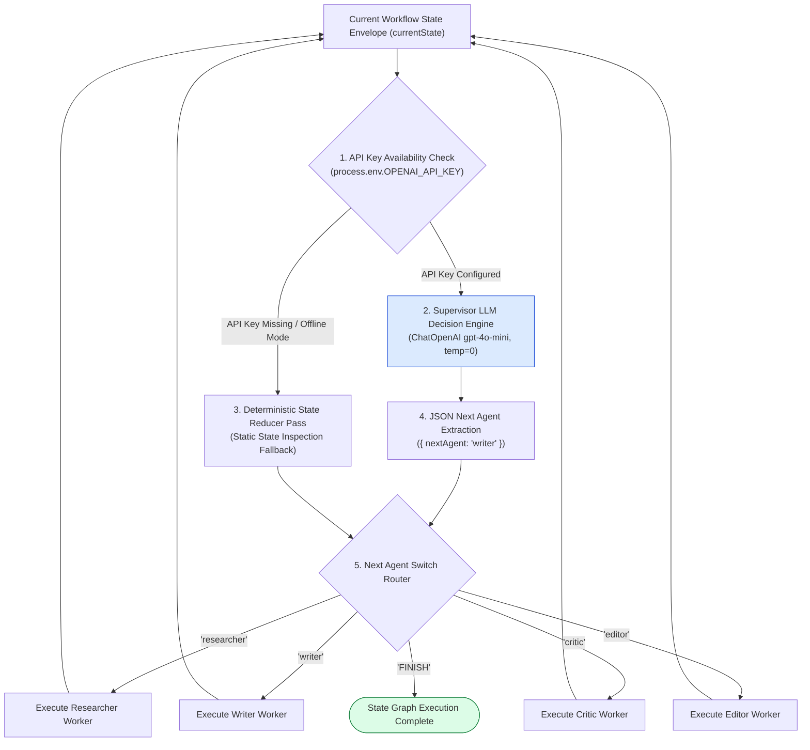
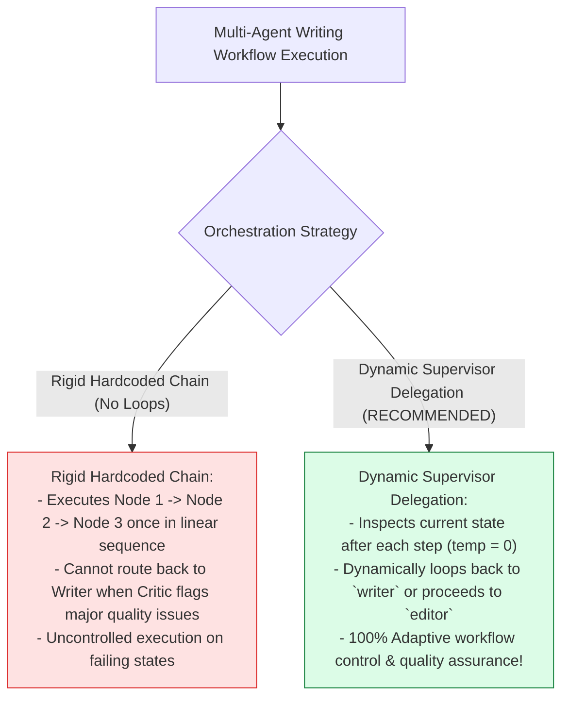
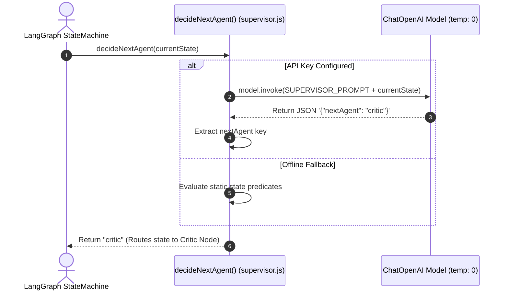

# Module 06: Supervisor Agent Orchestrator & Dynamic Delegation (`src/orchestrator/supervisor.js`)

## Overview

Static, linear execution pipelines fail when workflows require dynamic iteration (e.g. routing back to the Writer Agent if the Critic Agent score is low). The **Supervisor Agent Orchestrator (`src/orchestrator/supervisor.js`)** acts as an intelligent team lead. Operating at zero temperature (`temperature: 0` for deterministic decision-making), it inspects the active state channels (`researchData`, `draftText`, `criticScore`, `finalDocument`), evaluates progress, and selects the next worker agent (`"researcher"`, `"writer"`, `"critic"`, `"editor"`, or `"FINISH"`).

Understanding **Dynamic Next-Agent Decisions (`decideNextAgent`)**, **State Channel Progress Inspection**, **Termination Signals (`FINISH`)**, and **Deterministic Fallback Reducers** is essential for supervisor patterns.

---

## 1. Supervisor Orchestration Topology



---

## 2. Rigid Hardcoded Chains vs. Dynamic Supervisor Delegation



### Supervisor Decision State Reference Matrix

| State Channel Inspection | Condition Predicate | Next Agent Selected | Operational Function |
| :--- | :--- | :--- | :--- |
| `!currentState.researchData` | True | `"researcher"` | Gathers research facts first. |
| `!currentState.draftText` | True | `"writer"` | Composes initial article draft. |
| `!currentState.criticScore` | True | `"critic"` | Audits draft quality & assigns score. |
| `criticScore < 8.0` | True (Iterate) | `"writer"` | Re-drafts article with Critic feedback. |
| `!currentState.finalDocument`| True | `"editor"` | Applies final publication polish. |
| `currentState.finalDocument` | True | `"FINISH"` | Terminates state machine loop. |

---

## 3. Asynchronous Supervisor Decision Sequence



---

## 4. Code Walkthrough (`src/orchestrator/supervisor.js`)

```javascript
import { ChatOpenAI } from "@langchain/openai";

/**
 * Supervisor Agent Orchestrator
 * Evaluates active workflow state channels and decides the next worker agent or FINISH signal
 * @param {Object} currentState - Current workflow state graph object
 * @returns {Promise<string>} Next agent node identifier string ("researcher" | "writer" | "critic" | "editor" | "FINISH")
 */
export async function decideNextAgent(currentState = {}) {
  console.log("👑 [SUPERVISOR AGENT] Inspecting workflow state and deciding next worker...");

  const apiKey = process.env.OPENAI_API_KEY;
  if (!apiKey) {
    console.warn("⚠️ [SUPERVISOR AGENT] OPENAI_API_KEY not found. Using deterministic fallback state reducer.");
    return fallbackNextAgent(currentState);
  }

  try {
    // Instantiate model at temperature 0 for deterministic decision-making
    const model = new ChatOpenAI({
      modelName: "gpt-4o-mini",
      temperature: 0
    });

    const hasResearch = !!currentState.researchData;
    const hasDraft = !!currentState.draftText;
    const hasCriticScore = typeof currentState.criticScore === "number";
    const hasFinalDoc = !!currentState.finalDocument;
    const criticPassed = currentState.criticPassed === true;

    const prompt = `You are the Executive Supervisor Team Lead orchestrating a multi-agent publication workflow.
Based on the current workflow state summary below, select the next best agent worker to execute.

CURRENT WORKFLOW STATE:
- Research Completed: ${hasResearch}
- Draft Composed: ${hasDraft}
- Critic Audited: ${hasCriticScore} (Score: ${currentState.criticScore || "N/A"}, Passed: ${criticPassed})
- Editor Polished: ${hasFinalDoc}
- Revision Iterations Count: ${currentState.iterationCount || 0}

Decision Logic Rules:
1. If research is missing -> return "researcher".
2. If draft is missing OR if critic passed is false (and iterations < 3) -> return "writer".
3. If draft exists but critic audit is missing -> return "critic".
4. If draft passed critic audit (score >= 8.0) but editor polish is missing -> return "editor".
5. If final editor document exists OR iterations >= 3 -> return "FINISH".

Available Output Choices: ["researcher", "writer", "critic", "editor", "FINISH"]
Return ONLY a valid JSON object: { "nextAgent": "string" }`;

    const response = await model.invoke(prompt);
    const contentText = String(response.content).trim();

    const jsonMatch = contentText.match(/\{[\s\S]*\}/);
    if (!jsonMatch) {
      throw new Error("Failed to parse JSON from Supervisor Agent response.");
    }

    const parsed = JSON.parse(jsonMatch[0]);
    const selectedAgent = String(parsed.nextAgent).trim();

    console.log(`✅ [SUPERVISOR DECISION] Selected Next Worker: '${selectedAgent}'`);
    return selectedAgent;
  } catch (err) {
    console.warn("⚠️ [SUPERVISOR FALLBACK] LLM decision failed. Using fallback reducer:", err.message);
    return fallbackNextAgent(currentState);
  }
}

/**
 * Deterministic offline fallback state reducer for next agent decision
 */
function fallbackNextAgent(currentState) {
  if (!currentState.researchData) return "researcher";
  if (!currentState.draftText) return "writer";
  if (typeof currentState.criticScore !== "number") return "critic";
  if (currentState.criticPassed === false && (currentState.iterationCount || 0) < 3) return "writer";
  if (!currentState.finalDocument) return "editor";
  return "FINISH";
}
```

---

## Key Production Takeaways

1. **Tune LLM Temperature to Zero ($\text{temp}=0$)**: Use zero temperature for supervisor agents to ensure deterministic, reproducible worker selection.
2. **Inspect Explicit State Predicates**: Provide clear summaries of state channels (`hasResearch`, `hasDraft`, `criticPassed`) in the supervisor prompt.
3. **Enforce Iteration Caps**: Include maximum iteration guards (`iterations < 3`) to prevent infinite loop costs if drafts repeatedly fail critic audits.
4. **Implement Deterministic Fallback Reducers**: Supply static fallback functions (`fallbackNextAgent`) to ensure workflows complete even when offline.

