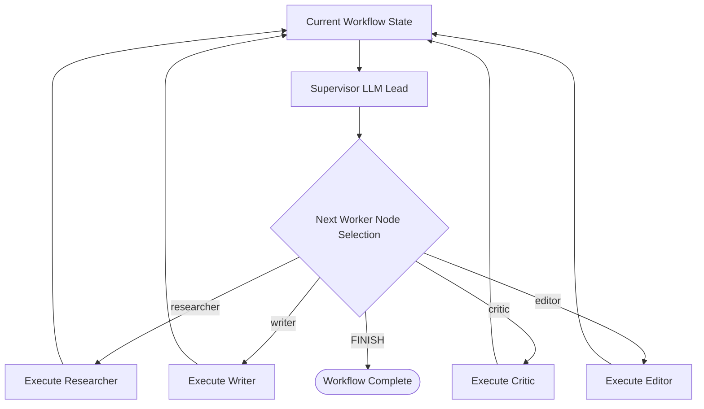

# File 06: Supervisor Agent Orchestrator (`src/orchestrator/supervisor.js`)

## Overview
The **Supervisor Agent** acts as an orchestrator team lead, evaluating current workflow state and dynamically deciding which worker agent should execute next or if the workflow is complete (`FINISH`).

---

## 1. Supervisor Orchestration Loop



---

## 2. Supervisor Implementation (`src/orchestrator/supervisor.js`)

```javascript
import { ChatOpenAI } from "@langchain/openai";

export async function decideNextAgent(currentState) {
    const apiKey = process.env.OPENAI_API_KEY;
    if (!apiKey) {
        // Fallback static state transitions
        if (!currentState.researchData) return "researcher";
        if (!currentState.draftText) return "writer";
        if (!currentState.criticScore) return "critic";
        if (!currentState.finalDocument) return "editor";
        return "FINISH";
    }

    const model = new ChatOpenAI({ modelName: "gpt-4o-mini", temperature: 0 });

    const prompt = `
You are the Supervisor Team Lead. Given the current state of the document creation workflow, select the next agent to run.

Current State:
- Research Done: ${!!currentState.researchData}
- Draft Written: ${!!currentState.draftText}
- Critic Evaluated: ${!!currentState.criticScore}
- Editor Polished: ${!!currentState.finalDocument}

Available Next Steps: ["researcher", "writer", "critic", "editor", "FINISH"]

Return JSON: { "nextAgent": "string" }`;

    const response = await model.invoke(prompt);
    const parsed = JSON.parse(response.content.match(/\{[\s\S]*\}/)[0]);
    return parsed.nextAgent;
}
```

---

## Key Takeaways
1. Dynamic LLM decision-making for multi-agent task routing.
2. Manages task delegation across worker team members.
