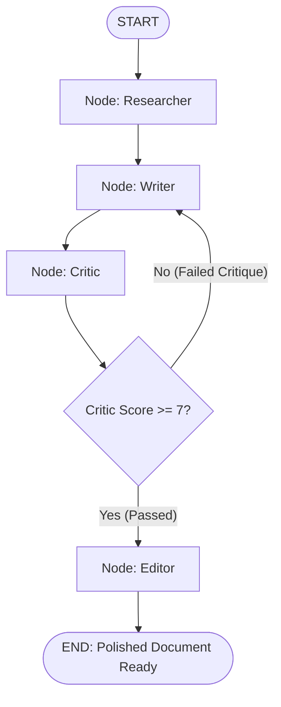

# File 07: Multi-Agent LangGraph State Graph (`src/orchestrator/state-graph.js`)

## Overview
The **Multi-Agent LangGraph State Graph** compiles the complete multi-agent workflow into an executable state machine graph using **`@langchain/langgraph`**.

---

## 1. Multi-Agent Graph State Machine Topology



---

## 2. Multi-Agent State Graph Implementation (`src/orchestrator/state-graph.js`)

```javascript
import { StateGraph, Annotation, END, START } from "@langchain/langgraph";
import { runResearcherAgent } from "../agents/researcher.js";
import { runWriterAgent } from "../agents/writer.js";
import { runCriticAgent } from "../agents/critic.js";
import { runEditorAgent } from "../agents/editor.js";

// Multi-Agent State Definition
const MultiAgentState = Annotation.Root({
    topic: Annotation({ reducer: (x, y) => y ?? x, default: () => "" }),
    researchData: Annotation({ reducer: (x, y) => y ?? x, default: () => "" }),
    draftText: Annotation({ reducer: (x, y) => y ?? x, default: () => "" }),
    criticScore: Annotation({ reducer: (x, y) => y ?? x, default: () => 0 }),
    criticFeedback: Annotation({ reducer: (x, y) => y ?? x, default: () => "" }),
    finalDocument: Annotation({ reducer: (x, y) => y ?? x, default: () => "" })
});

export function buildMultiAgentGraph() {
    const workflow = new StateGraph(MultiAgentState)
        .addNode("researcher", async state => ({
            researchData: await runResearcherAgent(state.topic)
        }))
        .addNode("writer", async state => ({
            draftText: await runWriterAgent(state.topic, state.researchData)
        }))
        .addNode("critic", async state => {
            const result = await runCriticAgent(state.draftText);
            return { criticScore: result.score, criticFeedback: result.feedback };
        })
        .addNode("editor", async state => ({
            finalDocument: await runEditorAgent(state.draftText, state.criticFeedback)
        }))
        
        .addEdge(START, "researcher")
        .addEdge("researcher", "writer")
        .addEdge("writer", "critic")
        
        // Conditional Edge Loop: Rewrite draft if score < 7
        .addConditionalEdges("critic", state => {
            if (state.criticScore >= 7) return "editor";
            console.log("[GRAPH EDGE] Score < 7. Routing back to 'writer' for revision.");
            return "writer";
        }, { editor: "editor", writer: "writer" })

        .addEdge("editor", END);

    return workflow.compile();
}
```

---

## Key Takeaways
1. Implements adversarial feedback loops (Writer $\leftrightarrow$ Critic) in a state graph.
2. Compiles modular worker agents into a deterministic state machine.
