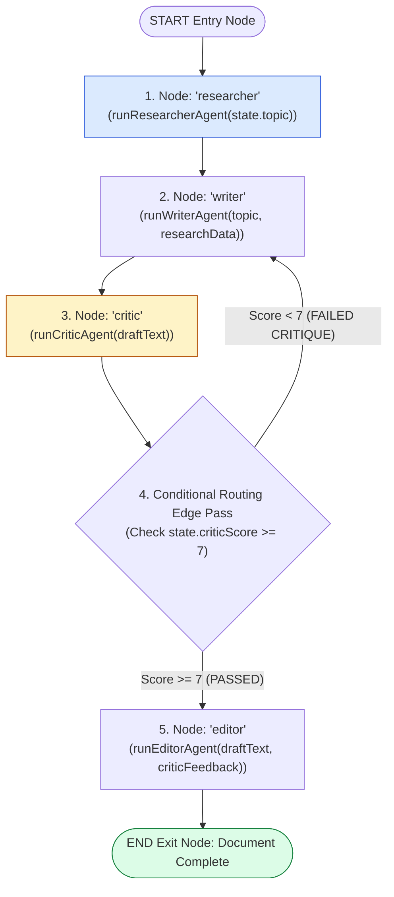
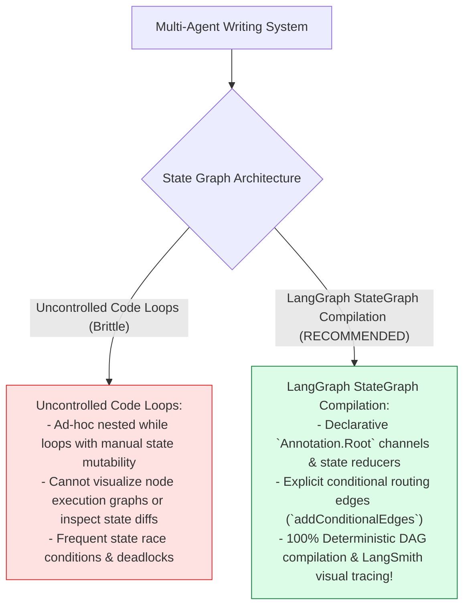
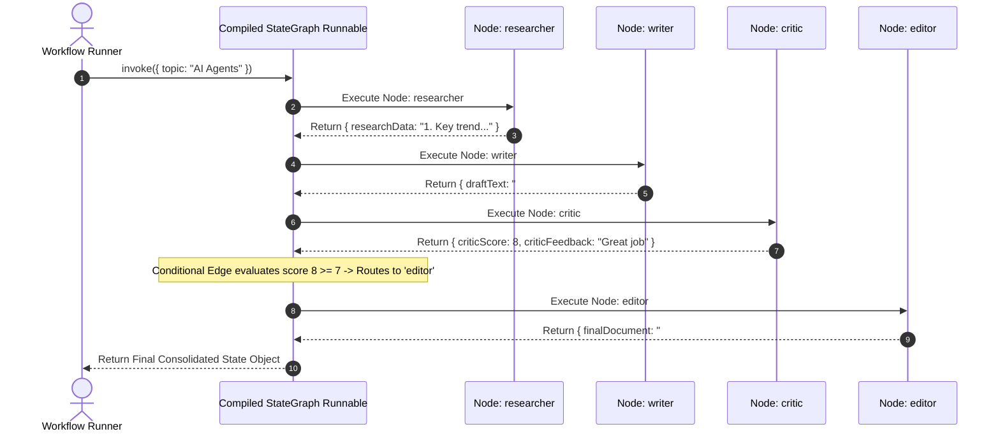

# Module 07: Multi-Agent LangGraph State Graph Compilation (`src/orchestrator/state-graph.js`)

## Overview

Orchestrating multiple autonomous worker agents requiring feedback loops and dynamic branching cannot be accomplished cleanly with basic array iteration loops. The **Multi-Agent LangGraph State Graph (`src/orchestrator/state-graph.js`)** compiles the 4-agent network (**Researcher**, **Writer**, **Critic**, **Editor**) into an executable state machine DAG using **`@langchain/langgraph`**. It defines state channels (`Annotation.Root`), adds node handlers, connects static edges, and binds conditional loop edges (`addConditionalEdges`) to route state back to the Writer Agent if the Critic Agent score is below threshold ($\text{score} < 7$).

Understanding **StateGraph Channel Annotations**, **Node Handler Partial Mutations**, **Conditional Routing Edges**, and **Graph DAG Compilation (`workflow.compile()`)** is essential for multi-agent state machines.

---

## 1. Multi-Agent LangGraph DAG Topology



---

## 2. Uncontrolled Agent Loops vs. LangGraph State Machine Compilation



### Multi-Agent State Channel Annotation Specification

| Channel Key | Reducer Pattern | Initial Default | Technical Purpose |
| :--- | :--- | :--- | :--- |
| **`topic`** | `(x, y) => y ?? x` | `""` | User requested article topic string. |
| **`researchData`** | `(x, y) => y ?? x` | `""` | Fact bullet points returned by Researcher. |
| **`draftText`** | `(x, y) => y ?? x` | `""` | Article draft composed by Writer. |
| **`criticScore`** | `(x, y) => y ?? x` | `0` | Numerical quality score ($0$ to $10$). |
| **`criticFeedback`**| `(x, y) => y ?? x` | `""` | Revision feedback text notes. |
| **`finalDocument`** | `(x, y) => y ?? x` | `""` | Publication-ready document from Editor. |

---

## 3. Asynchronous Multi-Agent Graph State Transitions



---

## 4. Code Walkthrough (`src/orchestrator/state-graph.js`)

```javascript
import { StateGraph, Annotation, END, START } from "@langchain/langgraph";
import { runResearcherAgent } from "../agents/researcher.js";
import { runWriterAgent } from "../agents/writer.js";
import { runCriticAgent } from "../agents/critic.js";
import { runEditorAgent } from "../agents/editor.js";

/**
 * Shared State Schema definition for Multi-Agent Publication Workflow
 */
const MultiAgentState = Annotation.Root({
  topic: Annotation({ reducer: (x, y) => y ?? x, default: () => "" }),
  researchData: Annotation({ reducer: (x, y) => y ?? x, default: () => "" }),
  draftText: Annotation({ reducer: (x, y) => y ?? x, default: () => "" }),
  criticScore: Annotation({ reducer: (x, y) => y ?? x, default: () => 0 }),
  criticFeedback: Annotation({ reducer: (x, y) => y ?? x, default: () => "" }),
  finalDocument: Annotation({ reducer: (x, y) => y ?? x, default: () => "" })
});

/**
 * Builds and compiles the multi-agent LangGraph state machine DAG
 * @returns {CompiledStateGraph} Compiled executable graph runnable
 */
export function buildMultiAgentGraph() {
  console.log("⚡ [STATE GRAPH] Compiling Multi-Agent LangGraph State Machine...");

  const workflow = new StateGraph(MultiAgentState)
    // 1. Add Processing Worker Nodes
    .addNode("researcher", async (state) => {
      console.log(`📌 [GRAPH NODE: researcher] Researching topic: "${state.topic}"`);
      const researchData = await runResearcherAgent(state.topic);
      return { researchData };
    })
    .addNode("writer", async (state) => {
      console.log(`📌 [GRAPH NODE: writer] Drafting document...`);
      const draftText = await runWriterAgent(state.topic, state.researchData);
      return { draftText };
    })
    .addNode("critic", async (state) => {
      console.log(`📌 [GRAPH NODE: critic] Evaluating draft score...`);
      const result = await runCriticAgent(state.draftText);
      return {
        criticScore: result.score,
        criticFeedback: result.feedback
      };
    })
    .addNode("editor", async (state) => {
      console.log(`📌 [GRAPH NODE: editor] Applying final editorial polish...`);
      const finalDocument = await runEditorAgent(state.draftText, state.criticFeedback);
      return { finalDocument };
    })

    // 2. Add Static Edges
    .addEdge(START, "researcher")
    .addEdge("researcher", "writer")
    .addEdge("writer", "critic")

    // 3. Add Conditional Edge Loop: Rewrite draft if criticScore < 7
    .addConditionalEdges(
      "critic",
      (state) => {
        if (state.criticScore >= 7) {
          console.log(`🔀 [GRAPH CONDITIONAL EDGE] Score ${state.criticScore} >= 7. Routing to 'editor'.`);
          return "editor";
        }
        console.log(`🔀 [GRAPH CONDITIONAL EDGE] Score ${state.criticScore} < 7. Routing back to 'writer' for revision.`);
        return "writer";
      },
      { editor: "editor", writer: "writer" }
    )

    // 4. Add Exit Edge
    .addEdge("editor", END);

  // Compile DAG State Machine
  const app = workflow.compile();
  console.log("✅ [STATE GRAPH COMPILED] Multi-Agent State Machine ready for execution.");
  return app;
}
```

---

## Key Production Takeaways

1. **Compile State Machine DAGs via `StateGraph`**: Use `@langchain/langgraph` to compile multi-agent networks into state machines with explicit channels and edges.
2. **Implement Conditional Edge Loops**: Add `addConditionalEdges` to route state back to previous worker nodes (`writer`) when quality thresholds fail.
3. **Define Strict Channel Annotations**: Use `Annotation.Root` to manage state channel keys (`topic`, `researchData`, `criticScore`) with overwrite reducers.
4. **Log Node Transitions for Observability**: Include console logs inside node handlers to trace state transitions during execution.


## Learn from the implementation

Use the matching source file as an executable example, not just something to copy. Before running it, state in your own words what data enters the module, what it returns, and which values it changes. Then trace one realistic request from the caller through each function.

Pay special attention to these questions:

- **Data flow:** Which object, array, string, or state value moves between functions? What shape must it have?
- **Control flow:** Which branch, loop, early return, or retry changes the outcome? What condition selects it?
- **Async boundaries:** Where does the code wait for an LLM, database, network, file system, or tool? What should happen if that operation rejects or returns no result?
- **Side effects:** Which lines log information, make an external request, store data, or mutate in-memory state? Keep those distinct from pure calculations.
- **Production limits:** Which assumptions are only safe for a tutorial—for example, in-memory storage, fixed thresholds, approximate token counts, mock data, or a hard-coded batch size?

A useful practice is to change one input at a time and predict the result before executing it. If you can explain why the output changed, when the module should be used, and one way it could fail, you understand the concept rather than only the syntax.
