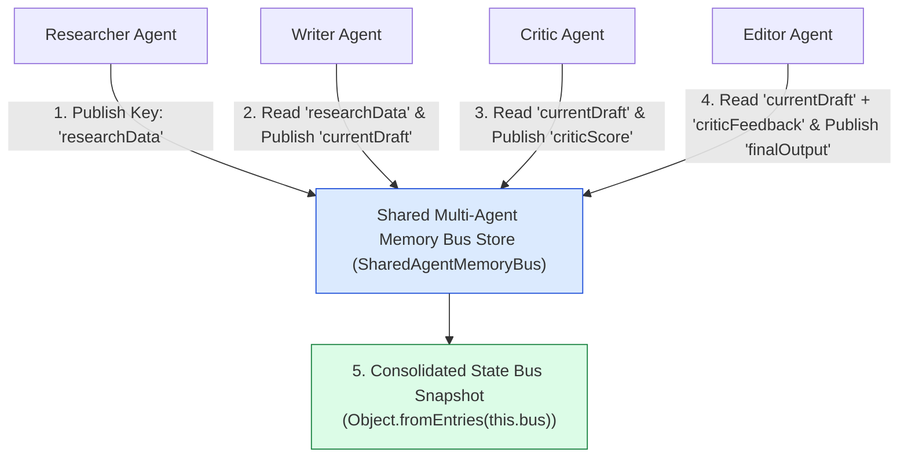
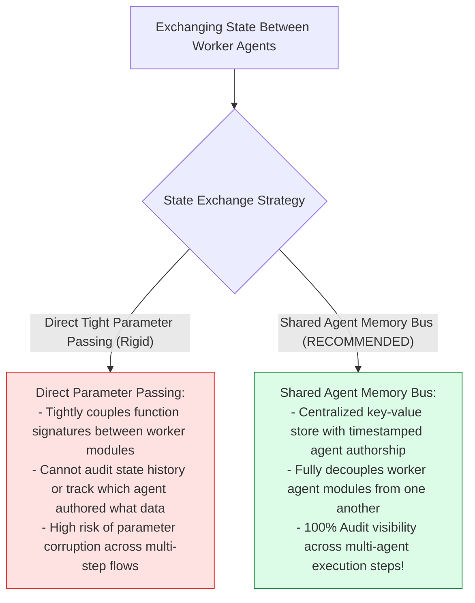
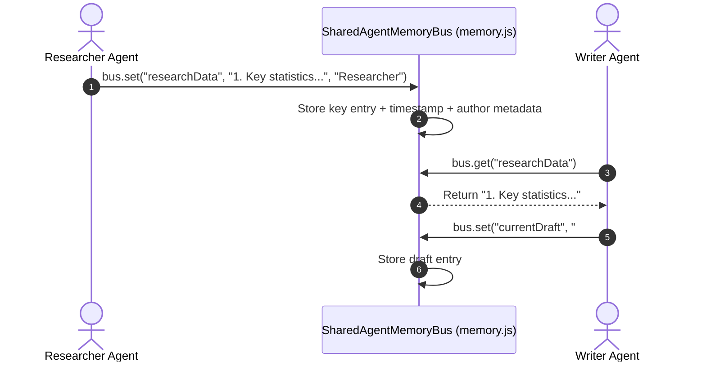

# Module 08: Shared Multi-Agent Memory Bus (`src/shared/memory.js`)

## Overview

In multi-agent systems where worker agents operate asynchronously across different node execution steps, passing state through global variables or direct function parameter chains creates high coupling and state loss. The **Shared Multi-Agent Memory Bus (`src/shared/memory.js`)** provides a centralized, key-value state store (`SharedAgentMemoryBus`) that allows worker agents (**Researcher**, **Writer**, **Critic**, **Editor**) to publish intermediate outputs and read predecessor results, complete with timestamped agent authorship metadata.

Understanding **Pub/Sub Inter-Agent State Bus Patterns**, **Key-Value State Envelopes**, **Agent Authorship Metadata**, and **Decoupled Memory Architectures** is essential for multi-agent state management.

---

## 1. Shared Memory Bus Topology



---

## 2. Direct Tight Parameter Passing vs. Shared Memory Bus



### Shared Memory Bus Envelope Specification

| Envelope Field | Data Type | Sample Memory Value | Technical Purpose |
| :--- | :--- | :--- | :--- |
| **`data`** | `Any` | `"Multi-agent trends..."` | Stored payload value (text, JSON object, score). |
| **`agentName`** | `String` | `"Researcher"` | Name identifier of publishing agent worker. |
| **`timestamp`** | `String` | ISO 8601 String | ISO timestamp recording when state key was updated. |

---

## 3. Asynchronous Memory Bus Read/Write Sequence



---

## 4. Code Walkthrough (`src/shared/memory.js`)

```javascript
/**
 * Shared Multi-Agent Memory Bus Store
 * Centralized key-value state store with agent authorship tracking
 */
export class SharedAgentMemoryBus {
  constructor() {
    this.bus = new Map();
  }

  /**
   * Publishes or updates a state key in the shared memory bus
   * @param {string} key - State key identifier (e.g. "researchData", "currentDraft")
   * @param {any} data - State payload data
   * @param {string} agentName - Name of the worker agent publishing the key
   */
  set(key, data, agentName = "System") {
    if (!key) throw new Error("[MEMORY BUS ERROR] Parameter 'key' string is required.");

    const entry = {
      data,
      agentName,
      timestamp: new Date().toISOString()
    };

    this.bus.set(key, entry);
    console.log(`💾 [MEMORY BUS] Agent '${agentName}' updated key '${key}' at ${entry.timestamp}`);
  }

  /**
   * Fetches data value associated with a state key
   * @param {string} key - Target state key
   * @returns {any} Stored payload data or null if key does not exist
   */
  get(key) {
    const entry = this.bus.get(key);
    return entry ? entry.data : null;
  }

  /**
   * Fetches full envelope object including metadata for a target key
   * @param {string} key - Target state key
   * @returns {Object|null} Memory envelope object ({ data, agentName, timestamp })
   */
  getEnvelope(key) {
    return this.bus.get(key) || null;
  }

  /**
   * Returns complete memory bus snapshot as a plain JavaScript object
   * @returns {Object} Key-value map of memory entries
   */
  getAll() {
    return Object.fromEntries(this.bus);
  }

  /**
   * Resets all keys in the memory bus
   */
  clear() {
    this.bus.clear();
    console.log("🧹 [MEMORY BUS] Cleared all stored memory keys.");
  }
}
```

---

## Key Production Takeaways

1. **Decouple Worker Agents with Memory Busses**: Use a centralized memory store (`SharedAgentMemoryBus`) so worker agents can read predecessor outputs without tight function coupling.
2. **Track Agent Authorship Metadata**: Record publishing agent names (`agentName`) and timestamps (`timestamp`) for full auditability.
3. **Provide Snapshot Extraction Capabilities**: Use `getAll()` to export the entire state bus snapshot for debugging or telemetry logging.
4. **Isolate State Mutations**: Encourage worker agents to publish state keys explicitly (`set("currentDraft", draft)`) to avoid unmonitored variable overrides.

