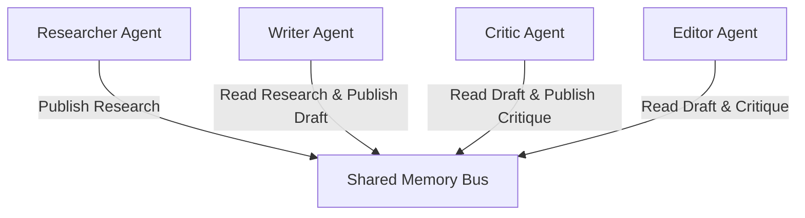

# File 08: Shared Multi-Agent Memory Bus (`src/shared/memory.js`)

## Overview
The **Shared Multi-Agent Memory Bus** provides a centralized pub/sub state log allowing worker agents to share research findings, draft versions, and review notes across execution steps.

---

## 1. Memory Bus Architecture



---

## 2. Memory Bus Implementation (`src/shared/memory.js`)

```javascript
export class SharedAgentMemoryBus {
    constructor() {
        this.bus = new Map();
    }

    set(key, data, agentName) {
        this.bus.set(key, {
            data,
            agentName,
            timestamp: new Date().toISOString()
        });
        console.log(`[MEMORY BUS] '${agentName}' updated key '${key}'`);
    }

    get(key) {
        const entry = this.bus.get(key);
        return entry ? entry.data : null;
    }

    getAll() {
        return Object.fromEntries(this.bus);
    }
}
```

---

## Key Takeaways
1. Enables inter-agent state sharing without coupling agent code directly.
2. Tracks agent authorship for every published state key.
