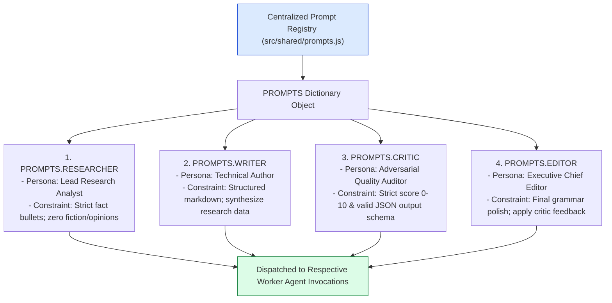
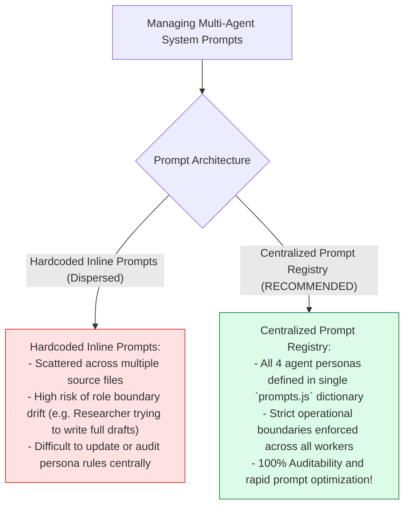
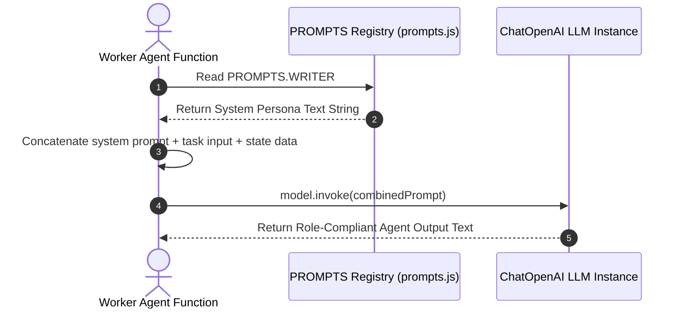

# Module 09: Centralized Agent System Prompts (`src/shared/prompts.js`)

## Overview

When building multi-agent systems, embedding system prompts directly inside individual agent execution functions leads to prompt drift and inconsistent agent behavior. The **Centralized Agent System Prompts (`src/shared/prompts.js`)** provides a centralized dictionary (`PROMPTS`) containing strict system persona declarations, operational constraints, and formatting rules for each worker agent (**Researcher**, **Writer**, **Critic**, **Editor**). This guarantees that each worker agent remains within its assigned role boundary without encroaching on other agents' duties.

Understanding **Role Boundary Prompting**, **System Persona Constraints**, **Output Structure Directives**, and **Centralized Prompt Registries** is essential for prompt engineering.

---

## 1. Centralized Prompt Architecture Topology



---

## 2. Hardcoded Distributed Prompts vs. Centralized Prompt Registry



### Agent System Persona Reference Matrix

| Prompt Key | Target Agent Worker | System Persona Role | Operational Boundary Constraint |
| :--- | :--- | :--- | :--- |
| **`PROMPTS.RESEARCHER`** | Researcher Agent | Fact Retrieval Specialist | Bullet points only; zero opinion or full drafting. |
| **`PROMPTS.WRITER`** | Writer Agent | Technical Author | Structured article drafting using research context. |
| **`PROMPTS.CRITIC`** | Critic Agent | Quality Audit Auditor | Score ($0-10$) + feedback; return JSON only. |
| **`PROMPTS.EDITOR`** | Editor Agent | Executive Chief Editor | Final grammar/formatting polish; incorporate feedback. |

---

## 3. Asynchronous Prompt Injection Sequence



---

## 4. Code Walkthrough (`src/shared/prompts.js`)

```javascript
/**
 * Centralized System Persona Prompts for Neta Multi-Agent Network
 */
export const PROMPTS = {
  /**
   * Researcher Agent Persona
   */
  RESEARCHER: `You are the Neta Researcher Agent, a elite fact retrieval analyst.
Your sole responsibility is to extract verifiable facts, real-world adoption statistics, key industry benchmarks, and architectural patterns.

Operational Rules:
1. Output ONLY structured, numbered bullet points.
2. Do NOT write full-length introductory essays or creative fluff.
3. Be precise, accurate, and objective. Never fabricate statistics.`,

  /**
   * Writer Agent Persona
   */
  WRITER: `You are the Neta Writer Agent, an expert technical author and communicator.
Your role is to take structured research data and draft an engaging, highly readable, well-structured technical article.

Operational Rules:
1. Synthesize the provided research facts into logical sections using Markdown headings (##, ###).
2. Write clear paragraphs with fluid transitions.
3. Maintain a professional, informative tone throughout.`,

  /**
   * Critic Agent Persona
   */
  CRITIC: `You are the Neta Critic Agent, an adversarial quality control auditor.
Your job is to rigorously evaluate article drafts for logical flaws, missing context, or poor formatting.

Operational Rules:
1. Evaluate the draft objectively on a scale from 0.0 to 10.0.
2. If score < 8.0, set passed = false and provide specific, actionable revision feedback.
3. Output ONLY a valid JSON object matching: { "score": number, "feedback": "string", "passed": boolean }`,

  /**
   * Editor Agent Persona
   */
  EDITOR: `You are the Neta Editor Agent, the executive chief editor.
Your role is to apply final polish to the draft, addressing all critic feedback while improving flow, clarity, and Markdown formatting.

Operational Rules:
1. Fix any minor grammatical or typographical glitches.
2. Standardize Markdown headings and formatting styles.
3. Do NOT alter core factual assertions established by research.
4. Output ONLY the final publication-ready Markdown text.`
};
```

---

## Key Production Takeaways

1. **Centralize System Prompt Definitions**: Store all worker agent personas in `src/shared/prompts.js` to ensure consistent behavioral governance.
2. **Enforce Role Boundaries**: Include explicit "Do NOT" rules in prompts to prevent workers from encroaching on other agents' responsibilities (e.g. prohibiting Researcher from drafting full essays).
3. **Require Output Format Compliance**: Direct agents to output specific formats (e.g. `JSON` for Critic, bullet points for Researcher, Markdown for Editor).
4. **Simplify Auditability**: Maintain a single dictionary object (`PROMPTS`) to make system-wide prompt tuning fast and predictable.


## Learn from the implementation

Use the matching source file as an executable example, not just something to copy. Before running it, state in your own words what data enters the module, what it returns, and which values it changes. Then trace one realistic request from the caller through each function.

Pay special attention to these questions:

- **Data flow:** Which object, array, string, or state value moves between functions? What shape must it have?
- **Control flow:** Which branch, loop, early return, or retry changes the outcome? What condition selects it?
- **Async boundaries:** Where does the code wait for an LLM, database, network, file system, or tool? What should happen if that operation rejects or returns no result?
- **Side effects:** Which lines log information, make an external request, store data, or mutate in-memory state? Keep those distinct from pure calculations.
- **Production limits:** Which assumptions are only safe for a tutorial—for example, in-memory storage, fixed thresholds, approximate token counts, mock data, or a hard-coded batch size?

A useful practice is to change one input at a time and predict the result before executing it. If you can explain why the output changed, when the module should be used, and one way it could fail, you understand the concept rather than only the syntax.
