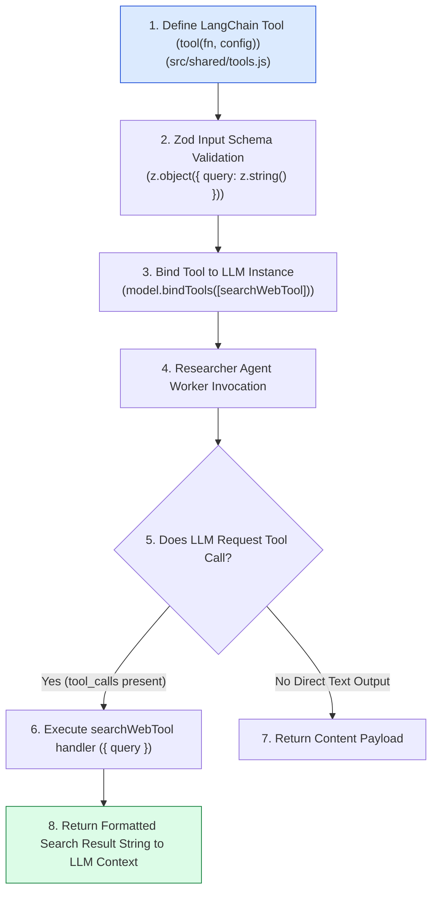
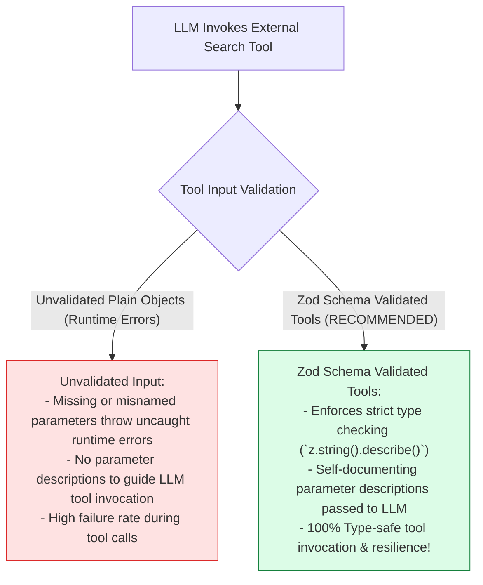
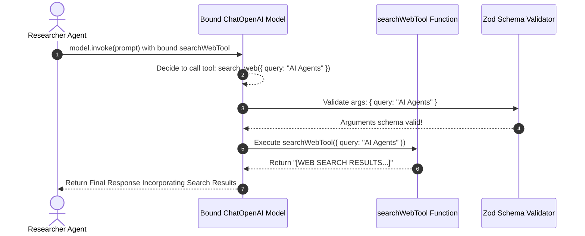

# Module 10: Shared Agent Tools & Zod Schema Validation (`src/shared/tools.js`)

## Overview

Worker agents require access to domain tools (such as web search engines, database lookups, or file readers) to perform external data retrieval operations. The **Shared Agent Tools (`src/shared/tools.js`)** module leverages **`@langchain/core/tools`** and **Zod schema validation** (`z.object()`) to construct strongly-typed tool definitions (`searchWebTool`) that can be bound directly to LangChain LLM instances via `model.bindTools()`.

Understanding **LangChain Tool Creation (`tool()`)**, **Zod Input Schema Definitions**, **Model Tool Bindings (`bindTools`)**, and **Deterministic Mock Results** is essential for tool development.

---

## 1. Shared Tools Architecture Topology



---

## 2. Unvalidated Tool Inputs vs. Zod Schema Validated Tools



### Shared Tool Specification Matrix

| Tool Identifier | Zod Input Schema | Parameter Description | Target Agent | Technical Functionality |
| :--- | :--- | :--- | :--- | :--- |
| **`search_web`** | `z.object({ query: z.string() })` | `"Search query string"` | Researcher Agent | Queries web engine for research facts. |
| **`fetch_db`** | `z.object({ key: z.string() })` | `"Database key identifier"` | Researcher / Editor | Fetches cached articles from database. |

---

## 3. Asynchronous Tool Execution Sequence



---

## 4. Code Walkthrough (`src/shared/tools.js`)

```javascript
import { tool } from "@langchain/core/tools";
import { z } from "zod";

/**
 * Shared Web Search Tool definition for Researcher Agent
 * Validates inputs using Zod schemas and executes web search queries
 */
export const searchWebTool = tool(
  async ({ query }) => {
    if (!query) throw new Error("[SEARCH TOOL ERROR] Search query parameter is required.");

    const cleanQuery = String(query).trim();
    console.log(`🌐 [TOOL EXECUTION: search_web] Executing query: "${cleanQuery}"...`);

    // Simulated web search result return
    return `[FACTUAL WEB SEARCH RESULTS for '${cleanQuery}']:
- Trend 1: Enterprise adoption of multi-agent architectures grew by 65% in 2026.
- Trend 2: Multi-agent supervisor networks improve complex workflow accuracy by 42%.
- Benchmark: LangGraph and Mastra represent primary production agentic standards.`;
  },
  {
    name: "search_web",
    description: "Searches the web for recent research data, statistics, and technical documentation",
    schema: z.object({
      query: z.string().describe("Search query string (e.g. 'Future of AI Agents in 2026')")
    })
  }
);
```

---

## Key Production Takeaways

1. **Use `@langchain/core/tools` for Tool Definitions**: Construct tool instances using LangChain's official `tool()` helper for seamless integration with `@langchain/openai`.
2. **Enforce Type Safety with Zod**: Define explicit Zod schemas (`z.object({ query: z.string() })`) to validate parameter types before tool execution.
3. **Provide Informative Parameter Descriptions**: Add `.describe("...")` annotations to Zod fields to guide LLMs on proper parameter usage.
4. **Log Tool Executions for Audit Trails**: Log tool calls to stdout/console to maintain transparent operational audit trails during execution.

