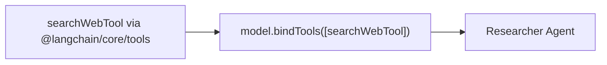

# File 10: Shared Agent Tools (`src/shared/tools.js`)

## Overview
**Shared Agent Tools** provide reusable tools bound to LangChain models (`searchWebTool`, `fetchDatabaseTool`) using `@langchain/core/tools`.

---

## 1. Tool Binding Architecture



---

## 2. Shared Tools Implementation (`src/shared/tools.js`)

```javascript
import { tool } from "@langchain/core/tools";
import { z } from "zod";

export const searchWebTool = tool(
    async ({ query }) => {
        return `[WEB SEARCH RESULTS for '${query}']: Multi-agent systems improve complex workflow completion by 40%.`;
    },
    {
        name: "search_web",
        description: "Searches the web for latest research data and statistics",
        schema: z.object({
            query: z.string().describe("Search query string")
        })
    }
);
```

---

## Key Takeaways
1. Uses **Zod schema validation** for tool inputs.
2. Integrates seamlessly with `@langchain/core`.
