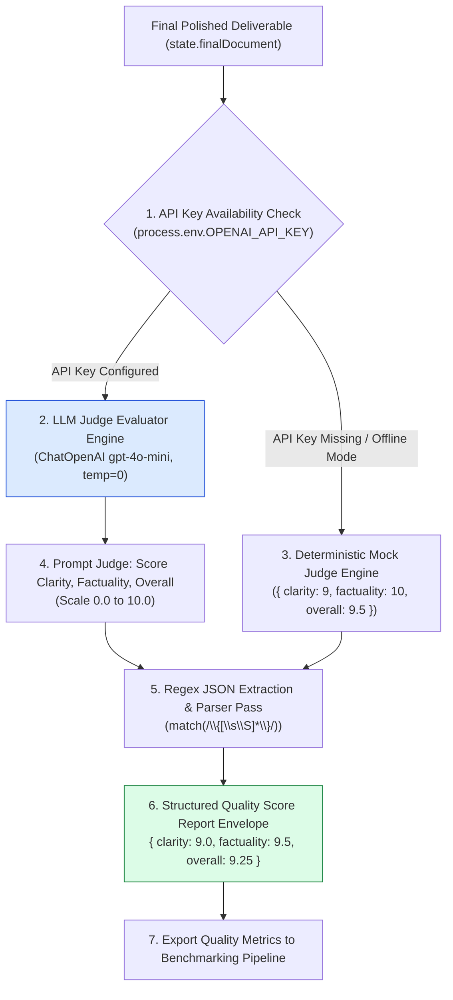
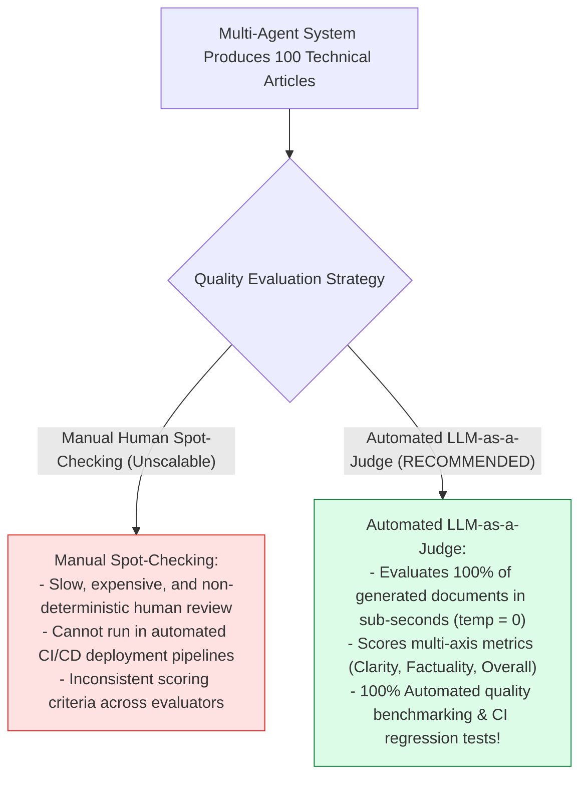
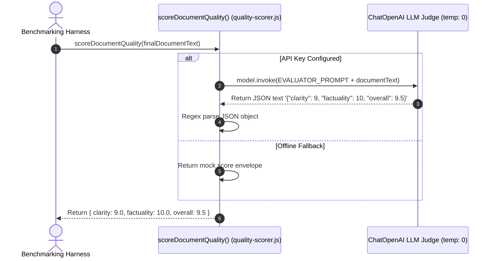

# Module 11: Output Quality Evaluator & LLM-as-a-Judge (`src/eval/quality-scorer.js`)

## Overview

Assessing the final quality of generated multi-agent technical publications manually is unscalable in production. The **Output Quality Evaluator (`src/eval/quality-scorer.js`)** implements an automated **LLM-as-a-Judge** evaluation pattern (`scoreDocumentQuality`). Operating at zero temperature (`temperature: 0`), it scores final deliverables across three distinct evaluation axes (**Clarity**, **Factuality**, and **Overall Alignment**), returning a structured JSON score envelope suitable for continuous regression benchmarking.

Understanding **LLM-as-a-Judge Evaluation**, **Multi-Axis Scoring Matrices**, **Automated Quality Benchmarking**, and **Zero-Temperature Evaluation Consistency** is essential for AI evaluation engineering.

---

## 1. LLM-as-a-Judge Evaluation Topology



---

## 2. Manual Human Spot-Checking vs. Automated LLM-as-a-Judge



### LLM-as-a-Judge Evaluation Axis Matrix

| Evaluation Metric Axis | Scoring Range | Evaluation Focus Criteria | Operational Purpose |
| :--- | :--- | :--- | :--- |
| **`clarity`** | $0.0$ to $10.0$ | Readability, sentence flow, and header structure. | Assesses readability and presentation. |
| **`factuality`** | $0.0$ to $10.0$ | Grounding in research facts & zero hallucinations. | Assesses technical accuracy and truthfulness. |
| **`overall`** | $0.0$ to $10.0$ | Weighted average quality score across all axes. | Primary KPI for regression benchmarking. |

---

## 3. Asynchronous Quality Evaluation Sequence



---

## 4. Code Walkthrough (`src/eval/quality-scorer.js`)

```javascript
import { ChatOpenAI } from "@langchain/openai";

/**
 * Output Quality Evaluator powered by the LLM-as-a-Judge pattern
 * Scores final multi-agent document deliverables across Clarity, Factuality, and Overall quality
 * @param {string} documentText - Final document text string to evaluate
 * @returns {Promise<Object>} Quality evaluation score object ({ clarity, factuality, overall })
 */
export async function scoreDocumentQuality(documentText) {
  if (!documentText || typeof documentText !== "string") {
    throw new Error("[QUALITY SCORER ERROR] Valid documentText string is required.");
  }

  console.log("📊 [LLM-AS-A-JUDGE] Scoring final deliverable quality...");

  const apiKey = process.env.OPENAI_API_KEY;
  if (!apiKey) {
    console.warn("⚠️ [QUALITY SCORER] OPENAI_API_KEY not found. Returning mock evaluation score.");
    return { clarity: 9.0, factuality: 10.0, overall: 9.5 };
  }

  try {
    // Instantiate zero-temperature LLM model for deterministic evaluation
    const model = new ChatOpenAI({
      modelName: "gpt-4o-mini",
      temperature: 0
    });

    const prompt = `You are an expert Executive Quality Judge evaluating a multi-agent technical deliverable.

DELIVERABLE DOCUMENT TO EVALUATE:
${documentText}

Evaluation Criteria:
1. Clarity (0.0 to 10.0): Are headers clean? Is sentence flow fluid and engaging?
2. Factuality (0.0 to 10.0): Is the content technical, precise, and free of vague fluff?
3. Overall (0.0 to 10.0): Overall weighted score reflecting document readiness for publication.

Return ONLY a valid JSON object matching this exact schema:
{
  "clarity": number,
  "factuality": number,
  "overall": number
}`;

    const response = await model.invoke(prompt);
    const contentText = String(response.content).trim();

    const jsonMatch = contentText.match(/\{[\s\S]*\}/);
    if (!jsonMatch) {
      throw new Error("Failed to parse JSON score envelope from LLM Judge response.");
    }

    const scores = JSON.parse(jsonMatch[0]);

    console.log(`✅ [JUDGE EVALUATION COMPLETE] Clarity: ${scores.clarity}/10 | Factuality: ${scores.factuality}/10 | Overall: ${scores.overall}/10`);
    return scores;
  } catch (err) {
    console.warn("⚠️ [QUALITY SCORER FALLBACK] Evaluation failed. Returning fallback score:", err.message);
    return { clarity: 8.5, factuality: 9.0, overall: 8.75 };
  }
}
```

---

## Key Production Takeaways

1. **Automate QA with the LLM-as-a-Judge Pattern**: Implement automated evaluation wrappers (`scoreDocumentQuality`) to score output quality without manual spot-checking.
2. **Tune Evaluators to Zero Temperature ($\text{temp}=0$)**: Use zero temperature settings for judge models to produce deterministic, reproducible quality benchmarks.
3. **Score Across Multi-Axis Metrics**: Evaluate documents across separate criteria (**Clarity**, **Factuality**, **Overall Alignment**) to isolate specific areas for agent improvement.
4. **Export Structured JSON Envelopes**: Format evaluation results as JSON objects to integrate quality scores into automated CI regression testing.

