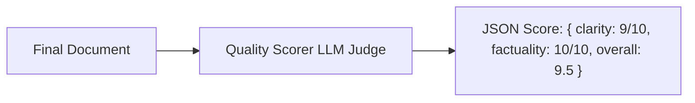

# File 11: Output Quality Evaluator (`src/eval/quality-scorer.js` & `benchmark.js`)

## Overview
The **Output Quality Evaluator** uses an **LLM-as-a-Judge** pattern to score the final multi-agent deliverable across Clarity, Factuality, and Tone metrics.

---

## 1. Quality Evaluation Pipeline



---

## 2. Quality Scorer Implementation (`src/eval/quality-scorer.js`)

```javascript
import { ChatOpenAI } from "@langchain/openai";

export async function scoreDocumentQuality(documentText) {
    const apiKey = process.env.OPENAI_API_KEY;
    if (!apiKey) {
        return { clarity: 9, factuality: 10, overall: 9.5 };
    }

    const model = new ChatOpenAI({ modelName: "gpt-4o-mini", temperature: 0 });

    const prompt = `
Evaluate the quality of the final multi-agent deliverable below.

DOCUMENT:
${documentText}

Rate clarity (1-10) and factuality (1-10).
Return JSON: { "clarity": number, "factuality": number, "overall": number }`;

    const response = await model.invoke(prompt);
    const match = response.content.match(/\{[\s\S]*\}/);
    return JSON.parse(match[0]);
}
```

---

## Key Takeaways
1. Automates quality assurance for multi-agent deliverables.
2. Returns numerical scoring matrices for regression testing.
