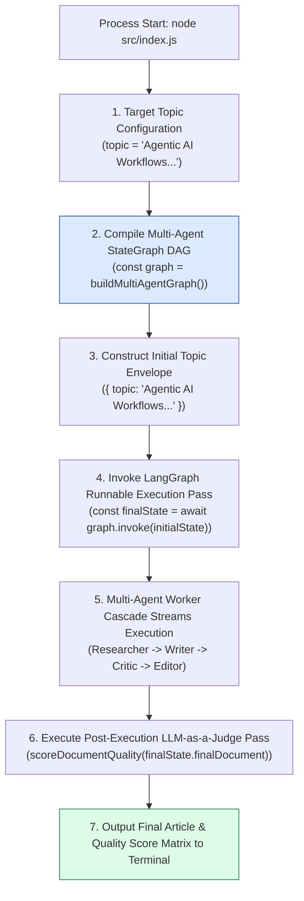
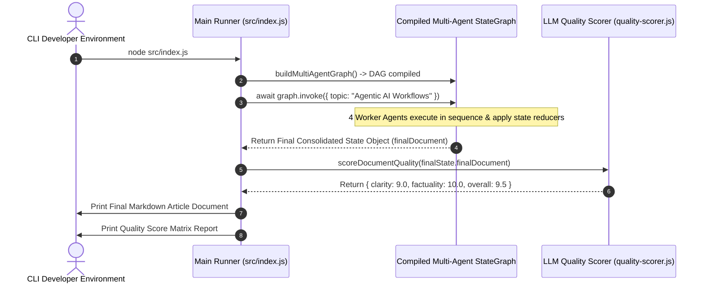

# Module 12: Main Multi-Agent Runner & Orchestrator (`src/index.js`)

## Overview

The **Main Multi-Agent Runner (`src/index.js`)** is the primary execution entry point for the Neta Multi-Agent Framework. It orchestrates the end-to-end lifecycle of the 4-agent network by calling `buildMultiAgentGraph()` to compile the state machine DAG, instantiating the initial topic state payload, invoking execution via **`graph.invoke(initialState)`**, and running an automated post-execution **LLM-as-a-Judge** quality evaluation pass on the final document deliverable.

Understanding **State Graph Invocation Lifecycles (`graph.invoke()`)**, **Initial Topic Envelope Construction**, **Automated Post-Execution QA Passes**, and **Terminal Telemetry Reporting** is essential for multi-agent deployment.

---

## 1. Application Runner Orchestration Topology



---

## 2. End-to-End Multi-Agent Lifecycle Sequence



---

## 3. Terminal Execution Output Matrix

| Summary Metric | Source State Channel | Sample Output Value | Operational Function |
| :--- | :--- | :--- | :--- |
| **Topic Objective** | `initialState.topic` | `"Agentic AI Workflows"` | User target topic input. |
| **Research Bullets**| `finalState.researchData` | `4 Key Facts` | Facts gathered by Researcher. |
| **Critic Audit Score**| `finalState.criticScore` | `8.5 / 10` | Intermediate quality audit score. |
| **Final Document** | `finalState.finalDocument` | Markdown Text | Publication-ready article output. |
| **Clarity Score** | `qualityScore.clarity` | `9.0 / 10` | LLM-as-a-Judge clarity metric score. |
| **Factuality Score**| `qualityScore.factuality` | `10.0 / 10` | LLM-as-a-Judge accuracy metric score. |

---

## 4. Code Walkthrough (`src/index.js`)

```javascript
import { buildMultiAgentGraph } from "./orchestrator/state-graph.js";
import { scoreDocumentQuality } from "./eval/quality-scorer.js";

/**
 * Main multi-agent application runner
 */
async function main() {
  console.log("=================================================");
  console.log("🚀 [STARTING NETA MULTI-AGENT WORKFLOW RUNNER]");
  console.log("=================================================\n");

  const startTime = Date.now();
  const topic = "Agentic AI Workflows in Enterprise Software Architecture";

  console.log(`🎯 Target Topic: "${topic}"\n`);

  // Step 1: Build & Compile Multi-Agent LangGraph State Machine
  console.log("⚡ Compiling State Machine DAG...");
  const graph = buildMultiAgentGraph();

  // Step 2: Invoke Multi-Agent Graph Execution
  console.log("\n⚡ [GRAPH RUNNER] Invoking multi-agent execution pass...");
  const finalState = await graph.invoke({ topic });

  const durationMs = Date.now() - startTime;

  console.log("\n=================================================");
  console.log("🎉 [MULTI-AGENT WORKFLOW COMPLETE]");
  console.log(`⏱️ Total Latency: ${durationMs}ms`);
  console.log("=================================================");

  console.log("\n-------------------------------------------------");
  console.log("📜 [FINAL PUBLICATION-READY DELIVERABLE]");
  console.log("-------------------------------------------------");
  console.log(finalState.finalDocument);
  console.log("-------------------------------------------------\n");

  // Step 3: Run Automated Post-Execution Quality Evaluation
  console.log("📊 Running Post-Execution LLM-as-a-Judge Quality Audit...");
  const qualityScore = await scoreDocumentQuality(finalState.finalDocument);

  console.log("\n=================================================");
  console.log("📈 [AUTOMATED QUALITY SCORE REPORT]");
  console.log("=================================================");
  console.log(`- Clarity Score:    ${qualityScore.clarity} / 10`);
  console.log(`- Factuality Score: ${qualityScore.factuality} / 10`);
  console.log(`- Overall Quality:  ${qualityScore.overall} / 10`);
  console.log("=================================================\n");
}

main().catch((err) => {
  console.error("🚨 [MAIN RUNNER ERROR] Multi-Agent execution failed:", err);
  process.exit(1);
});
```

---

## Key Production Takeaways

1. **Invoke Multi-Agent Graphs via `graph.invoke()`**: Pass initial state objects (`{ topic }`) to `graph.invoke()` to execute multi-agent state graph DAGs.
2. **Deconstruct Final Deliverable States**: Extract final polished documents directly from the returned state object (`finalState.finalDocument`).
3. **Automate Post-Execution QA Passes**: Combine state graph execution with `scoreDocumentQuality()` to score deliverables automatically upon completion.
4. **Log Clean Execution Metrics**: Output structured latency timings and quality score reports to stdout for easy developer verification.


## Learn from the implementation

Use the matching source file as an executable example, not just something to copy. Before running it, state in your own words what data enters the module, what it returns, and which values it changes. Then trace one realistic request from the caller through each function.

Pay special attention to these questions:

- **Data flow:** Which object, array, string, or state value moves between functions? What shape must it have?
- **Control flow:** Which branch, loop, early return, or retry changes the outcome? What condition selects it?
- **Async boundaries:** Where does the code wait for an LLM, database, network, file system, or tool? What should happen if that operation rejects or returns no result?
- **Side effects:** Which lines log information, make an external request, store data, or mutate in-memory state? Keep those distinct from pure calculations.
- **Production limits:** Which assumptions are only safe for a tutorial—for example, in-memory storage, fixed thresholds, approximate token counts, mock data, or a hard-coded batch size?

A useful practice is to change one input at a time and predict the result before executing it. If you can explain why the output changed, when the module should be used, and one way it could fail, you understand the concept rather than only the syntax.
