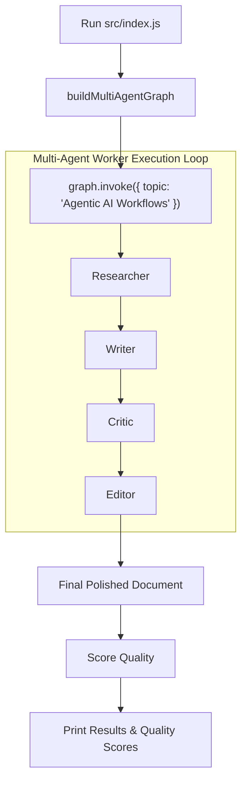

# File 12: Main Multi-Agent Runner (`src/index.js` & `src/db.js`)

## Overview
**`src/index.js`** is the main entry point for Neta Multi-Agent, instantiating the compiled LangGraph multi-agent state machine, invoking execution across worker agents, and evaluating final document quality scores.

---

## 1. Multi-Agent Execution Flow



---

## 2. Main Runner Implementation (`src/index.js`)

```javascript
import { buildMultiAgentGraph } from "./orchestrator/state-graph.js";
import { scoreDocumentQuality } from "./eval/quality-scorer.js";

async function main() {
    console.log("=== STARTING NETA MULTI-AGENT WORKFLOW ===");
    const topic = "Agentic AI Workflows in Enterprise Architecture";

    // 1. Build Multi-Agent Graph
    const graph = buildMultiAgentGraph();

    // 2. Invoke Graph Execution
    const finalState = await graph.invoke({ topic });

    console.log("\n=== MULTI-AGENT WORKFLOW COMPLETE ===");
    console.log("\n--- FINAL DELIVERABLE ---");
    console.log(finalState.finalDocument);

    // 3. Evaluate Output Quality
    const qualityScore = await scoreDocumentQuality(finalState.finalDocument);
    console.log("\n--- QUALITY SCORE REPORT ---");
    console.log(qualityScore);
}

main().catch(console.error);
```

---

## Key Takeaways
1. Demonstrates end-to-end execution of a 4-agent state graph collaboration pipeline.
2. Evaluates deliverable quality automatically upon completion.
