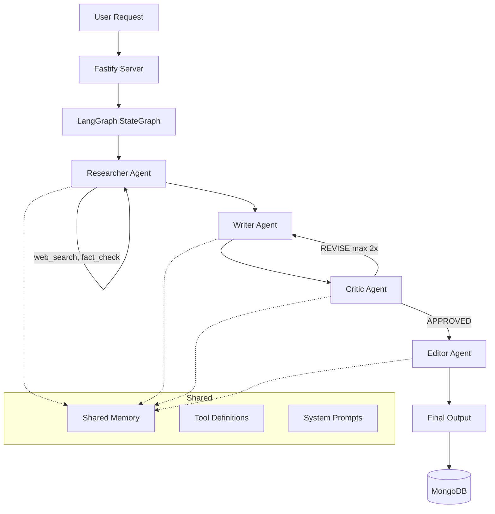
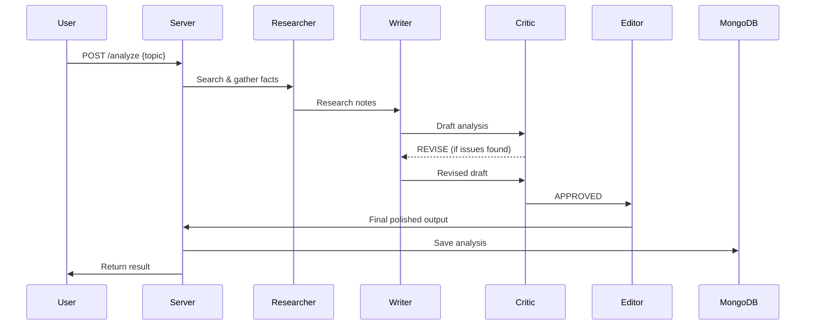

# 07 - NetaWatch Multi-Agent System

Client: **NetaWatch, Mumbai** — civic-tech multi-agent research and analysis platform.

A multi-agent pipeline using LangGraph.js where specialized agents (researcher, writer, critic, editor) collaborate to produce balanced civic analysis. A supervisor orchestrates the flow with revision loops.

## Architecture





## Tech Stack

- **LangGraph.js** — StateGraph with conditional edges and revision loops
- **OpenAI GPT-4o-mini** — Powers all agents
- **Fastify** — HTTP server
- **MongoDB** — Persistence for completed analyses

## Setup

```bash
cp .env.example .env
# Add your OPENAI_API_KEY and MONGODB_URI
npm install
npm run dev
```

## API

```bash
# Run analysis
curl -X POST http://localhost:3007/analyze \
  -H "Content-Type: application/json" \
  -d '{"topic": "Mumbai pothole crisis and BMC budget 2026"}'

# Run analysis with quality score
curl -X POST http://localhost:3007/analyze/score \
  -H "Content-Type: application/json" \
  -d '{"topic": "Delhi air pollution policy"}'

# Get past analyses
curl http://localhost:3007/analyses

# Run benchmark eval suite
npm run eval
```

## Agent Roles

| Agent | Role | Tools |
|-------|------|-------|
| Researcher | Gathers facts from web search | web_search, fact_check |
| Writer | Drafts clear, balanced analysis | none |
| Critic | Reviews for bias, accuracy, completeness | none |
| Editor | Final polish with TL;DR and confidence | none |

## Key Concepts

- **StateGraph** — LangGraph's core abstraction for multi-agent orchestration
- **Conditional Edges** — Critic routes to either editor (approved) or back to writer (revise)
- **Max Revisions** — Prevents infinite loops (capped at 2 revisions)
- **Shared Memory** — All agents can read/write to a common memory store
- **LLM-as-Judge** — Quality scorer evaluates output on accuracy, clarity, completeness, neutrality
