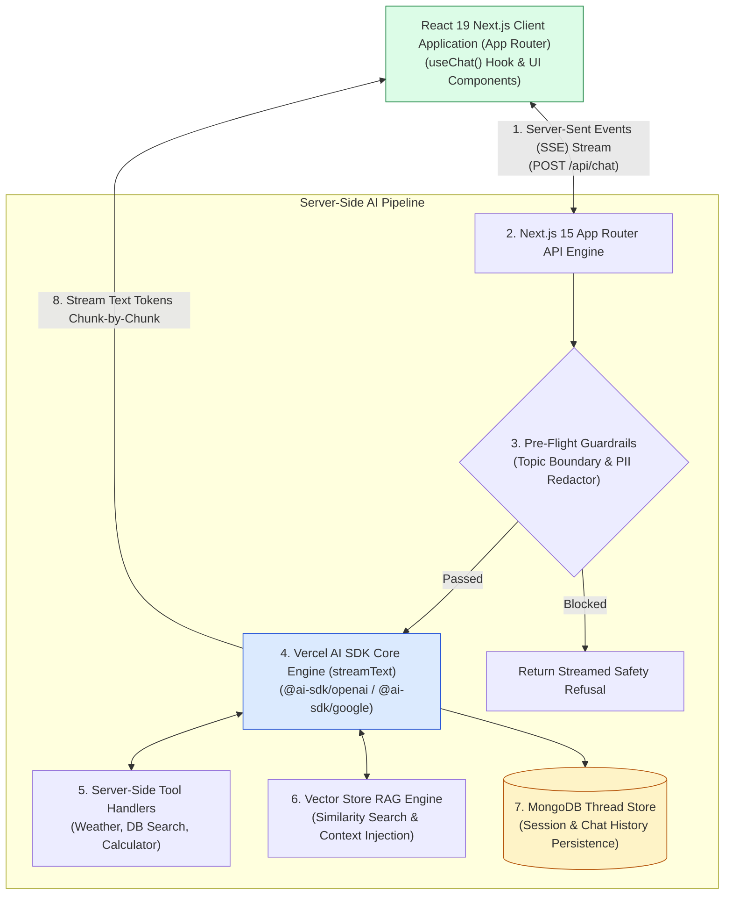
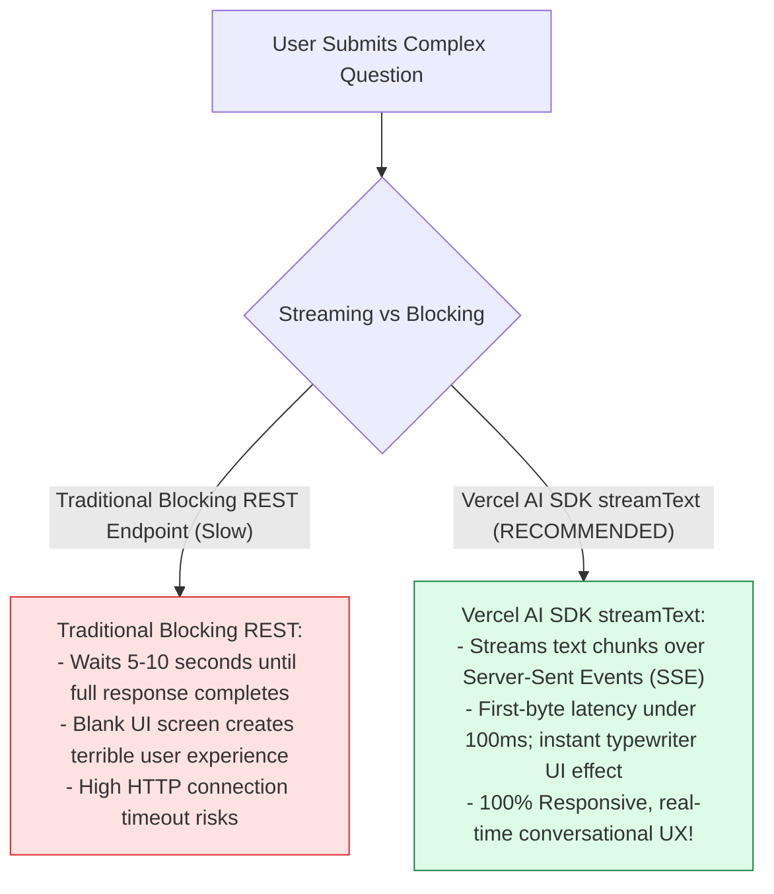
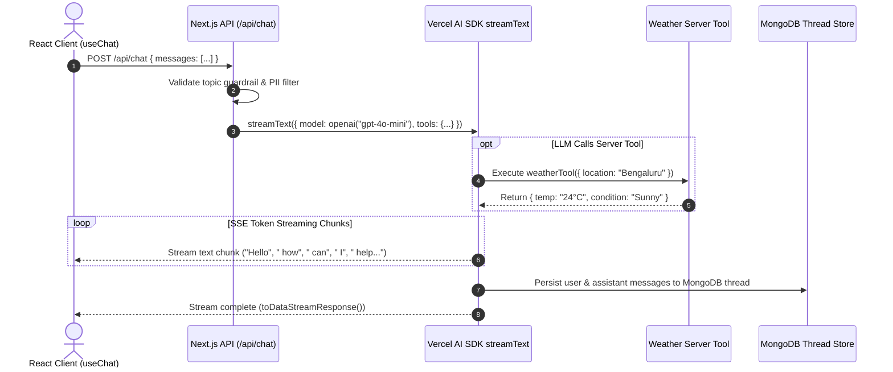

# Module 00: Full-Stack Next.js AI Application Architecture Overview

## Overview

Modern web applications require responsive, low-latency AI conversational interfaces that deliver sub-100ms first-byte streaming text responses, execute backend server tools dynamically, perform Retrieval-Augmented Generation (RAG), and enforce security guardrails. **Samvaad AI** is a production-grade full-stack conversational platform built with **Next.js 15 App Router**, **React 19**, the **Vercel AI SDK (`ai`)**, **MongoDB thread persistence**, and modern Tailwind CSS UI components.

Understanding **Next.js 15 App Router Server Routes (`/api/chat`)**, **Vercel AI SDK Streaming (`streamText`)**, **Server Tool Execution Envelopes**, and **Full-Stack RAG Architectures** is essential for AI web applications.

---

## 1. Samvaad AI Full-Stack Topology

---

## 2. Blocking Polling Endpoints vs. Vercel AI SDK Streaming (`streamText`)

### Core System API Endpoints & Library Specification

| Endpoint / Library Module | Technology Stack | Core Functional Responsibility |
| :--- | :--- | :--- |
| **`POST /api/chat`** | Vercel AI SDK `streamText` | Streams real-time chat completions with tool calls. |
| **`POST /api/rag`** | RAG Engine + Vector Store | Queries vector embeddings & injects context. |
| **`POST /api/agents`** | Multi-Agent Orchestrator | Routes queries across specialized agent workers. |
| **`src/lib/ai-config.ts`** | `@ai-sdk/openai`, `@ai-sdk/google` | Provider initialization & model parameter tuning. |
| **`src/lib/mongodb.ts`** | MongoDB Node Driver | Persists conversation threads and session state. |

---

## 3. Asynchronous Streaming Chat Request Sequence

---

## Key Production Takeaways

1. **Leverage Vercel AI SDK `streamText`**: Use `streamText` and `toDataStreamResponse()` to deliver sub-100ms first-byte streaming text responses over Server-Sent Events.
2. **Build with Next.js 15 App Router**: Structure AI endpoints using App Router Route Handlers (`app/api/chat/route.ts`) for serverless deployment compatibility.
3. **Execute Server-Side Tools Dynamically**: Declare type-safe server tools inside `streamText` to allow LLMs to invoke real-world data APIs seamlessly.
4. **Persist Threads Asynchronously**: Save conversation history and metadata to MongoDB without blocking the streaming UI response loop.

