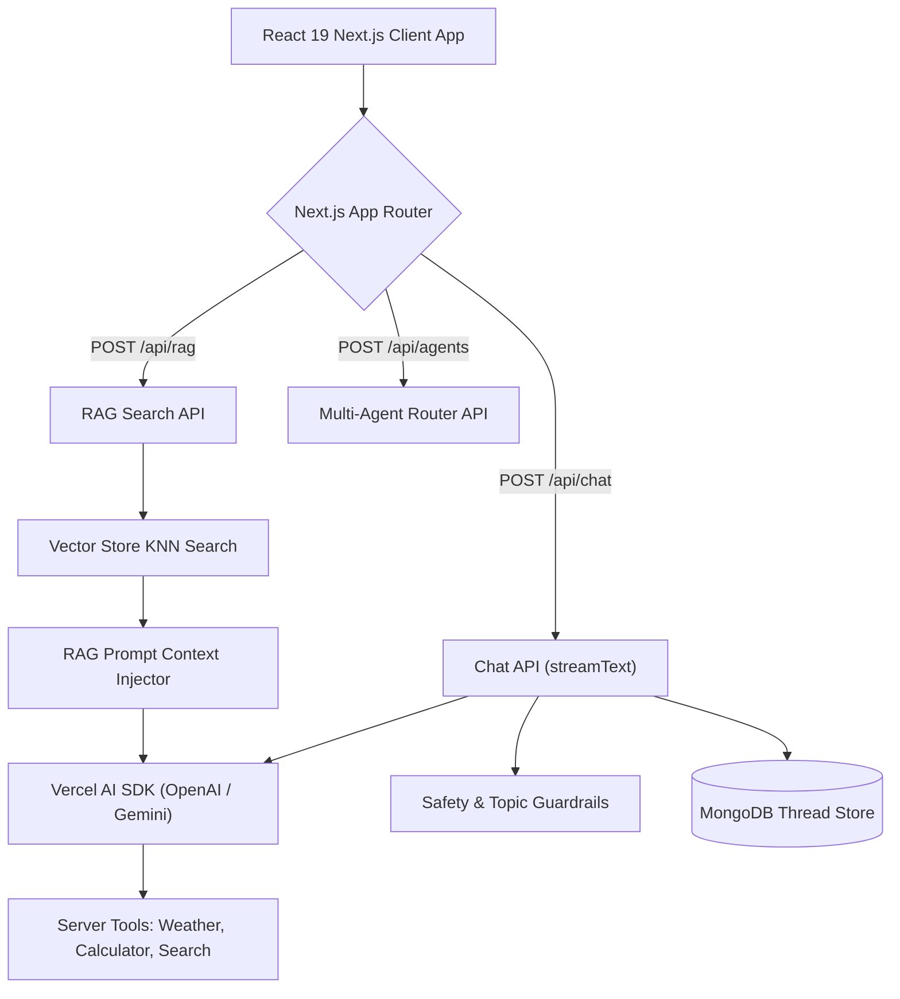

# File 00: Full-Stack Next.js AI Application Overview & Architecture

## Overview
**Samvaad AI** is a full-stack **Conversational AI Platform** built with **Next.js 15 App Router**, **React 19**, and the **Vercel AI SDK (`ai`)**. It features realtime streaming AI chat (`streamText`), dynamic tool calling, semantic RAG search, safety guardrails, and responsive dark-mode Tailwind UI components.

---

## 1. Samvaad AI System Architecture

---

## 2. API Endpoints & Core Libraries

| Endpoint / Library | Technology | Function |
| :--- | :--- | :--- |
| `POST /api/chat` | Vercel AI SDK `streamText` | Streamed conversational chat completions |
| `POST /api/rag` | RAG Engine + Vector Store | Context-augmented Q&A with source citations |
| `POST /api/agents` | Multi-Agent Delegation | Routes queries between specialized agent roles |
| `src/lib/ai-config.ts` | `@ai-sdk/openai`, `@ai-sdk/google` | Standardized model provider initialization |

---

## Key Takeaways
1. Leverages **Vercel AI SDK `streamText`** for sub-100ms first-byte streaming responses.
2. Built with **Next.js 15 App Router** server routes and Server Actions.
3. Incorporates **RAG and Safety Guardrails** in full-stack TypeScript.
