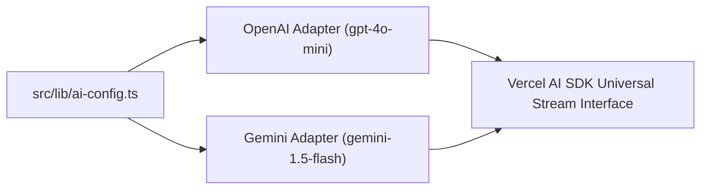

# File 01: Vercel AI SDK Model Configuration (`src/lib/ai-config.ts`)

## Overview
**`src/lib/ai-config.ts`** initializes standardized LLM provider instances using Vercel AI SDK provider adapters (**`@ai-sdk/openai`**, **`@ai-sdk/google`**).

---

## 1. Multi-Provider Abstraction Layer



---

## 2. Model Configuration Implementation (`src/lib/ai-config.ts`)

```typescript
import { openai } from "@ai-sdk/openai";
import { google } from "@ai-sdk/google";

// 1. OpenAI Model Provider Instance
export const defaultModel = openai("gpt-4o-mini");

// 2. Google Gemini Model Provider Instance
export const geminiModel = google("gemini-1.5-flash");

// 3. Dynamic Model Selector Helper
export function getModel(provider: "openai" | "google" = "openai") {
    if (provider === "google") {
        return geminiModel;
    }
    return defaultModel;
}
```

---

## Key Takeaways
1. Decouples application UI code from underlying LLM provider SDKs.
2. Allows switching between OpenAI and Gemini by toggling a single string parameter.
