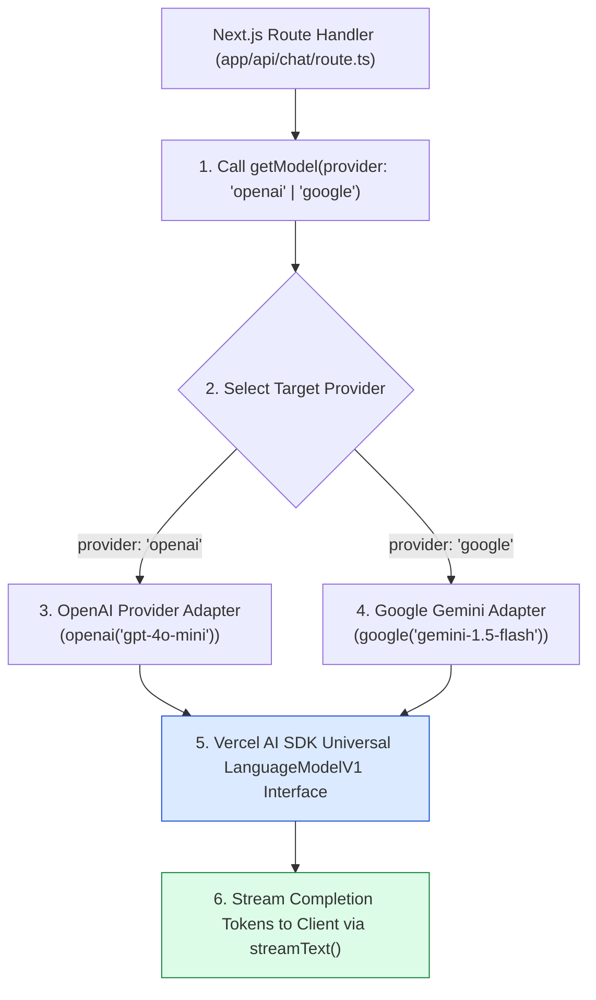
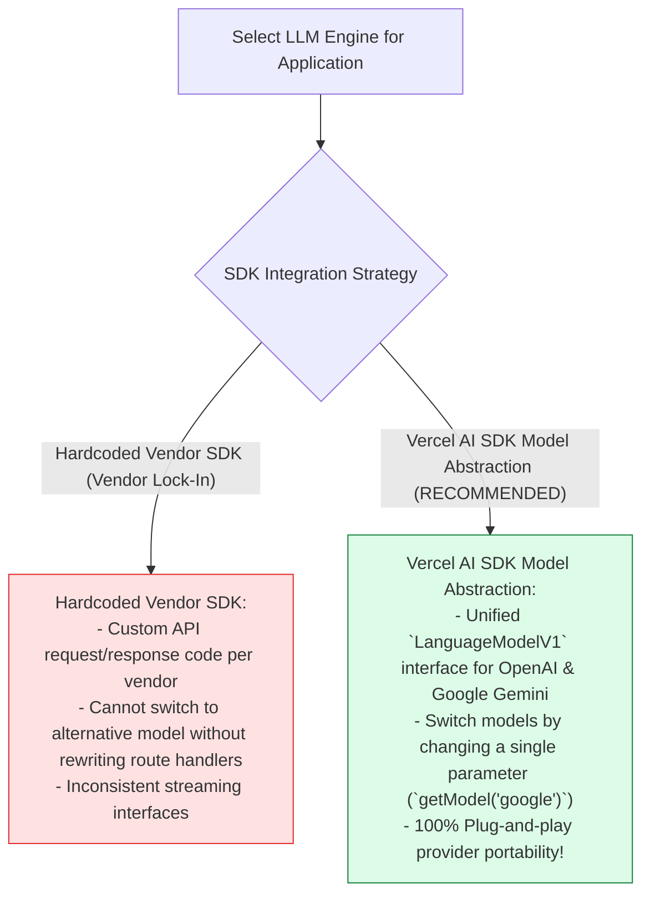
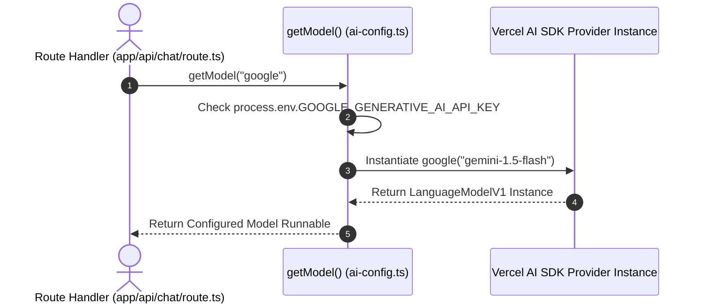

# Module 01: Vercel AI SDK Multi-Provider Model Configuration (`src/lib/ai-config.ts`)

## Overview

Hardcoding vendor-specific LLM SDK initialization calls directly inside API route handlers creates vendor lock-in and makes switching providers (e.g. from OpenAI `gpt-4o-mini` to Google Gemini `gemini-1.5-flash`) difficult. The **Model Configuration Module (`src/lib/ai-config.ts`)** leverages the **Vercel AI SDK (`ai`)** provider abstraction layer (**`@ai-sdk/openai`** and **`@ai-sdk/google`**) to export standardized model instances and a dynamic factory selector (`getModel(provider)`), enabling multi-provider fallback and runtime model switching.

Understanding **Vercel AI SDK Provider Adapters**, **Model Instance Factories**, **Multi-Provider Fallback Logic**, and **Environment Variable Guards** is essential for AI application architecture.

---

## 1. Multi-Provider Abstraction Topology



---

## 2. Hardcoded SDK Instantiation vs. Vercel AI SDK Abstraction



### Model Provider Reference Matrix

| Provider Key | Adapter Package | Default Model Instance | Technical Target Use Case |
| :--- | :--- | :--- | :--- |
| **`"openai"`** | `@ai-sdk/openai` | `openai("gpt-4o-mini")` | Fast, cost-efficient conversational completion. |
| **`"google"`** | `@ai-sdk/google` | `google("gemini-1.5-flash")` | High-context, low-latency Flash completions. |

---

## 3. Asynchronous Model Instantiation Sequence



---

## 4. Code Walkthrough (`src/lib/ai-config.ts`)

```typescript
import { openai } from "@ai-sdk/openai";
import { google } from "@ai-sdk/google";
import { LanguageModelV1 } from "ai";

/**
 * Standardized OpenAI Model Provider Instance
 * Uses gpt-4o-mini for cost-efficient, low-latency text completions
 */
export const defaultModel = openai("gpt-4o-mini");

/**
 * Standardized Google Gemini Model Provider Instance
 * Uses gemini-1.5-flash for high-context window completions
 */
export const geminiModel = google("gemini-1.5-flash");

/**
 * Dynamic Model Factory Function
 * Returns the target model instance based on provider identifier string
 * @param provider - Model provider string ("openai" | "google")
 * @returns Configured LanguageModelV1 instance for Vercel AI SDK
 */
export function getModel(provider: "openai" | "google" = "openai"): LanguageModelV1 {
  console.log(`⚡ [AI CONFIG] Instantiating LLM model provider: '${provider}'`);

  if (provider === "google") {
    const apiKey = process.env.GOOGLE_GENERATIVE_AI_API_KEY;
    if (!apiKey) {
      console.warn("⚠️ [AI CONFIG WARNING] GOOGLE_GENERATIVE_AI_API_KEY missing. Falling back to OpenAI provider.");
      return defaultModel;
    }
    return geminiModel;
  }

  const openAiKey = process.env.OPENAI_API_KEY;
  if (!openAiKey) {
    console.warn("⚠️ [AI CONFIG WARNING] OPENAI_API_KEY missing in environment variables.");
  }

  return defaultModel;
}
```

---

## Key Production Takeaways

1. **Use Vercel AI SDK Provider Adapters**: Import official adapters (`@ai-sdk/openai`, `@ai-sdk/google`) to unify LLM model instantiations under the `LanguageModelV1` interface.
2. **Export Dynamic Model Selector Functions**: Provide a factory function (`getModel(provider)`) to switch between OpenAI and Gemini models dynamically via API query parameters.
3. **Include Graceful Fallback Guards**: Check for environment variables (`GOOGLE_GENERATIVE_AI_API_KEY`) and fall back to default providers if secondary API keys are missing.
4. **Decouple API Routes from Provider Specifics**: Keep API route handlers clean by referencing exported model instances (`defaultModel`) directly.


## Learn from the implementation

Use the matching source file as an executable example, not just something to copy. Before running it, state in your own words what data enters the module, what it returns, and which values it changes. Then trace one realistic request from the caller through each function.

Pay special attention to these questions:

- **Data flow:** Which object, array, string, or state value moves between functions? What shape must it have?
- **Control flow:** Which branch, loop, early return, or retry changes the outcome? What condition selects it?
- **Async boundaries:** Where does the code wait for an LLM, database, network, file system, or tool? What should happen if that operation rejects or returns no result?
- **Side effects:** Which lines log information, make an external request, store data, or mutate in-memory state? Keep those distinct from pure calculations.
- **Production limits:** Which assumptions are only safe for a tutorial—for example, in-memory storage, fixed thresholds, approximate token counts, mock data, or a hard-coded batch size?

A useful practice is to change one input at a time and predict the result before executing it. If you can explain why the output changed, when the module should be used, and one way it could fail, you understand the concept rather than only the syntax.
