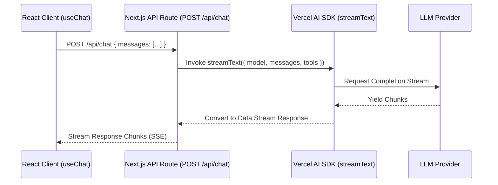

# File 02: Realtime Streaming Chat API (`src/app/api/chat/route.ts`)

## Overview
The **Realtime Streaming Chat API** handles HTTP POST requests, invoking Vercel AI SDK's **`streamText()`** to stream response chunks back to the client over Server-Sent Events (SSE).

---

## 1. Response Streaming Lifecycle



---

## 2. Streaming Route Implementation (`src/app/api/chat/route.ts`)

```typescript
import { streamText } from "ai";
import { defaultModel } from "@/lib/ai-config";
import { tools } from "@/lib/tools";

export async function POST(req: Request) {
    const { messages } = await req.json();

    // 1. Invoke Realtime Streaming
    const result = streamText({
        model: defaultModel,
        system: "You are Samvaad AI, a helpful, polite conversational assistant. Answer user queries accurately and use tools when appropriate.",
        messages,
        tools,
        maxSteps: 5 // Enable automatic multi-step tool execution loops!
    });

    // 2. Return UI Data Stream Response
    return result.toDataStreamResponse();
}
```

---

## Key Takeaways
1. **`streamText`** returns token chunks immediately, providing responsive UI interaction.
2. Setting **`maxSteps: 5`** allows `streamText` to automatically execute client/server tool calls in multi-step loops.
