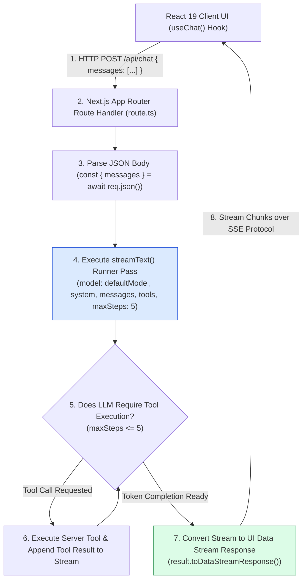
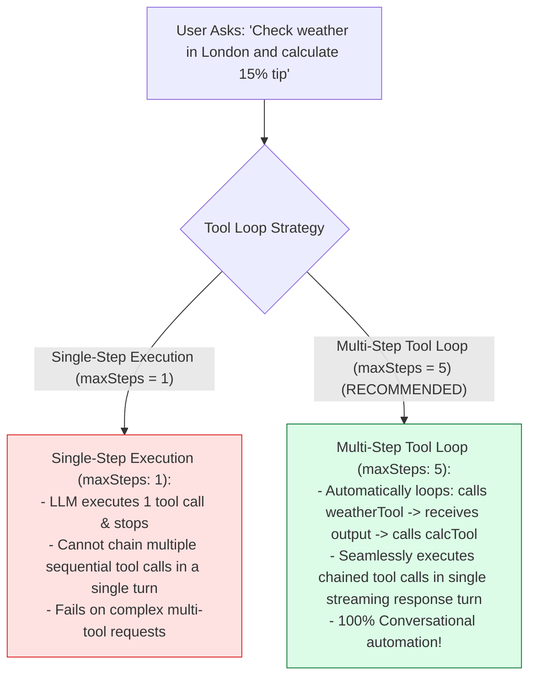
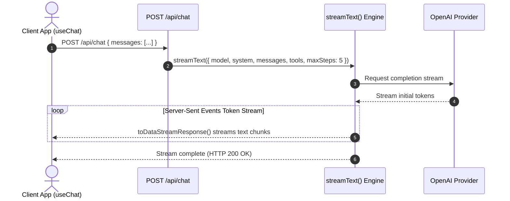

# Module 02: Realtime Streaming Chat API Route Handler (`src/app/api/chat/route.ts`)

## Overview

Delivering responsive conversational AI web experiences requires streaming response tokens back to the user interface as they are generated by the LLM provider. The **Realtime Streaming Chat API (`src/app/api/chat/route.ts`)** implements a Next.js 15 App Router Route Handler (`POST /api/chat`) powered by Vercel AI SDK's **`streamText()`**. It configures system prompts, binds server tool definitions (`tools`), enables automatic multi-step tool execution loops (`maxSteps: 5`), and converts the completion stream into an optimized UI response via **`result.toDataStreamResponse()`**.

Understanding **Vercel AI SDK Streaming (`streamText`)**, **`maxSteps` Multi-Step Tool Loops**, **Server-Sent Event (SSE) Protocols**, and **`toDataStreamResponse` Envelopes** is essential for full-stack AI engineering.

---

## 1. Streaming Chat Route Topology



---

## 2. Single-Step Tool Execution vs. Multi-Step Tool Loops (`maxSteps: 5`)



### Route Handler Parameter Reference Matrix

| Property Key | Configured Value | Technical Purpose |
| :--- | :--- | :--- |
| **`model`** | `defaultModel` (`gpt-4o-mini`) | Primary LLM engine instance for text completion. |
| **`system`** | Persona System Prompt | System instructions governing AI conversational tone. |
| **`messages`** | `UIMessage[]` Array | Client-side chat history array passed from `useChat()`. |
| **`tools`** | `tools` Object | Server tool declarations (`weatherTool`, `calcTool`). |
| **`maxSteps`** | `5` | Maximum automatic tool call reasoning steps permitted. |

---

## 3. Asynchronous Streaming Chat Sequence



---

## 4. Code Walkthrough (`src/app/api/chat/route.ts`)

```typescript
import { streamText } from "ai";
import { defaultModel } from "@/lib/ai-config";
import { tools } from "@/lib/tools";

/**
 * Next.js 15 App Router POST Route Handler for Realtime Streaming AI Chat
 */
export async function POST(req: Request) {
  try {
    const { messages } = await req.json();

    if (!messages || !Array.isArray(messages)) {
      return new Response(JSON.stringify({ error: "Invalid request: 'messages' array is required." }), {
        status: 400,
        headers: { "Content-Type": "application/json" }
      });
    }

    console.log(`⚡ [API/CHAT] Processing streaming chat request with ${messages.length} messages...`);

    // 1. Invoke Realtime Streaming Engine via Vercel AI SDK
    const result = streamText({
      model: defaultModel,
      system: `You are Samvaad AI, an empathetic, intelligent conversational assistant built with Next.js 15 and Vercel AI SDK.
Answer user questions accurately, maintain a friendly tone, and invoke server tools ('getWeather', 'calculate') whenever helpful.`,
      messages,
      tools,
      maxSteps: 5 // Enables automatic multi-step tool call execution loops!
    });

    // 2. Return UI Data Stream Response compatible with useChat()
    return result.toDataStreamResponse();
  } catch (err: any) {
    console.error("🚨 [API/CHAT ERROR] Failed to stream chat completion:", err.message);

    return new Response(JSON.stringify({ error: "Internal Server Error: " + err.message }), {
      status: 500,
      headers: { "Content-Type": "application/json" }
    });
  }
}
```

---

## Key Production Takeaways

1. **Stream Tokens with `toDataStreamResponse()`**: Use `result.toDataStreamResponse()` to stream text chunks and tool invocation metadata to `useChat()` client hooks.
2. **Enable Multi-Step Tool Execution with `maxSteps: 5`**: Set `maxSteps: 5` in `streamText()` so the SDK can execute sequential tool calls automatically within a single user turn.
3. **Bind Strongly-Typed Server Tools**: Pass server tool definitions (`tools`) into `streamText()` to expose executable backend APIs to the model.
4. **Validate Request Payloads in Route Handlers**: Check incoming request bodies for valid `messages` arrays before invoking `streamText()`.


## Learn from the implementation

Use the matching source file as an executable example, not just something to copy. Before running it, state in your own words what data enters the module, what it returns, and which values it changes. Then trace one realistic request from the caller through each function.

Pay special attention to these questions:

- **Data flow:** Which object, array, string, or state value moves between functions? What shape must it have?
- **Control flow:** Which branch, loop, early return, or retry changes the outcome? What condition selects it?
- **Async boundaries:** Where does the code wait for an LLM, database, network, file system, or tool? What should happen if that operation rejects or returns no result?
- **Side effects:** Which lines log information, make an external request, store data, or mutate in-memory state? Keep those distinct from pure calculations.
- **Production limits:** Which assumptions are only safe for a tutorial—for example, in-memory storage, fixed thresholds, approximate token counts, mock data, or a hard-coded batch size?

A useful practice is to change one input at a time and predict the result before executing it. If you can explain why the output changed, when the module should be used, and one way it could fail, you understand the concept rather than only the syntax.
