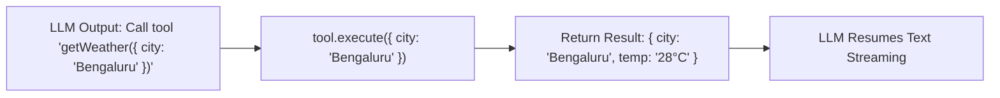

# File 03: Vercel AI SDK Tool Definitions (`src/lib/tools.ts`)

## Overview
**`src/lib/tools.ts`** defines executable tools (`getWeather`, `calculate`, `searchDatabase`) using Vercel AI SDK's **`tool()`** function and **Zod** schema parameter validation.

---

## 1. Vercel AI SDK Tool Call Lifecycle



---

## 2. Tools Implementation (`src/lib/tools.ts`)

```typescript
import { tool } from "ai";
import { z } from "zod";

export const tools = {
    // 1. Weather Information Tool
    getWeather: tool({
        description: "Get current weather information for a specified city",
        parameters: z.object({
            city: z.string().describe("City name e.g. Bengaluru, Mumbai")
        }),
        execute: async ({ city }) => {
            return {
                city,
                temperature: "28°C",
                condition: "Partly Cloudy",
                humidity: "65%"
            };
        }
    }),

    // 2. Mathematical Evaluation Tool
    calculate: tool({
        description: "Evaluate mathematical expressions",
        parameters: z.object({
            expression: z.string().describe("Math expression e.g. '120 * 0.18'")
        }),
        execute: async ({ expression }) => {
            const sanitized = expression.replace(/[^0-9+\-*/(). ]/g, "");
            const result = Function(`"use strict"; return (${sanitized})`)();
            return { expression, result };
        }
    }),

    // 3. Database Search Tool
    searchDatabase: tool({
        description: "Search internal database for user or product records",
        parameters: z.object({
            query: z.string().describe("Search term")
        }),
        execute: async ({ query }) => {
            return {
                query,
                results: [
                    { id: "rec_101", title: `Record matching ${query}`, status: "active" }
                ]
            };
        }
    })
};
```

---

## Key Takeaways
1. Uses **Zod** for strict type validation of tool arguments.
2. Integrates seamlessly with Vercel AI SDK's `streamText`.
