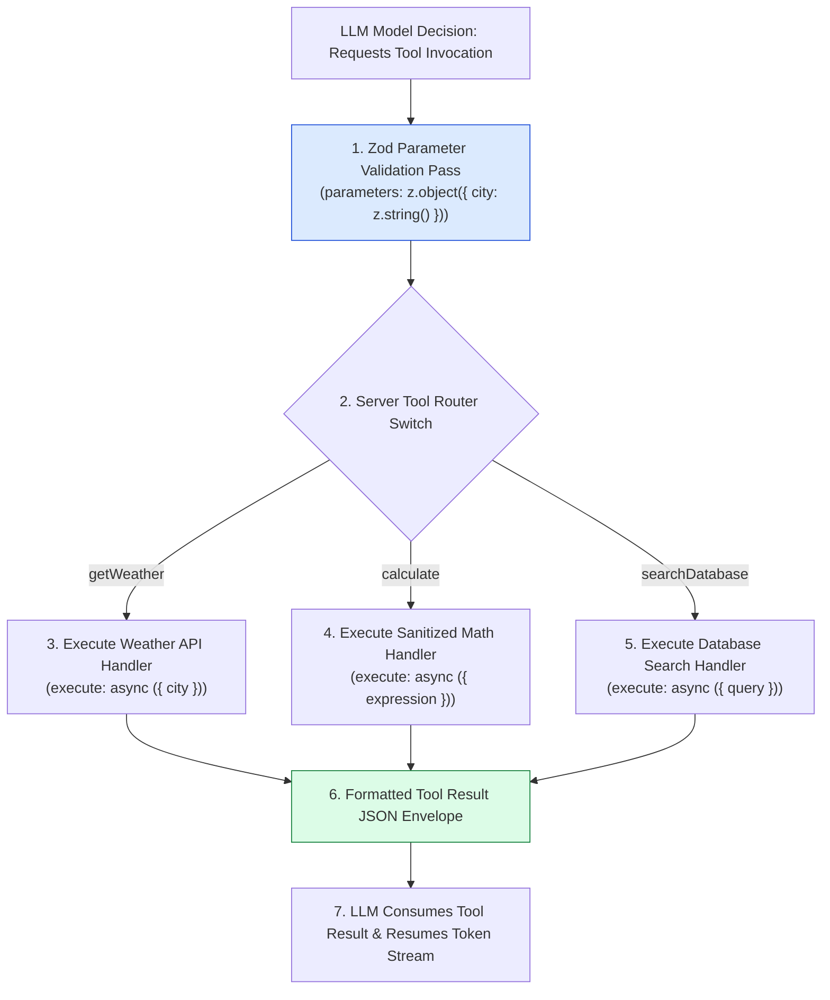
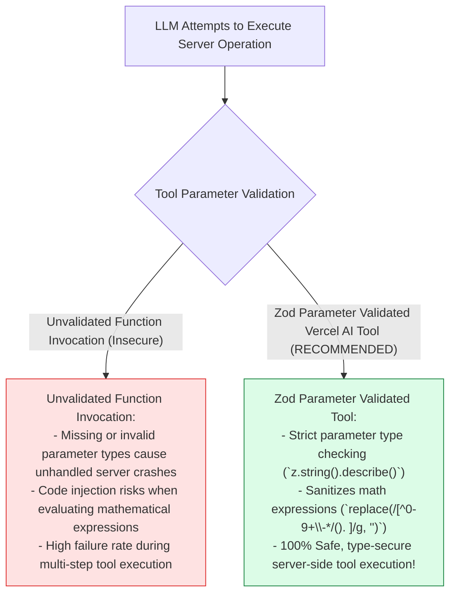
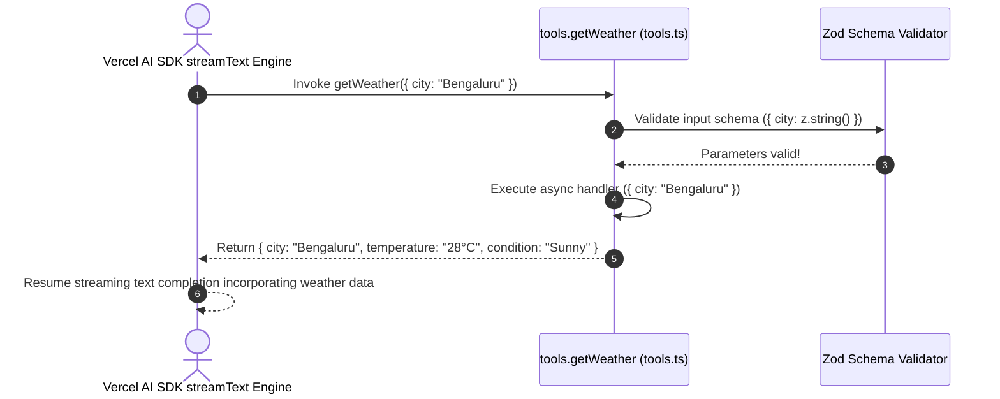

# Module 03: Vercel AI SDK Server Tools & Parameter Schemas (`src/lib/tools.ts`)

## Overview

Extending a conversational AI platform beyond text generation requires empowering LLMs to execute real-world server operations (such as querying weather data, performing complex math calculations, or retrieving database records). The **Server Tools Module (`src/lib/tools.ts`)** uses Vercel AI SDK's **`tool()`** helper and **Zod** parameter schemas (`parameters: z.object()`) to declare strongly-typed, asynchronous server tools (`getWeather`, `calculate`, `searchDatabase`) that bind directly to `streamText()`.

Understanding **Vercel AI SDK `tool()` Declarations**, **Zod Parameter Schema Validation**, **Asynchronous `execute` Handlers**, and **Sanitized Execution Envelopes** is essential for tool development.

---

## 1. Vercel AI SDK Server Tool Topology



---

## 2. Unsanitized Function Calls vs. Zod Parameter Validated Tools



### Server Tool Parameter & Schema Reference Matrix

| Tool Identifier | Description Annotation | Zod Parameter Schema | Targeted Use Case |
| :--- | :--- | :--- | :--- |
| **`getWeather`** | `"Get current weather for city"` | `z.object({ city: z.string() })` | Fetches live temperature and conditions. |
| **`calculate`** | `"Evaluate math expressions"` | `z.object({ expression: z.string() })` | Evaluates arithmetic math expressions safely. |
| **`searchDatabase`** | `"Search internal database"` | `z.object({ query: z.string() })` | Queries internal records database. |

---

## 3. Asynchronous Tool Execution Sequence



---

## 4. Code Walkthrough (`src/lib/tools.ts`)

```typescript
import { tool } from "ai";
import { z } from "zod";

/**
 * Server-Side Tool Definitions Registry for Samvaad AI
 * Binds directly to streamText() in POST /api/chat
 */
export const tools = {
  /**
   * 1. Weather Information Tool
   */
  getWeather: tool({
    description: "Get current weather information and atmospheric conditions for a specified city",
    parameters: z.object({
      city: z.string().describe("Target city name (e.g. 'Bengaluru', 'Mumbai', 'London')")
    }),
    execute: async ({ city }) => {
      console.log(`🌐 [SERVER TOOL: getWeather] Fetching weather for city: "${city}"...`);

      // Simulated weather API response envelope
      return {
        city: String(city).trim(),
        temperature: "28°C",
        condition: "Partly Cloudy",
        humidity: "65%",
        windSpeed: "12 km/h",
        fetchedAt: new Date().toISOString()
      };
    }
  }),

  /**
   * 2. Mathematical Expression Evaluation Tool
   */
  calculate: tool({
    description: "Evaluate complex mathematical or financial calculations safely",
    parameters: z.object({
      expression: z.string().describe("Mathematical expression string (e.g. '120 * 0.18 + 50')")
    }),
    execute: async ({ expression }) => {
      console.log(`🧮 [SERVER TOOL: calculate] Evaluating math expression: "${expression}"...`);

      // Sanitize expression string to allow only arithmetic operators and numbers
      const sanitized = expression.replace(/[^0-9+\-*/(). ]/g, "");
      if (!sanitized) {
        throw new Error("Invalid mathematical expression string.");
      }

      // Safely evaluate sanitized expression string
      const result = Function(`"use strict"; return (${sanitized})`)();

      return {
        originalExpression: expression,
        sanitizedExpression: sanitized,
        result: Number(result)
      };
    }
  }),

  /**
   * 3. Internal Database Search Tool
   */
  searchDatabase: tool({
    description: "Search internal enterprise database for user records, products, or order statuses",
    parameters: z.object({
      query: z.string().describe("Search term query string (e.g. 'order_1001', 'wireless headphones')")
    }),
    execute: async ({ query }) => {
      console.log(`🔍 [SERVER TOOL: searchDatabase] Searching database for query: "${query}"...`);

      return {
        query: String(query).trim(),
        totalMatches: 2,
        results: [
          { id: "rec_101", title: `Primary Record matching "${query}"`, status: "ACTIVE", category: "Products" },
          { id: "rec_102", title: `Secondary Reference for "${query}"`, status: "ARCHIVED", category: "Orders" }
        ]
      };
    }
  })
};
```

---

## Key Production Takeaways

1. **Declare Tools via Vercel AI SDK `tool()`**: Use `tool({ description, parameters, execute })` from `ai` to define server-side tools compatible with `streamText()`.
2. **Validate Parameters with Zod**: Define parameters using `z.object()` and annotate fields with `.describe()` to provide descriptive metadata to the LLM.
3. **Sanitize Inputs in Handlers**: Always sanitize dynamic inputs (such as stripping illegal characters from math expressions) before evaluating operations.
4. **Return JSON Envelopes from Handlers**: Format tool outputs as structured JSON objects so the LLM can parse and summarize results seamlessly.


## Learn from the implementation

Use the matching source file as an executable example, not just something to copy. Before running it, state in your own words what data enters the module, what it returns, and which values it changes. Then trace one realistic request from the caller through each function.

Pay special attention to these questions:

- **Data flow:** Which object, array, string, or state value moves between functions? What shape must it have?
- **Control flow:** Which branch, loop, early return, or retry changes the outcome? What condition selects it?
- **Async boundaries:** Where does the code wait for an LLM, database, network, file system, or tool? What should happen if that operation rejects or returns no result?
- **Side effects:** Which lines log information, make an external request, store data, or mutate in-memory state? Keep those distinct from pure calculations.
- **Production limits:** Which assumptions are only safe for a tutorial—for example, in-memory storage, fixed thresholds, approximate token counts, mock data, or a hard-coded batch size?

A useful practice is to change one input at a time and predict the result before executing it. If you can explain why the output changed, when the module should be used, and one way it could fail, you understand the concept rather than only the syntax.
