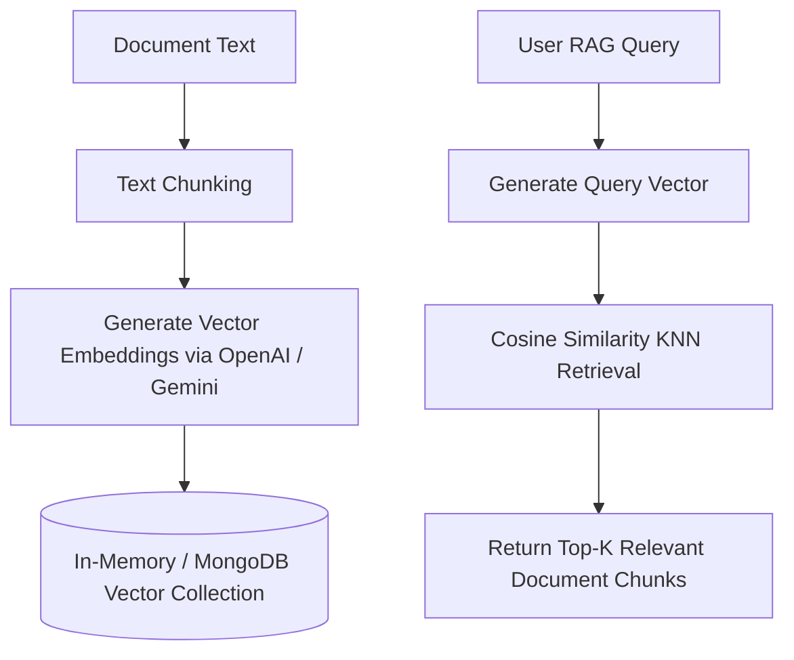

# File 04: Semantic Vector Store (`src/lib/vector-store.ts`)

## Overview
The **Semantic Vector Store** provides vector embedding generation (`embed`) and Cosine Similarity Nearest Neighbor (KNN) retrieval for document chunks.

---

## 1. Vector Search Architecture



---

## 2. Vector Store Implementation (`src/lib/vector-store.ts`)

```typescript
import { embed } from "ai";
import { defaultModel } from "./ai-config";

export interface VectorDocument {
    id: string;
    content: string;
    embedding: number[];
}

export class SimpleVectorStore {
    private documents: VectorDocument[] = [];

    async addDocument(id: string, content: string): Promise<void> {
        // Generate embedding using Vercel AI SDK embed
        const { embedding } = await embed({
            model: defaultModel as any,
            value: content
        });

        this.documents.push({ id, content, embedding });
    }

    private cosineSimilarity(vecA: number[], vecB: number[]): number {
        let dot = 0, normA = 0, normB = 0;
        for (let i = 0; i < vecA.length; i++) {
            dot += vecA[i] * vecB[i];
            normA += vecA[i] * vecA[i];
            normB += vecB[i] * vecB[i];
        }
        return dot / (Math.sqrt(normA) * Math.sqrt(normB));
    }

    async similaritySearch(queryVector: number[], topK = 3): Promise<VectorDocument[]> {
        const scored = this.documents.map(doc => ({
            ...doc,
            score: this.cosineSimilarity(queryVector, doc.embedding)
        }));

        scored.sort((a, b) => b.score - a.score);
        return scored.slice(0, topK);
    }
}
```

---

## Key Takeaways
1. Computes vector embeddings using Vercel AI SDK's `embed()` function.
2. Performs Cosine Similarity matching for semantic retrieval.
