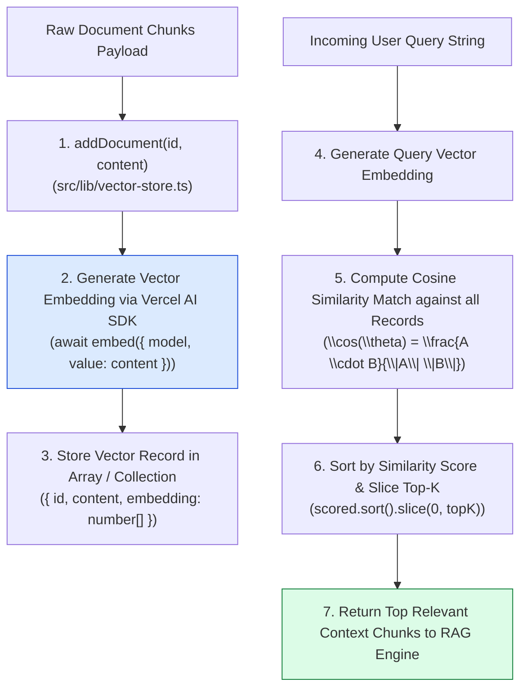
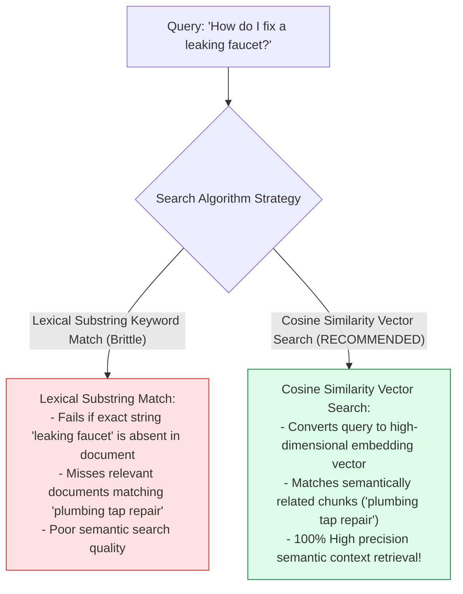
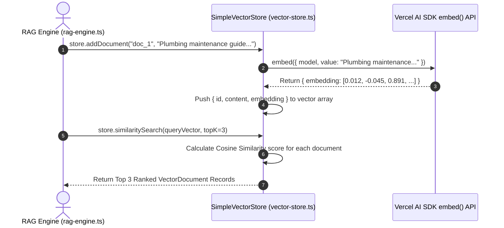

# Module 04: Semantic Vector Store & Embedding Retrieval (`src/lib/vector-store.ts`)

## Overview

Keyword-based text search fails when users ask questions using different vocabulary than the underlying documents (e.g. asking for "automobile maintenance tips" when documents discuss "car repair guides"). The **Semantic Vector Store (`src/lib/vector-store.ts`)** converts text chunks into high-dimensional vector embeddings using Vercel AI SDK's **`embed()`** function and performs **Cosine Similarity** K-Nearest Neighbors (KNN) search to retrieve the most semantically relevant document chunks (`topK: 3`) for RAG context injection.

Understanding **Vercel AI SDK Embedding Generation (`embed()`)**, **High-Dimensional Vector Spaces**, **Cosine Similarity Vector Mathematics**, and **Top-K Nearest Neighbor Retrieval** is essential for vector search.

---

## 1. Semantic Vector Store Topology



---

## 2. Keyword Substring Search vs. Cosine Similarity Vector Search



### Mathematical Vector Search Reference Matrix

| Mathematical Property | Formula / Equation | Technical Purpose |
| :--- | :--- | :--- |
| **Dot Product ($A \cdot B$)** | $\sum_{i=1}^{n} A_i B_i$ | Measures direction alignment between query and doc vectors. |
| **Vector Magnitude ($\|A\|$)** | $\sqrt{\sum_{i=1}^{n} A_i^2}$ | Normalizes vector lengths to eliminate chunk size bias. |
| **Cosine Similarity** | $\frac{A \cdot B}{\|A\| \|B\|}$ | Yields normalized similarity score ($0.0$ to $1.0$). |

---

## 3. Asynchronous Vector Embedding & Retrieval Sequence



---

## 4. Code Walkthrough (`src/lib/vector-store.ts`)

```typescript
import { embed } from "ai";
import { defaultModel } from "./ai-config";

/**
 * Interface representing a document record stored in the vector index
 */
export interface VectorDocument {
  id: string;
  content: string;
  embedding: number[];
  metadata?: Record<string, any>;
}

/**
 * In-memory Semantic Vector Store implementation
 * Generates embeddings via Vercel AI SDK embed() and ranks chunks using Cosine Similarity
 */
export class SimpleVectorStore {
  private documents: VectorDocument[] = [];

  /**
   * Generates a vector embedding for text content and stores it in the index
   * @param id - Unique document chunk identifier
   * @param content - Text chunk string
   * @param metadata - Optional metadata key-value object
   */
  async addDocument(id: string, content: string, metadata?: Record<string, any>): Promise<void> {
    if (!id || !content) {
      throw new Error("[VECTOR STORE ERROR] Both 'id' and 'content' are required.");
    }

    console.log(`⚡ [VECTOR STORE] Generating embedding vector for doc ID: "${id}"...`);

    // Generate high-dimensional vector embedding using Vercel AI SDK embed()
    const { embedding } = await embed({
      model: defaultModel as any,
      value: content
    });

    this.documents.push({
      id,
      content,
      embedding,
      metadata
    });

    console.log(`✅ [VECTOR STORE] Successfully indexed doc "${id}" (${embedding.length} dimensions).`);
  }

  /**
   * Computes Cosine Similarity between two vector arrays
   * Formula: cos(theta) = (A . B) / (||A|| * ||B||)
   */
  private cosineSimilarity(vecA: number[], vecB: number[]): number {
    if (vecA.length !== vecB.length) {
      throw new Error("[VECTOR STORE ERROR] Vector dimension mismatch.");
    }

    let dotProduct = 0;
    let normA = 0;
    let normB = 0;

    for (let i = 0; i < vecA.length; i++) {
      dotProduct += vecA[i] * vecB[i];
      normA += vecA[i] * vecA[i];
      normB += vecB[i] * vecB[i];
    }

    const denominator = Math.sqrt(normA) * Math.sqrt(normB);
    if (denominator === 0) return 0;

    return dotProduct / denominator;
  }

  /**
   * Performs Cosine Similarity KNN retrieval for a target query vector
   * @param queryVector - Query vector embedding array
   * @param topK - Maximum number of nearest neighbor documents to return (default: 3)
   * @returns Array of ranked VectorDocument records sorted by similarity score
   */
  async similaritySearch(queryVector: number[], topK = 3): Promise<VectorDocument[]> {
    if (!queryVector || queryVector.length === 0) {
      throw new Error("[VECTOR STORE ERROR] Query vector cannot be empty.");
    }

    console.log(`🔍 [VECTOR STORE] Running Cosine Similarity KNN search across ${this.documents.length} records...`);

    const scored = this.documents.map((doc) => ({
      ...doc,
      score: this.cosineSimilarity(queryVector, doc.embedding)
    }));

    // Sort documents in descending order of similarity score
    scored.sort((a, b) => b.score - a.score);

    const topResults = scored.slice(0, topK);
    console.log(`✅ [VECTOR STORE MATCH] Retreived Top ${topResults.length} chunks (Best Score: ${topResults[0]?.score.toFixed(4) || 0}).`);

    return topResults;
  }
}
```

---

## Key Production Takeaways

1. **Generate Vector Embeddings via `embed()`**: Use Vercel AI SDK's `embed({ model, value })` to produce standardized high-dimensional vector representations.
2. **Rank Chunks using Cosine Similarity**: Calculate Cosine Similarity scores ($\cos(\theta) = \frac{A \cdot B}{\|A\| \|B\|}$) to measure semantic alignment between query and chunk vectors.
3. **Normalize Magnitudes for Accuracy**: Divide vector dot products by the product of magnitudes to eliminate document length bias.
4. **Slice Top-K Results for Context Windows**: Sort matching chunks by similarity score and slice the top-K results to fit within LLM prompt token context budgets.


## Learn from the implementation

Use the matching source file as an executable example, not just something to copy. Before running it, state in your own words what data enters the module, what it returns, and which values it changes. Then trace one realistic request from the caller through each function.

Pay special attention to these questions:

- **Data flow:** Which object, array, string, or state value moves between functions? What shape must it have?
- **Control flow:** Which branch, loop, early return, or retry changes the outcome? What condition selects it?
- **Async boundaries:** Where does the code wait for an LLM, database, network, file system, or tool? What should happen if that operation rejects or returns no result?
- **Side effects:** Which lines log information, make an external request, store data, or mutate in-memory state? Keep those distinct from pure calculations.
- **Production limits:** Which assumptions are only safe for a tutorial—for example, in-memory storage, fixed thresholds, approximate token counts, mock data, or a hard-coded batch size?

A useful practice is to change one input at a time and predict the result before executing it. If you can explain why the output changed, when the module should be used, and one way it could fail, you understand the concept rather than only the syntax.
