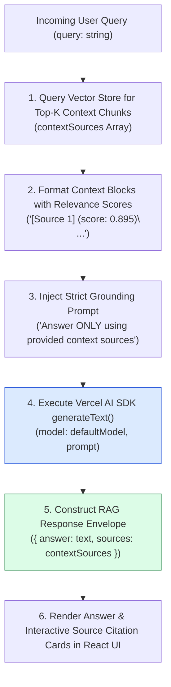
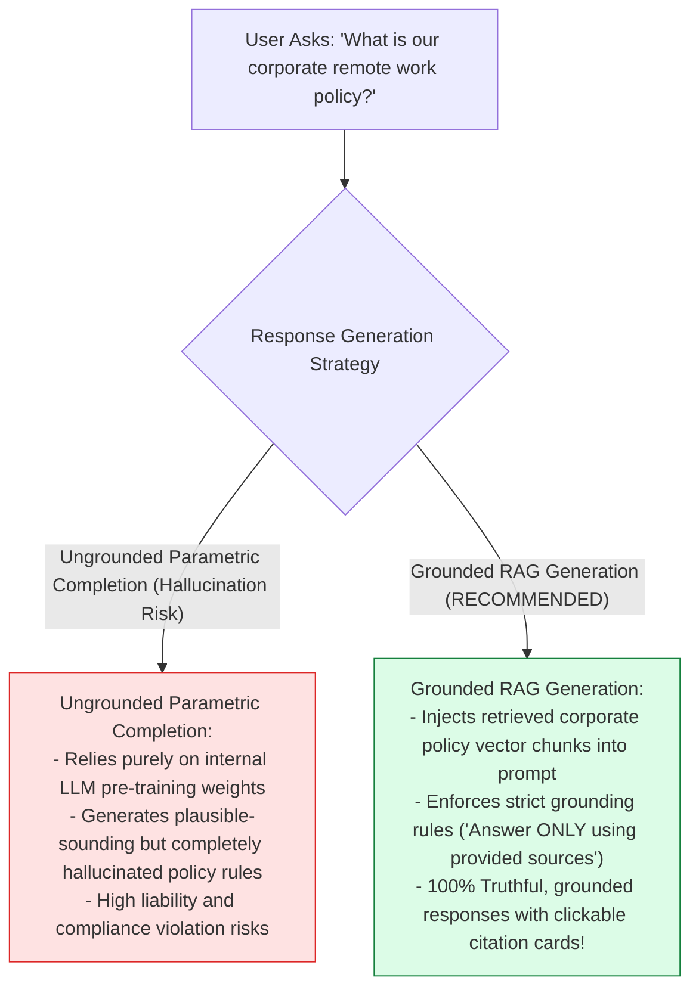
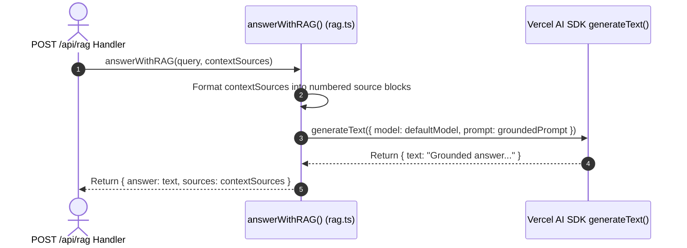

# Module 05: RAG Generation Engine & Source Citation (`src/lib/rag.ts`)

## Overview

Generating responses based solely on parametric LLM memory often leads to hallucinated facts or outdated information. The **RAG Generation Engine (`src/lib/rag.ts`)** consumes retrieved vector document chunks (`contextSources`), formats them into numbered context blocks with relevance scores, injects strict grounding rules into the system prompt, and executes Vercel AI SDK's **`generateText()`** to produce accurate, grounded answers accompanied by structured source citation cards.

Understanding **Retrieval-Augmented Generation (RAG)**, **Vercel AI SDK `generateText()`**, **Context Formatting & Grounding Rules**, and **Source Citation Array Schemas** is essential for enterprise RAG applications.

---

## 1. RAG Generation Engine Topology



---

## 2. Ungrounded LLM Parametric Output vs. Grounded RAG Generation



### RAG Response Payload Schema Specification

| JSON Property | Data Type | Sample Schema Value | Technical Purpose |
| :--- | :--- | :--- | :--- |
| **`answer`** | `String` | `"Employees may work remotely 2 days..."` | Grounded textual response generated by LLM. |
| **`sources`** | `Array<Object>` | `[{ content: '...', score: 0.895 }]` | Array of retrieved context chunks for citation cards. |
| **`sources[i].score`** | `Number` | `0.895` | Cosine similarity relevance score ($0.0$ to $1.0$). |

---

## 3. Asynchronous RAG Generation Sequence



---

## 4. Code Walkthrough (`src/lib/rag.ts`)

```typescript
import { generateText } from "ai";
import { defaultModel } from "./ai-config";

/**
 * Interface representing a retrieved context source chunk
 */
export interface RAGSource {
  id?: string;
  content: string;
  score?: number;
  metadata?: Record<string, any>;
}

/**
 * RAG Response Payload Envelope interface
 */
export interface RAGResponsePayload {
  answer: string;
  sources: RAGSource[];
}

/**
 * Executes grounded RAG generation using retrieved context sources
 * @param query - User question string
 * @param contextSources - Array of retrieved VectorDocument chunk sources
 * @returns Promise resolving to RAGResponsePayload ({ answer, sources })
 */
export async function answerWithRAG(query: string, contextSources: RAGSource[] = []): Promise<RAGResponsePayload> {
  if (!query) throw new Error("[RAG ENGINE ERROR] Parameter 'query' string is required.");

  console.log(`⚡ [RAG ENGINE] Processing grounded answer for query: "${query}" across ${contextSources.length} context sources...`);

  // Handle case where zero context chunks were retrieved
  if (contextSources.length === 0) {
    console.warn("⚠️ [RAG ENGINE WARNING] Zero context sources provided. Returning ungrounded refusal.");
    return {
      answer: "I do not have enough relevant document information in my knowledge base to answer your question accurately.",
      sources: []
    };
  }

  // 1. Format retrieved context chunks into numbered source blocks
  const formattedContext = contextSources
    .map((s, i) => `[Source ${i + 1}] (Relevance Score: ${s.score ? s.score.toFixed(3) : "N/A"})\n${s.content.trim()}`)
    .join("\n\n----------------------------------------\n\n");

  // 2. Construct grounded prompt with strict refusal instructions
  const prompt = `You are Samvaad AI's RAG Knowledge Assistant.
Answer the user's question below strictly using ONLY the provided CONTEXT SOURCES.

Strict Grounding Instructions:
1. Base your answer ENTIRELY on the provided context sources below.
2. If the answer cannot be explicitly derived from the sources, state: "I do not have enough information to answer based on the provided documents."
3. Include inline numerical source citations (e.g. [Source 1], [Source 2]) whenever referencing specific facts.

CONTEXT SOURCES:
${formattedContext}

USER QUESTION: "${query}"

Grounded Answer:`;

  try {
    // 3. Execute Vercel AI SDK generateText()
    const { text } = await generateText({
      model: defaultModel,
      prompt
    });

    console.log(`✅ [RAG GENERATION SUCCESS] Generated grounded response (${text.length} characters).`);

    return {
      answer: text.trim(),
      sources: contextSources
    };
  } catch (err: any) {
    console.error("🚨 [RAG GENERATION ERROR] LLM text generation failed:", err.message);
    throw new Error("RAG Text Generation Failed: " + err.message);
  }
}
```

---

## Key Production Takeaways

1. **Ground LLMs with Strict Refusal Prompts**: Direct the model to answer strictly using provided context sources and explicitly state when information is missing to prevent hallucinations.
2. **Include Inline Citation Markers**: Instruct the LLM to insert numerical citation references (e.g., `[Source 1]`) matching the formatted context blocks.
3. **Return Structured Source Envelopes**: Include the `sources` array in the response payload so front-end UIs can render interactive citation accordions or cards.
4. **Handle Empty Retrieval Gracefully**: Catch empty context source arrays (`contextSources.length === 0`) early and return clean refusal messages without wasting LLM token calls.


## Learn from the implementation

Use the matching source file as an executable example, not just something to copy. Before running it, state in your own words what data enters the module, what it returns, and which values it changes. Then trace one realistic request from the caller through each function.

Pay special attention to these questions:

- **Data flow:** Which object, array, string, or state value moves between functions? What shape must it have?
- **Control flow:** Which branch, loop, early return, or retry changes the outcome? What condition selects it?
- **Async boundaries:** Where does the code wait for an LLM, database, network, file system, or tool? What should happen if that operation rejects or returns no result?
- **Side effects:** Which lines log information, make an external request, store data, or mutate in-memory state? Keep those distinct from pure calculations.
- **Production limits:** Which assumptions are only safe for a tutorial—for example, in-memory storage, fixed thresholds, approximate token counts, mock data, or a hard-coded batch size?

A useful practice is to change one input at a time and predict the result before executing it. If you can explain why the output changed, when the module should be used, and one way it could fail, you understand the concept rather than only the syntax.
