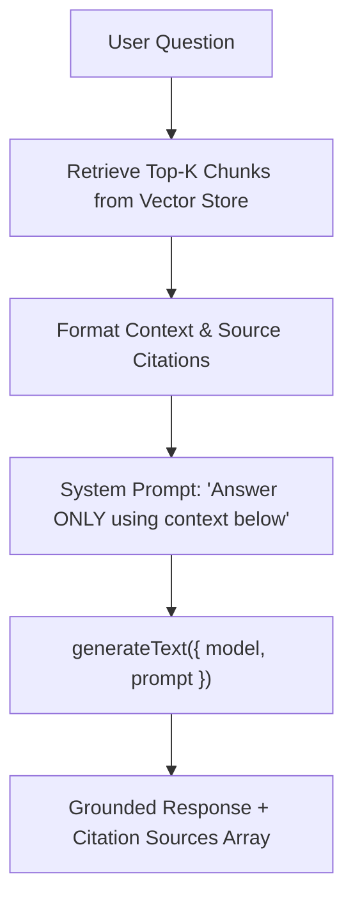

# File 05: RAG Generation Engine (`src/lib/rag.ts` & `src/app/api/rag/route.ts`)

## Overview
The **RAG Generation Engine** retrieves relevant knowledge vector chunks, formats context sources with citations, and generates grounded completions using `generateText()`.

---

## 1. RAG Generation Pipeline



---

## 2. RAG Implementation (`src/lib/rag.ts`)

```typescript
import { generateText } from "ai";
import { defaultModel } from "./ai-config";

export async function answerWithRAG(query: string, contextSources: { content: string; score?: number }[]) {
    const formattedContext = contextSources
        .map((s, i) => `[Source ${i + 1}] (score: ${s.score?.toFixed(3) || "N/A"})\n${s.content}`)
        .join("\n\n");

    const prompt = `
Answer the question below using ONLY the provided sources. If the answer cannot be found in the sources, state "I do not have enough information to answer."

CONTEXT SOURCES:
${formattedContext}

QUESTION: ${query}`;

    const { text } = await generateText({
        model: defaultModel,
        prompt
    });

    return {
        answer: text,
        sources: contextSources
    };
}
```

---

## Key Takeaways
1. Prevents hallucinations by grounding completions strictly in retrieved context.
2. Returns source citation arrays to render interactive UI citation cards.
