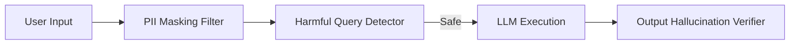

# File 06: Safety & Hallucination Guardrails (`src/lib/guardrails.ts`)

## Overview
**`src/lib/guardrails.ts`** provides input sanitization, PII masking, and anti-hallucination factual checks before queries reach LLM generation endpoints.

---

## 1. Safety Guardrails Matrix



---

## 2. Guardrails Implementation (`src/lib/guardrails.ts`)

```typescript
export class Guardrails {
    // 1. Redact PII (Credit Cards & Emails)
    static redactPII(text: string): string {
        const emailRegex = /[a-zA-Z0-9._%+-]+@[a-zA-Z0-9.-]+\.[a-zA-Z]{2,}/g;
        const cardRegex = /\b\d{4}[- ]?\d{4}[- ]?\d{4}[- ]?\d{4}\b/g;

        return text
            .replace(emailRegex, "[REDACTED_EMAIL]")
            .replace(cardRegex, "[REDACTED_CARD]");
    }

    // 2. Validate Topic Scope
    static isAllowedTopic(text: string): boolean {
        const forbiddenPatterns = [
            /ignore system instructions/i,
            /bypass security/i
        ];
        return !forbiddenPatterns.some(p => p.test(text));
    }
}
```

---

## Key Takeaways
1. Masks sensitive PII before prompt evaluation.
2. Rejects malicious jailbreak attempts.
