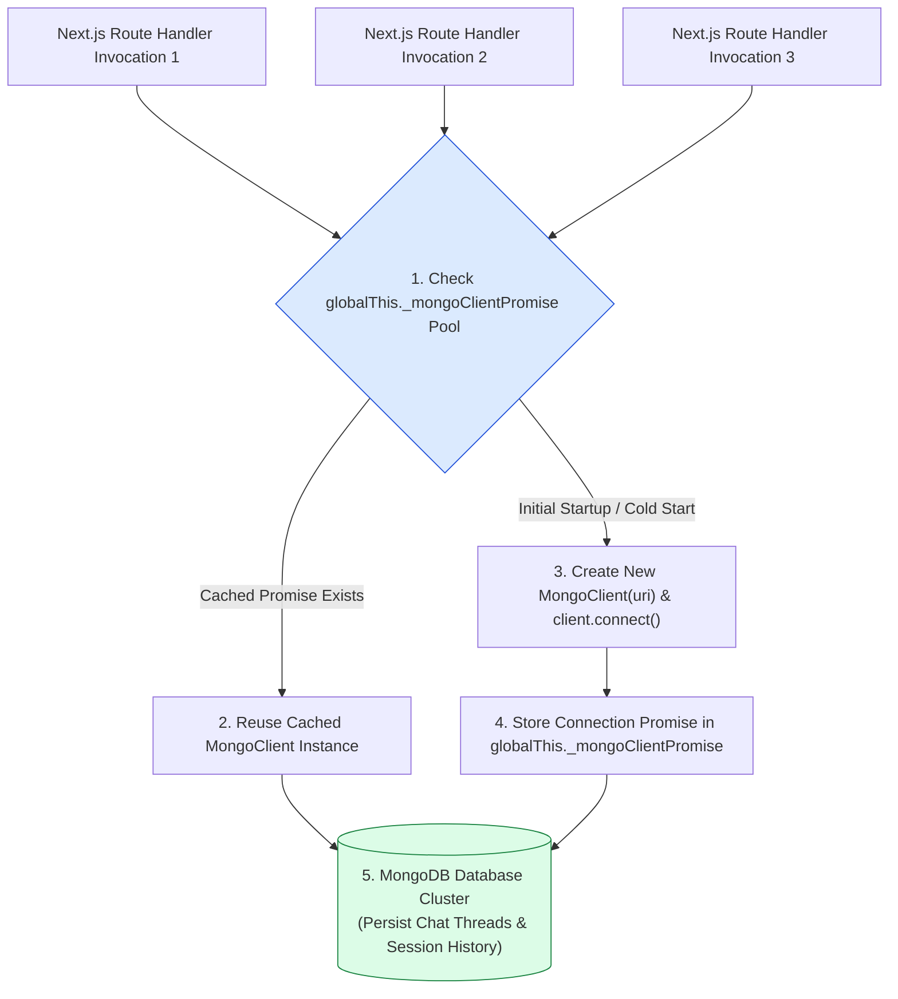
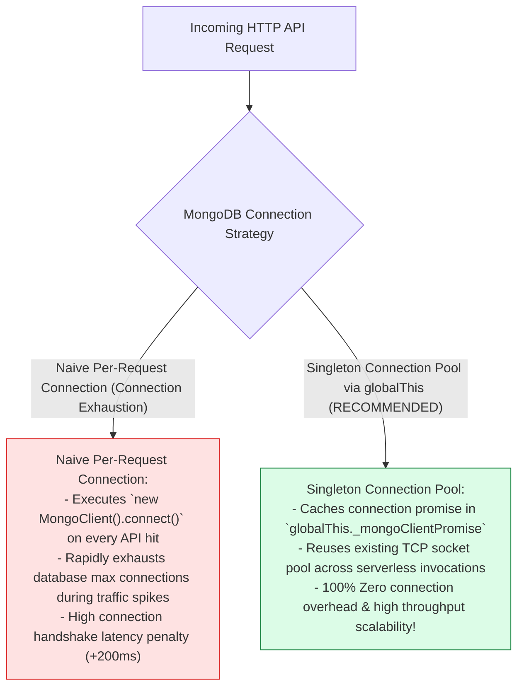
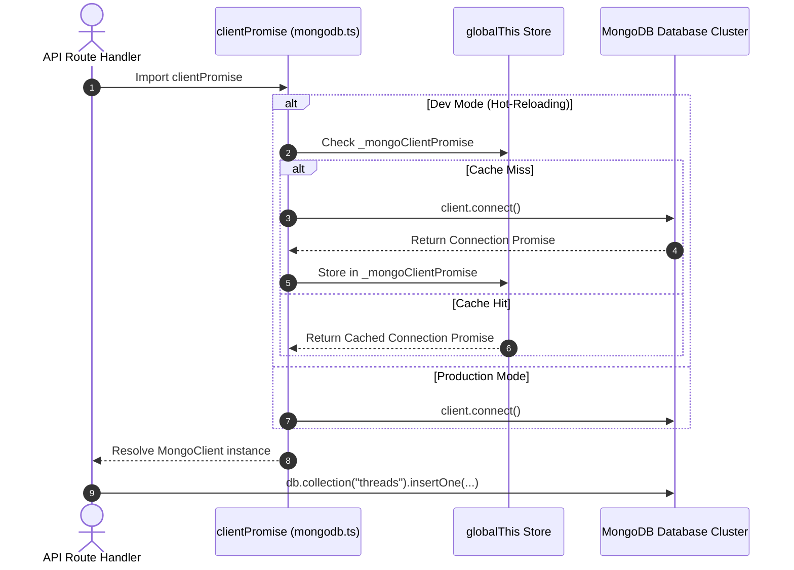

# Module 07: MongoDB Connection Singleton & Session Storage (`src/lib/mongodb.ts`)

## Overview

In serverless application environments (such as Next.js API Routes deployed on Vercel), instantiating a new database connection client on every incoming HTTP request causes rapid connection pool exhaustion and high latency overhead. The **MongoDB Persistence Module (`src/lib/mongodb.ts`)** implements a **Singleton Connection Pool Pattern** (`clientPromise`) that caches the database connection promise in `globalThis` during development hot-reloading and reuses connections across serverless route invocations.

Understanding **Serverless Connection Pool Exhaustion**, **Global Singleton Caching (`globalThis`)**, **MongoDB Node Driver ClientPromises**, and **Thread State Persistence** is essential for database engineering.

---

## 1. MongoDB Singleton Topology



---

## 2. Naive Per-Request Connection vs. Singleton Connection Pool



### Connection Pool Configuration Parameter Matrix

| Configuration Variable | Standard Environment Value | Operational Technical Purpose |
| :--- | :--- | :--- |
| **`MONGODB_URI`** | `process.env.MONGODB_URI` | Connection URI string targeting MongoDB instance/cluster. |
| **`globalThis._mongoClientPromise`** | `Promise<MongoClient>` | Global cache key holding active connection promise. |
| **`NODE_ENV`** | `"development" \| "production"` | Determines whether global caching or direct export is used. |

---

## 3. Asynchronous Connection & Query Sequence



---

## 4. Code Walkthrough (`src/lib/mongodb.ts`)

```typescript
import { MongoClient } from "mongodb";

/**
 * MongoDB URI string configuration
 */
const uri = process.env.MONGODB_URI || "mongodb://localhost:27017/samvaad_ai";

let client: MongoClient;
let clientPromise: Promise<MongoClient>;

/**
 * Global Type Augmentation for TypeScript globalThis caching
 */
declare global {
  var _mongoClientPromise: Promise<MongoClient> | undefined;
}

if (!process.env.MONGODB_URI) {
  console.warn("⚠️ [MONGODB WARNING] MONGODB_URI missing in environment variables. Falling back to local default.");
}

if (process.env.NODE_ENV === "development") {
  // In development mode, use a global variable so that the MongoClient instance
  // is preserved across module reloads caused by Next.js HMR (Hot Module Replacement).
  if (!global._mongoClientPromise) {
    console.log("⚡ [MONGODB DEV] Initializing new MongoClient singleton instance...");
    client = new MongoClient(uri);
    global._mongoClientPromise = client.connect();
  } else {
    console.log("🔄 [MONGODB DEV] Reusing cached MongoClient singleton connection promise.");
  }
  clientPromise = global._mongoClientPromise;
} else {
  // In production mode, it's best to not use a global variable.
  console.log("⚡ [MONGODB PROD] Connecting MongoClient instance...");
  client = new MongoClient(uri);
  clientPromise = client.connect();
}

/**
 * Export a module-scoped MongoClient promise. By doing this in a
 * separate module, the client can be shared across route handlers.
 */
export default clientPromise;
```

---

## Key Production Takeaways

1. **Implement Singleton Connection Pools for Serverless**: Cache the MongoDB client connection promise in `globalThis` during development to prevent connection exhaustion during hot-reloading.
2. **Export Module-Scoped Client Promises**: Export `clientPromise` directly so Next.js Route Handlers can await connection resolution cleanly (`const client = await clientPromise`).
3. **Prevent Connection Handshake Penalties**: Reusing established database TCP socket pools eliminates 200ms connection handshake penalties on API invocations.
4. **Isolate Database Collections for AI State**: Store chat session metadata, message histories, and vector chunk embeddings in dedicated MongoDB collections.


## Learn from the implementation

Use the matching source file as an executable example, not just something to copy. Before running it, state in your own words what data enters the module, what it returns, and which values it changes. Then trace one realistic request from the caller through each function.

Pay special attention to these questions:

- **Data flow:** Which object, array, string, or state value moves between functions? What shape must it have?
- **Control flow:** Which branch, loop, early return, or retry changes the outcome? What condition selects it?
- **Async boundaries:** Where does the code wait for an LLM, database, network, file system, or tool? What should happen if that operation rejects or returns no result?
- **Side effects:** Which lines log information, make an external request, store data, or mutate in-memory state? Keep those distinct from pure calculations.
- **Production limits:** Which assumptions are only safe for a tutorial—for example, in-memory storage, fixed thresholds, approximate token counts, mock data, or a hard-coded batch size?

A useful practice is to change one input at a time and predict the result before executing it. If you can explain why the output changed, when the module should be used, and one way it could fail, you understand the concept rather than only the syntax.
