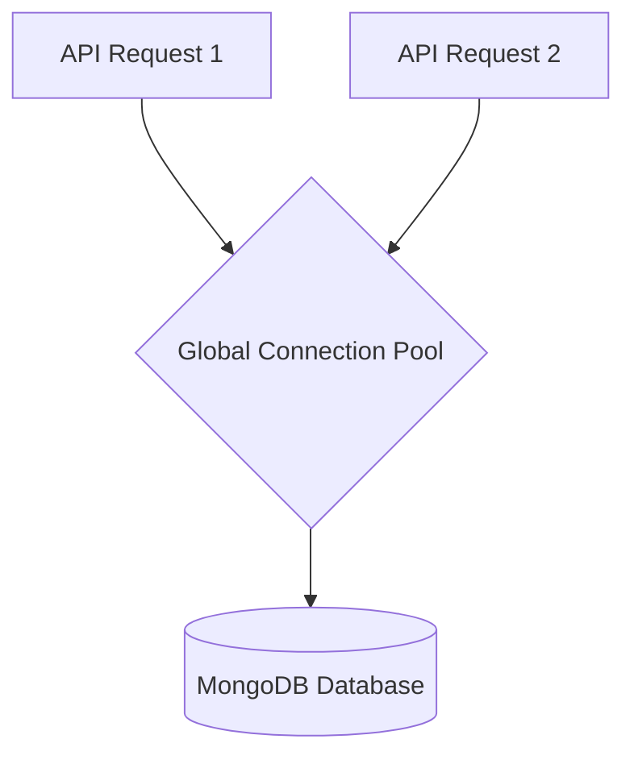

# File 07: MongoDB Connection & Session Storage (`src/lib/mongodb.ts`)

## Overview
**`src/lib/mongodb.ts`** provides singleton connection pooling for MongoDB, persisting user sessions, thread state, and message histories across serverless Next.js API route invocations.

---

## 1. MongoDB Singleton Connection Pool



---

## 2. MongoDB Singleton Implementation (`src/lib/mongodb.ts`)

```typescript
import { MongoClient } from "mongodb";

const uri = process.env.MONGODB_URI || "mongodb://localhost:27017/samvaad_ai";
let client: MongoClient;
let clientPromise: Promise<MongoClient>;

if (process.env.NODE_ENV === "development") {
    // Reuse global connection pool in dev mode to prevent connection exhaustion
    let globalWithMongo = global as typeof globalThis & {
        _mongoClientPromise?: Promise<MongoClient>;
    };

    if (!globalWithMongo._mongoClientPromise) {
        client = new MongoClient(uri);
        globalWithMongo._mongoClientPromise = client.connect();
    }
    clientPromise = globalWithMongo._mongoClientPromise;
} else {
    client = new MongoClient(uri);
    clientPromise = client.connect();
}

export default clientPromise;
```

---

## Key Takeaways
1. Caches database connection in `globalThis` during development hot-reloading.
2. Prevents connection exhaustion in serverless environments.
