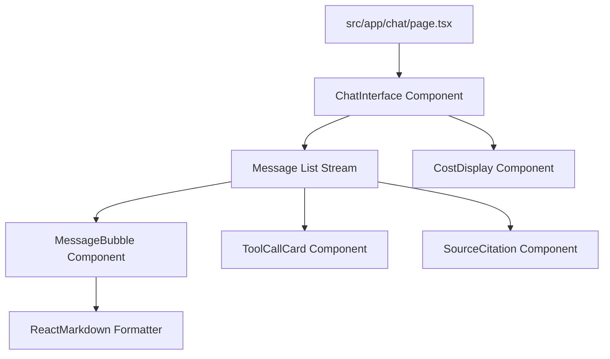

# File 08: React 19 UI Component Architecture (`src/components/`)

## Overview
The **React 19 UI Component Suite** renders streaming chat messages (`chat-interface.tsx`, `message-bubble.tsx`), interactive tool invocation cards (`tool-call-card.tsx`), RAG source citations (`source-citation.tsx`), and realtime token cost tracking (`cost-display.tsx`).

---

## 1. UI Component Hierarchy



---

## 2. Component Key Implementations (`src/components/`)

### Tool Call Card (`src/components/tool-call-card.tsx`)
```tsx
interface ToolCallProps {
    name: string;
    args: any;
    result?: any;
}

export function ToolCallCard({ name, args, result }: ToolCallProps) {
    return (
        <div className="bg-gray-800 border border-yellow-500/30 rounded-lg p-3 my-2 text-xs font-mono">
            <div className="flex items-center justify-between text-yellow-400 font-bold mb-2">
                <span>🔧 Tool Call: {name}</span>
            </div>
            <div className="bg-gray-900 rounded p-2 mb-2 text-gray-300">
                <p className="text-gray-500 mb-1">Arguments:</p>
                <pre>{JSON.stringify(args, null, 2)}</pre>
            </div>
            {result && (
                <div className="bg-gray-900 rounded p-2 text-green-400">
                    <p className="text-gray-500 mb-1">Result:</p>
                    <pre>{JSON.stringify(result, null, 2)}</pre>
                </div>
            )}
        </div>
    );
}
```

---

## Key Takeaways
1. Visually presents server/client tool calls and results cleanly in the chat stream.
2. Built with modern TailwindCSS dark mode styling.
