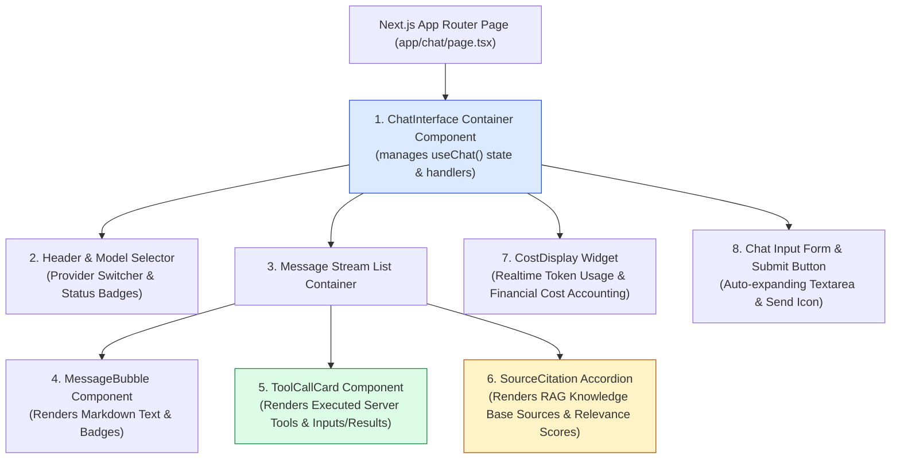
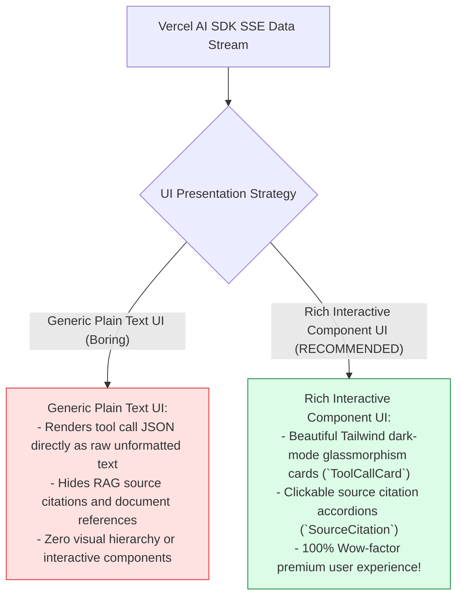
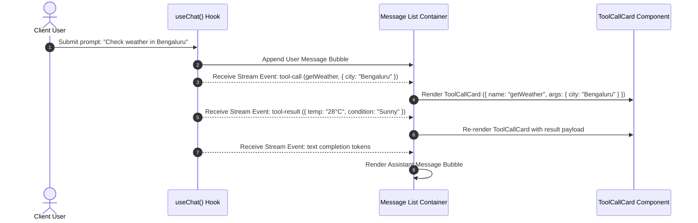

# Module 08: React 19 UI Component Architecture & Streaming Cards (`src/components/`)

## Overview

A premium conversational AI user interface must go beyond displaying plain text paragraphs by providing rich visual feedback for streaming message tokens, rendering interactive tool execution cards (`ToolCallCard`), displaying RAG source citations (`SourceCitation`), and tracking token usage costs in real time (`CostDisplay`). The **React 19 UI Component Architecture (`src/components/`)** leverages Next.js 15 App Router components, Tailwind CSS dark mode design tokens, and the **Vercel AI SDK `useChat()`** hook to construct a responsive, full-stack AI user interface.

Understanding **React 19 Server/Client Component Boundaries**, **Vercel AI SDK `useChat()` UI Binding**, **Interactive Tool Call Rendering (`ToolCallCard`)**, and **Tailwind Dark Mode Glassmorphism Systems** is essential for frontend AI design.

---

## 1. UI Component Hierarchy Topology



---

## 2. Generic Plain Text UI vs. Rich Interactive AI Component UI



### React UI Component Reference Specification

| Component File | Props Signature | Targeted UI Responsibility | Tailwind Theme Styling |
| :--- | :--- | :--- | :--- |
| **`ToolCallCard`** | `{ name, args, result }` | Renders executed tool arguments & JSON outputs. | `bg-slate-900 border-amber-500/30 text-amber-400` |
| **`SourceCitation`**| `{ sources }` | Renders clickable RAG source document cards. | `bg-slate-800/80 border-blue-500/30 text-blue-300` |
| **`MessageBubble`**| `{ message }` | Formats streaming assistant text with Markdown. | `bg-slate-800 text-slate-100 rounded-2xl` |
| **`CostDisplay`** | `{ inputTokens, outputTokens }` | Displays token usage & USD cost estimates. | `bg-emerald-950/40 border-emerald-500/30 text-emerald-400` |

---

## 3. Asynchronous UI Render Sequence for Tool Invocation



---

## 4. Code Walkthrough (`src/components/tool-call-card.tsx`)

```tsx
"use client";

import React, { useState } from "react";

/**
 * Interface properties for ToolCallCard Component
 */
export interface ToolCallProps {
  name: string;
  args: Record<string, any>;
  result?: Record<string, any> | string | null;
  state?: "calling" | "result" | "error";
}

/**
 * Interactive UI Component for displaying AI tool executions in the chat stream
 * Built with React 19 Client Component conventions and Tailwind CSS dark mode styling
 */
export function ToolCallCard({ name, args, result, state = "result" }: ToolCallProps) {
  const [isExpanded, setIsExpanded] = useState<boolean>(true);

  return (
    <div className="my-3 rounded-xl border border-amber-500/30 bg-slate-900/90 p-3.5 shadow-lg backdrop-blur-md transition-all hover:border-amber-500/50">
      {/* Header Bar */}
      <div className="flex items-center justify-between font-mono text-xs font-semibold text-amber-400">
        <div className="flex items-center gap-2">
          <span className="flex h-6 w-6 items-center justify-center rounded-lg bg-amber-500/20 text-amber-300">
            🔧
          </span>
          <span>Tool Execution: <span className="text-slate-100 font-bold">{name}</span></span>
        </div>
        
        <button
          onClick={() => setIsExpanded(!isExpanded)}
          className="rounded px-2 py-1 text-slate-400 hover:bg-slate-800 hover:text-slate-200 transition-colors"
        >
          {isExpanded ? "Collapse ▲" : "Expand ▼"}
        </button>
      </div>

      {/* Expandable Content Body */}
      {isExpanded && (
        <div className="mt-3 space-y-2.5 font-mono text-xs">
          {/* Tool Arguments Block */}
          <div className="rounded-lg bg-slate-950/80 p-2.5 text-slate-300 border border-slate-800">
            <p className="mb-1.5 font-sans font-semibold text-slate-400">Input Arguments:</p>
            <pre className="overflow-x-auto text-amber-200/90">{JSON.stringify(args, null, 2)}</pre>
          </div>

          {/* Tool Result Block */}
          {result && (
            <div className="rounded-lg bg-slate-950/80 p-2.5 text-emerald-400 border border-emerald-900/50">
              <p className="mb-1.5 font-sans font-semibold text-emerald-500">Output Payload Result:</p>
              <pre className="overflow-x-auto">{typeof result === "string" ? result : JSON.stringify(result, null, 2)}</pre>
            </div>
          )}

          {/* Loading Indicator when Tool is Active */}
          {!result && state === "calling" && (
            <div className="flex items-center gap-2 text-amber-300/80 italic font-sans text-xs pt-1">
              <span className="h-2 w-2 animate-ping rounded-full bg-amber-400"></span>
              Executing backend server tool operation...
            </div>
          )}
        </div>
      )}
    </div>
  );
}
```

---

## Key Production Takeaways

1. **Use `ToolCallCard` for Visual Transparency**: Render tool calls in dedicated dark-mode cards so users understand when and why the LLM is calling server tools.
2. **Support Collapsible Inspector Views**: Include expand/collapse toggles in card headers so users can inspect full JSON payloads without cluttering the chat view.
3. **Style Components with Tailwind CSS**: Apply modern dark-mode glassmorphism styling (`bg-slate-900/90`, `border-amber-500/30`, `backdrop-blur-md`) to ensure a premium UI aesthetic.
4. **Leverage Vercel AI SDK Client Hooks**: Connect UI components to `useChat()` message arrays to automatically stream tool invocations and results as they arrive over SSE.


## Learn from the implementation

Use the matching source file as an executable example, not just something to copy. Before running it, state in your own words what data enters the module, what it returns, and which values it changes. Then trace one realistic request from the caller through each function.

Pay special attention to these questions:

- **Data flow:** Which object, array, string, or state value moves between functions? What shape must it have?
- **Control flow:** Which branch, loop, early return, or retry changes the outcome? What condition selects it?
- **Async boundaries:** Where does the code wait for an LLM, database, network, file system, or tool? What should happen if that operation rejects or returns no result?
- **Side effects:** Which lines log information, make an external request, store data, or mutate in-memory state? Keep those distinct from pure calculations.
- **Production limits:** Which assumptions are only safe for a tutorial—for example, in-memory storage, fixed thresholds, approximate token counts, mock data, or a hard-coded batch size?

A useful practice is to change one input at a time and predict the result before executing it. If you can explain why the output changed, when the module should be used, and one way it could fail, you understand the concept rather than only the syntax.
