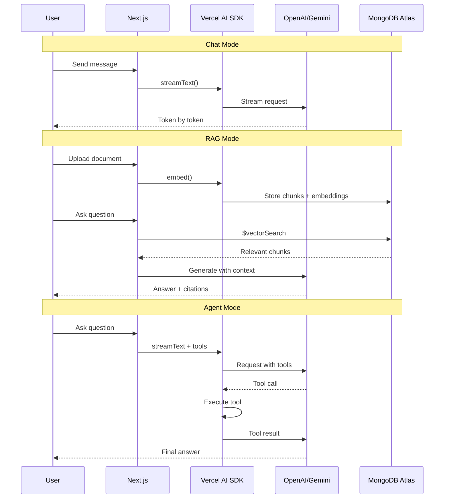

# 08 - SamvaadAI

Client: **SamvaadAI, Hyderabad** — full-stack AI chat app with 3 modes.

A Next.js app using Vercel AI SDK that demonstrates streaming chat, RAG with MongoDB Atlas Vector Search, and AI agents with tool calling.

## Architecture

```mermaid
graph TD
    A[Next.js App] --> B[Chat Mode]
    A --> C[RAG Mode]
    A --> D[Agent Mode]

    B --> E[/api/chat]
    C --> F[/api/rag]
    D --> G[/api/agents]

    E --> H{Model Picker}
    H --> I[OpenAI GPT-4o-mini]
    H --> J[Gemini 2.0 Flash]

    F --> K[Ingest Pipeline]
    F --> L[Query Pipeline]
    K --> M[Chunk Text]
    M --> N[Generate Embeddings]
    N --> O[(MongoDB Atlas)]
    L --> P[Vector Search]
    P --> O
    P --> Q[Generate + Cite]

    G --> R[Tool Router]
    R --> S[Weather Tool]
    R --> T[Calculator Tool]
    R --> U[Search Tool]

    subgraph Safety
        V[Input Guardrails]
        W[Output Guardrails]
    end

    E -.-> V
    F -.-> V
    G -.-> V
```



## Tech Stack

- **Next.js 15** — React full-stack framework
- **Vercel AI SDK** — Streaming, tool calling, multi-model support
- **OpenAI + Gemini** — Dual LLM provider support
- **MongoDB Atlas Vector Search** — RAG document retrieval
- **Tailwind CSS** — Styling
- **TypeScript** — Type safety

## Setup

```bash
cp .env.example .env
# Add OPENAI_API_KEY, GOOGLE_GENERATIVE_AI_API_KEY, MONGODB_URI
npm install
npm run dev
```

Open http://localhost:3000

## MongoDB Atlas Vector Search Index

Create this index on the `documents` collection:

```json
{
  "fields": [
    {
      "type": "vector",
      "path": "embedding",
      "numDimensions": 1536,
      "similarity": "cosine"
    }
  ]
}
```

## Pages

| Route | Mode | Description |
|-------|------|-------------|
| `/` | Landing | Three mode cards |
| `/chat` | Chat | Streaming with model picker |
| `/search` | RAG | Document upload + Q&A with citations |
| `/agents` | Agent | Tool calling with visible tool cards |

## Key Concepts

- **Streaming** — `streamText()` + `toDataStreamResponse()` for real-time tokens
- **Multi-model** — Switch between OpenAI and Gemini at runtime
- **RAG Pipeline** — Chunk, embed, store, vector search, generate with context
- **Tool Calling** — Zod-typed tools with automatic execution via `maxSteps`
- **Guardrails** — Input validation and output filtering


## Learning path

Read the numbered module notes in order before changing the application. Each note explains one responsibility and points to the matching implementation. For each module, follow one input through the code, identify its output and side effects, then run a small example. This builds understanding of the system boundaries before you combine them.
