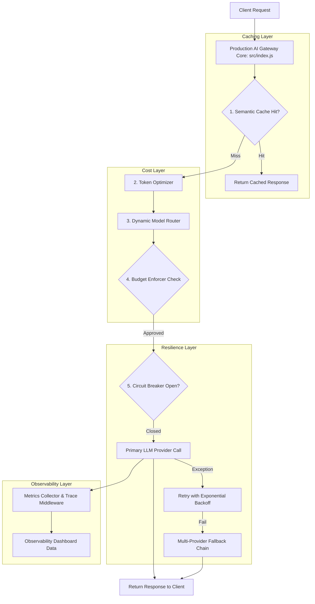

# File 00: Production AI Infrastructure Patterns Overview

## Overview
**Production Patterns** implements enterprise-grade infrastructure resiliency, caching, cost-control, and observability layers for AI applications, shielding downstream systems from API outages, high costs, and latency spikes.

---

## 1. Production AI Gateway Pipeline

---

## 2. Infrastructure Patterns Matrix

| Pattern Domain | Source Module | Responsibility |
| :--- | :--- | :--- |
| **Caching** | `src/caching/` | Semantic similarity query cache, embedding cache, prompt cache |
| **Resilience** | `src/resilience/` | Circuit breaker, multi-provider fallback chains, exponential backoff retries |
| **Cost Optimization** | `src/cost/` | Token budget enforcer, model cost router, prompt token optimizer |
| **Observability** | `src/observability/` | Distributed tracing, Prometheus metrics collector, health dashboard |

---

## Key Takeaways
1. Implements **Defense-in-Depth** for production LLM API calls.
2. Cuts API expenditure through semantic caching and dynamic model routing.
3. Protects uptime using circuit breakers and multi-provider fallback chains.
