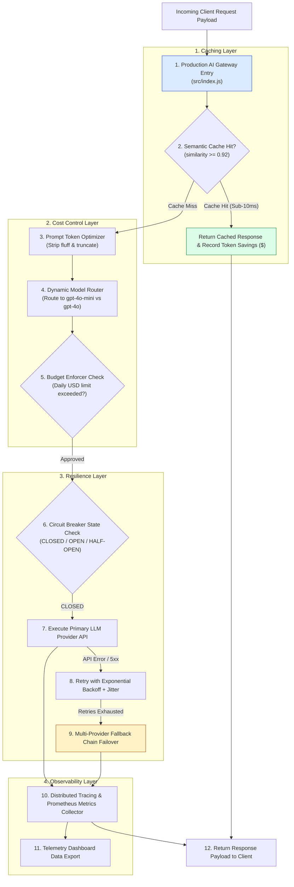
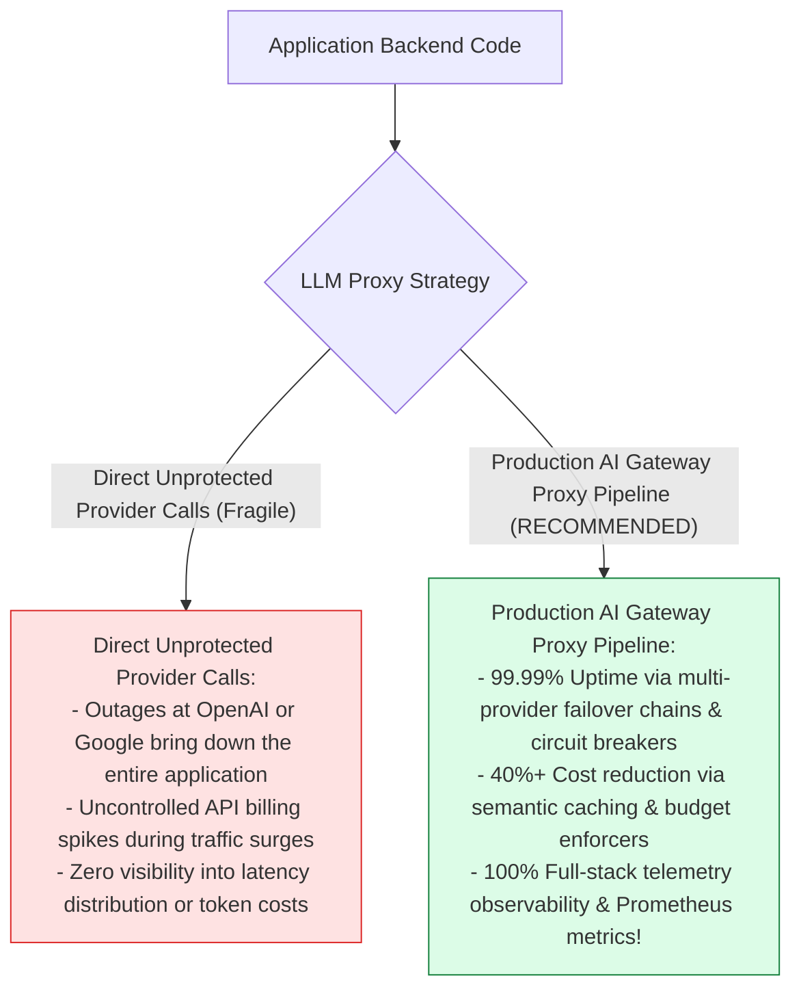
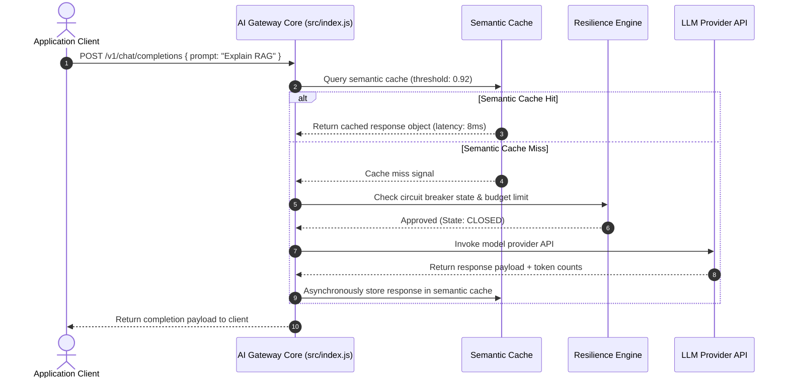

# Module 00: Production AI Infrastructure Patterns & Gateway Architecture Overview

## Overview

Deploying Large Language Model (LLM) applications directly to production without an enterprise proxy gateway exposes organizations to API rate limits, unexpected billing spikes, vendor outages, and unmonitored prompt latencies. The **Production AI Infrastructure Gateway (`src/index.js`)** implements a **Defense-in-Depth Proxy Pipeline** spanning 4 critical operational domains: **Caching** (`semantic-cache`, `prompt-cache`), **Resilience** (`circuit-breaker`, `fallback-chain`, `retry-backoff`), **Cost Control** (`budget-enforcer`, `model-router`, `token-optimizer`), and **Observability** (`trace-middleware`, `metrics-collector`, `dashboard-data`).

Understanding **Enterprise AI Gateway Architecture**, **Multi-Layer Defense-in-Depth**, **Semantic Cache Offloading**, and **Multi-Provider Failover Topologies** is essential for AI systems engineering.

---

## 1. Production AI Gateway Pipeline Topology

---

## 2. Direct Unprotected Provider Calls vs. Production AI Gateway Architecture

### Production Pattern Domain Reference Matrix

| Pattern Domain | Module Directory | Primary Operational Responsibility | Business / Technical Value |
| :--- | :--- | :--- | :--- |
| **Caching Layer** | `src/caching/` | Semantic vector cache, prompt cache. | Sub-10ms latency; cuts API costs by 35%+. |
| **Resilience Layer** | `src/resilience/` | Circuit breaker, fallback chain, exponential backoff retries. | Prevents cascading failures & provider outages. |
| **Cost Control Layer** | `src/cost/` | Budget enforcer, model router, token optimizer. | Enforces hard USD daily spending limits. |
| **Observability Layer**| `src/observability/` | Distributed tracing, Prometheus metrics collector, telemetry dashboard. | Real-time health metrics & latency profiling. |

---

## 3. Asynchronous Defense-in-Depth Request Lifecycle

---

## Key Production Takeaways

1. **Deploy Defense-in-Depth AI Gateways**: Route all LLM API requests through a centralized gateway (`src/index.js`) to enforce caching, resilience, cost control, and observability.
2. **Offload Requests with Semantic Caching**: Use vector similarity caching (`semantic-cache.js`) to return sub-10ms cached answers for semantically equivalent queries.
3. **Protect Uptime with Multi-Provider Failover**: Combine circuit breakers, exponential backoff retries, and fallback chains to achieve 99.99% uptime.
4. **Enforce Hard USD Budget Limits**: Intercept requests with a budget enforcer (`budget-enforcer.js`) to prevent runaway API billing during traffic spikes.

## Learn from the implementation

Use the matching source file as an executable example, not just something to copy. Before running it, state in your own words what data enters the module, what it returns, and which values it changes. Then trace one realistic request from the caller through each function.

Pay special attention to these questions:

- **Data flow:** Which object, array, string, or state value moves between functions? What shape must it have?
- **Control flow:** Which branch, loop, early return, or retry changes the outcome? What condition selects it?
- **Async boundaries:** Where does the code wait for an LLM, database, network, file system, or tool? What should happen if that operation rejects or returns no result?
- **Side effects:** Which lines log information, make an external request, store data, or mutate in-memory state? Keep those distinct from pure calculations.
- **Production limits:** Which assumptions are only safe for a tutorial—for example, in-memory storage, fixed thresholds, approximate token counts, mock data, or a hard-coded batch size?

A useful practice is to change one input at a time and predict the result before executing it. If you can explain why the output changed, when the module should be used, and one way it could fail, you understand the concept rather than only the syntax.
