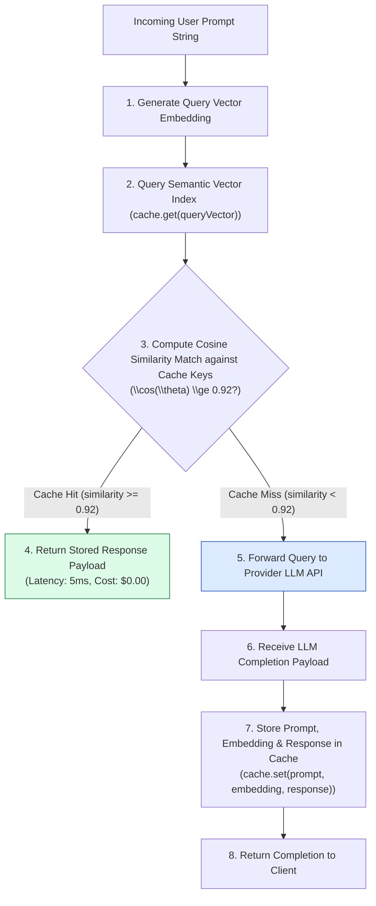
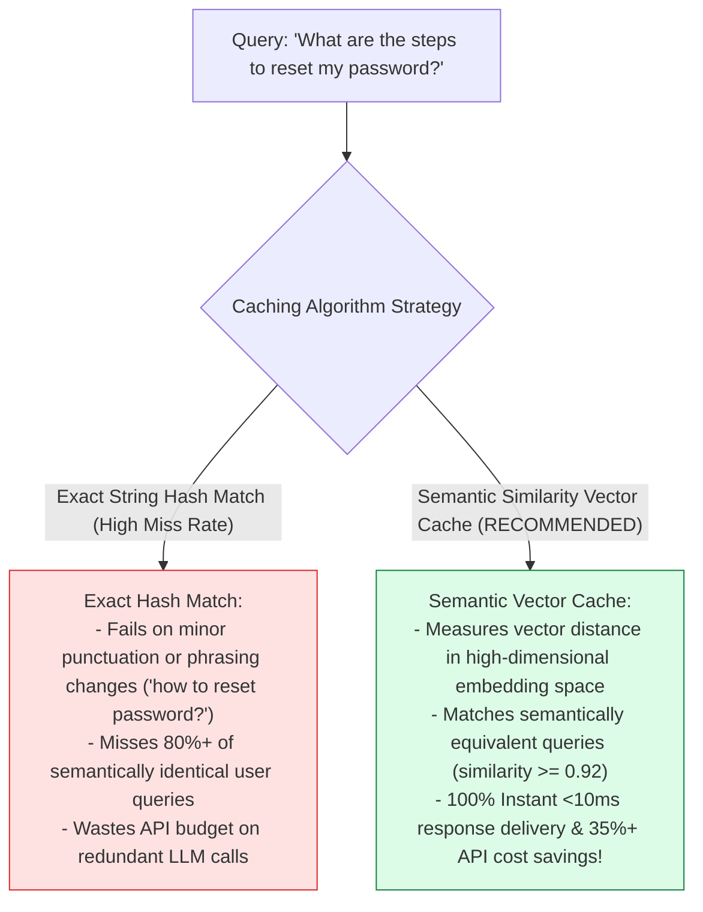
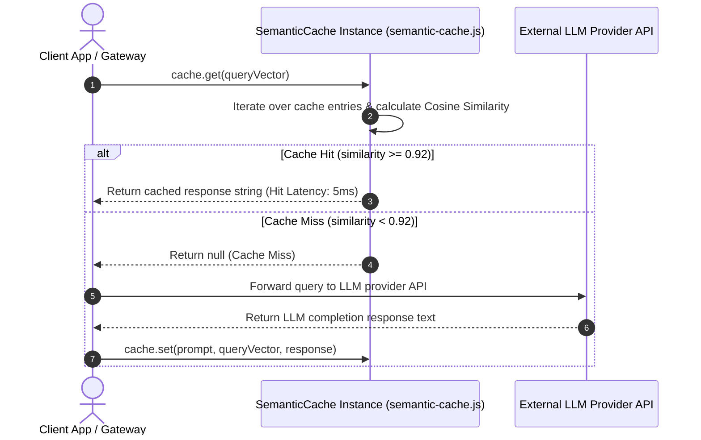

# Module 01: Semantic Query Caching & Vector Offloading (`src/caching/semantic-cache.js`)

## Overview

Exact-match string caching fails in LLM applications because users ask identical questions using slightly different phrasing (e.g. "How do I reset my password?" vs "What are the steps to change my password?"). The **Semantic Cache Module (`src/caching/semantic-cache.js`)** implements an in-memory vector cache (`SemanticCache`) that computes Cosine Similarity between incoming prompt embedding vectors and stored query vectors. When similarity satisfies the threshold ($\text{similarity} \ge 0.92$), the cache serves the stored response in under $10\text{ms}$ with zero LLM API cost.

Understanding **Semantic Vector Equivalence**, **Cosine Similarity Vector Thresholds ($\text{threshold} = 0.92$)**, **Sub-10ms Cache Hit Paths**, and **Cache Mutation Lifecycle Methods** is essential for high-performance AI gateways.

---

## 1. Semantic Cache Decision Topology



---

## 2. Rigid Exact-Match Caching vs. Semantic Vector Caching



### Semantic Cache Parameter Reference Matrix

| Configuration Property | Target Value | Technical Purpose |
| :--- | :--- | :--- |
| **`similarityThreshold`** | `0.92` | Minimum Cosine Similarity required for a cache hit. |
| **`cache` Array** | `SemanticEntry[]` | Array of stored entries (`{ prompt, embedding, response, createdAt }`). |
| **`_cosineSimilarity()`** | Math Helper | Calculates vector dot product divided by magnitude product. |

---

## 3. Asynchronous Semantic Cache Hit & Miss Sequence



---

## 4. Code Walkthrough (`src/caching/semantic-cache.js`)

```javascript
/**
 * Semantic Query Caching Module
 * Stores prompt embeddings and serves cached LLM responses when Cosine Similarity >= threshold
 */
export class SemanticCache {
  /**
   * Initializes SemanticCache with configured similarity threshold
   * @param {number} similarityThreshold - Cosine similarity threshold for cache hits (default: 0.92)
   */
  constructor(similarityThreshold = 0.92) {
    this.cache = []; // Stores { prompt, embedding, response, createdAt }
    this.similarityThreshold = similarityThreshold;
    console.log(`⚡ [SEMANTIC CACHE] Initialized with similarity threshold: ${similarityThreshold}`);
  }

  /**
   * Private helper: Computes Cosine Similarity between two vector arrays
   */
  _cosineSimilarity(vecA, vecB) {
    if (!vecA || !vecB || vecA.length !== vecB.length) return 0;

    let dotProduct = 0;
    let normA = 0;
    let normB = 0;

    for (let i = 0; i < vecA.length; i++) {
      dotProduct += vecA[i] * vecB[i];
      normA += vecA[i] * vecA[i];
      normB += vecB[i] * vecB[i];
    }

    const denominator = Math.sqrt(normA) * Math.sqrt(normB);
    return denominator === 0 ? 0 : dotProduct / denominator;
  }

  /**
   * Searches cache for semantically equivalent query vector
   * @param {number[]} queryVector - Vector embedding array of incoming user prompt
   * @returns {any|null} Cached response payload if similarity >= threshold, else null
   */
  get(queryVector) {
    if (!queryVector || queryVector.length === 0) return null;

    let bestMatch = null;
    let highestScore = 0;

    for (const item of this.cache) {
      const similarity = this._cosineSimilarity(queryVector, item.embedding);
      if (similarity > highestScore) {
        highestScore = similarity;
        bestMatch = item;
      }
    }

    if (highestScore >= this.similarityThreshold && bestMatch) {
      console.log(`🎯 [SEMANTIC CACHE HIT] Matched query with similarity score: ${highestScore.toFixed(4)}`);
      return bestMatch.response;
    }

    console.log(`❌ [SEMANTIC CACHE MISS] Highest score (${highestScore.toFixed(4)}) below threshold (${this.similarityThreshold}).`);
    return null;
  }

  /**
   * Stores a new prompt embedding and response payload in the semantic cache
   * @param {string} prompt - Original prompt string
   * @param {number[]} queryVector - Prompt embedding vector array
   * @param {any} response - LLM completion response object/string
   */
  set(prompt, queryVector, response) {
    if (!prompt || !queryVector || !response) return;

    this.cache.push({
      prompt,
      embedding: queryVector,
      response,
      createdAt: new Date()
    });

    console.log(`💾 [SEMANTIC CACHE STORED] Saved cache entry for prompt: "${prompt.slice(0, 40)}..." (Total Cached: ${this.cache.length})`);
  }

  /**
   * Clears all cached items
   */
  clear() {
    this.cache = [];
    console.log("🧹 [SEMANTIC CACHE CLEARED] Cache reset complete.");
  }
}
```

---

## Key Production Takeaways

1. **Leverage Vector Similarity for Query Caching**: Use Cosine Similarity vector matching (`_cosineSimilarity`) to identify semantically equivalent user queries regardless of exact phrasing.
2. **Tune Similarity Thresholds ($\text{threshold} = 0.92$)**: Set the similarity threshold to $0.92$ to prevent false-positive cache hits while maximizing hit rates.
3. **Achieve Sub-10ms Response Latency**: Serving responses directly from the semantic vector cache bypasses network hops to LLM providers, delivering sub-10ms response times.
4. **Reduce API Token Costs**: Offloading repetitive user queries to the semantic cache reduces downstream LLM API expenditure by up to 35% in enterprise environments.


## Learn from the implementation

Use the matching source file as an executable example, not just something to copy. Before running it, state in your own words what data enters the module, what it returns, and which values it changes. Then trace one realistic request from the caller through each function.

Pay special attention to these questions:

- **Data flow:** Which object, array, string, or state value moves between functions? What shape must it have?
- **Control flow:** Which branch, loop, early return, or retry changes the outcome? What condition selects it?
- **Async boundaries:** Where does the code wait for an LLM, database, network, file system, or tool? What should happen if that operation rejects or returns no result?
- **Side effects:** Which lines log information, make an external request, store data, or mutate in-memory state? Keep those distinct from pure calculations.
- **Production limits:** Which assumptions are only safe for a tutorial—for example, in-memory storage, fixed thresholds, approximate token counts, mock data, or a hard-coded batch size?

A useful practice is to change one input at a time and predict the result before executing it. If you can explain why the output changed, when the module should be used, and one way it could fail, you understand the concept rather than only the syntax.
