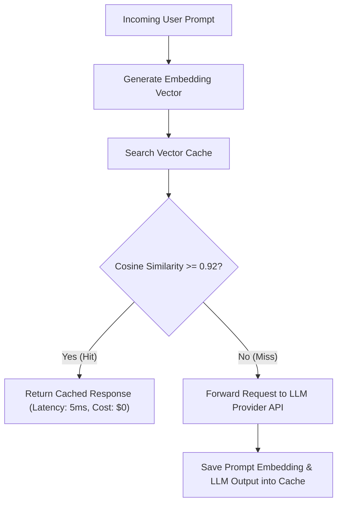

# File 01: Semantic Query Caching (`src/caching/semantic-cache.js`)

## Overview
**Semantic Query Caching** checks if a new user prompt is semantically equivalent to a previously cached prompt using vector embeddings and Cosine Similarity (threshold $\ge 0.92$), serving responses instantly without invoking external LLMs.

---

## 1. Semantic Cache Decision Flow



---

## 2. Semantic Cache Implementation (`src/caching/semantic-cache.js`)

```javascript
export class SemanticCache {
    constructor(similarityThreshold = 0.92) {
        this.cache = []; // { prompt, embedding, response, createdAt }
        this.similarityThreshold = similarityThreshold;
    }

    _cosineSimilarity(vecA, vecB) {
        let dot = 0, normA = 0, normB = 0;
        for (let i = 0; i < vecA.length; i++) {
            dot += vecA[i] * vecB[i];
            normA += vecA[i] * vecA[i];
            normB += vecB[i] * vecB[i];
        }
        return dot / (Math.sqrt(normA) * Math.sqrt(normB));
    }

    get(queryVector) {
        for (const item of this.cache) {
            const sim = this._cosineSimilarity(queryVector, item.embedding);
            if (sim >= this.similarityThreshold) {
                console.log(`[SEMANTIC CACHE HIT] Similarity: ${sim.toFixed(4)}`);
                return item.response;
            }
        }
        console.log("[SEMANTIC CACHE MISS]");
        return null;
    }

    set(prompt, queryVector, response) {
        this.cache.push({ prompt, embedding: queryVector, response, createdAt: new Date() });
    }
}
```

---

## Key Takeaways
1. Bypasses LLM generation for semantically similar user prompts.
2. Drastically reduces latency ($<10\text{ms}$) and API costs.
